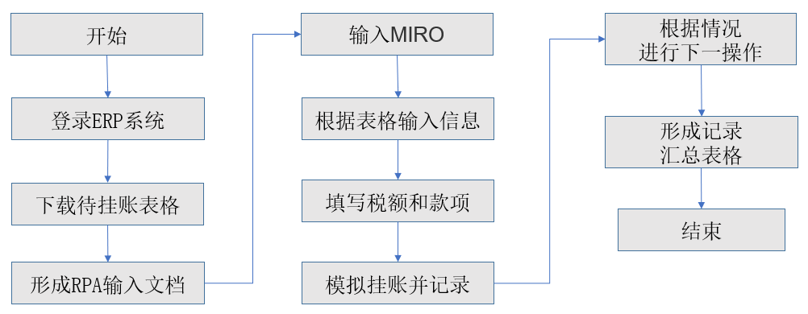

## 1.3.2 RPA在会计财务行业的应用

RPA能够模仿特定工作流程中的人类用户操作。具有登录应用程序、移动文件和文件夹、复制和粘贴数据、填写表格、从文档中提取结构化和半结构化数据、抓取浏览器等功能的能力。从而减少会计人员在这些耗时且低价值的工作上，使会计人员可以重新部署到更高价值的业务功能上，从而可以提高公司的整体生产力。

会计行业是一个规则性强的领域，在其业务流程往往存在大量重复的且需要手工来完成的任务，耗费着企业大量的人力资源和时间成本。这使得企业在未来的竞争中，将面临竞争劣势的处境。

同时，会计是企业天然的大数据中心，是企业数字化变革的有利切入点。实际上，企业财务工作的业务特点与RPA技术的应用条件高度吻合。

RPA应用于会计财务领域，能够最大限度实现企业财务流程的高效运转，以及财务运行成本的降低。通过RPA技术的使用，企业财务工作效率得以大幅提升，数据信息安全实现可控，保障了企业业务发展和管理决策中的数据需求，为企业发展提供了有效支撑。这就是为什么都在积极推广应用财务机器人的原因所在。

拥有大量财务流程的公司，应该率先考虑引入RPA解决方案。基于目前常见的集团财务职能划分，RPA最容易发挥效用的地方就在交易型财务处理及内部风险管控两大部分。尤其对于依托财务共享模式进行企业财务管理转型的企业，共享服务中心的主要职责恰恰就是交易型财务处理及部分控制审核，再加上SSC特有的标准化及流程化，RPA也就具备了上好的应用环境，这也就是为什么国内的共享服务中心建设浪潮之后，财务机器人技术备受关注的原因。

以处理交易型财务的共享服务中心为例，我们常见的业务流程包括：销售至收款、采购至应付、员工费用报销、存货与成本、资产核算、总账与报告、资金结算等流程，那么这些流程均适合采用RPA机器人。

以最常见的凭证制单为例，凭证信息在财务共享服务中心统一录入，存在大量纸质发票文件，需要人工验证并制单，人力成本高质量差。应用RPA结合OCR影像识别技术，票据自动扫描后将输出为结构化的信息，机器人会自动将这些结构化信息录入ERP系统里完成制单。整个流程自动化，平均处理时间节省了90%以上。

图1.3.2-1 凭证制单

以发票校验业务为例，传统方式是线下流转单据，人工处理，繁琐且容易出错。我们不妨尝试一下新思路，在智能发票交收终端接收到发票后，机器人可以自动登陆SAP系统，输入事务代码MIRO进行发票校验的操作，形成记录并汇总发送给对应的业务人员，人工进行复核。这里的人机交互是为了保险起见，技术上完全可以不用人工复核。我们可以清楚地通过下图的流程看到，是完全由机器人实现的流程。不仅提高了发票校验的准确率、时效性、应付账款的准确性，更避免了人工操作的失误和查错的成本。

图1.3.2-2 发票自动校验

## links
   * [目录](<preface.md>)
   * 上一节: [RPA在金融业的应用](<01.3.1.md>)
   * 下一节: [RPA在HR行业的应用](<01.3.3.md>)