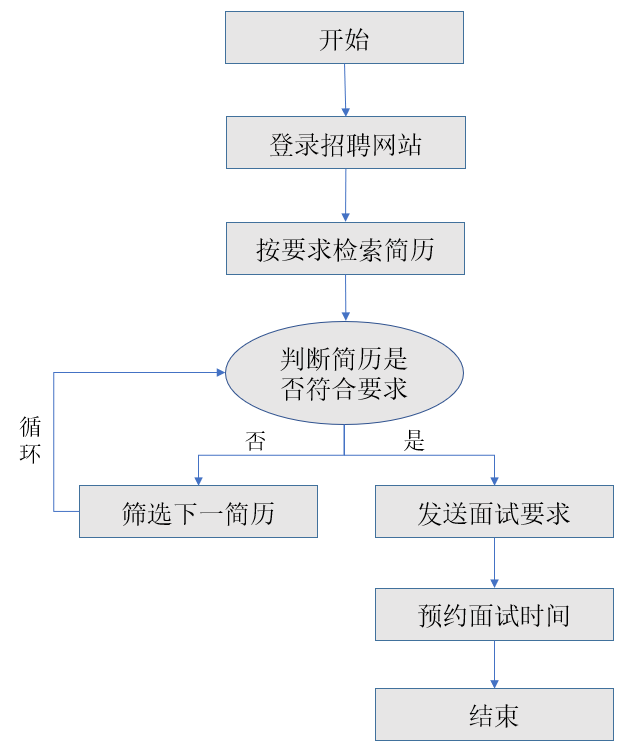
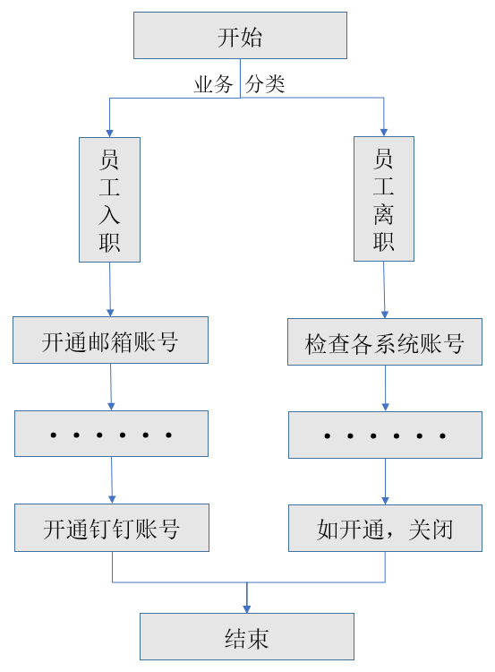
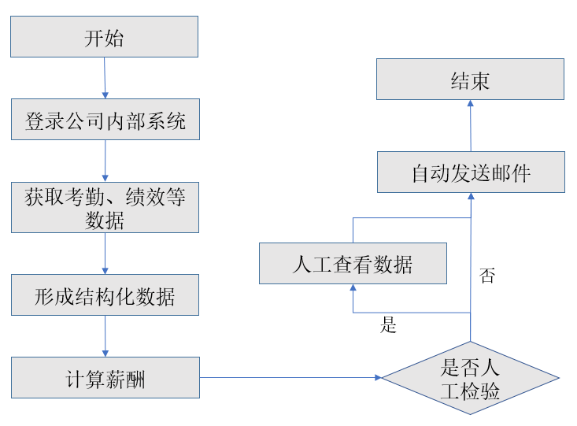

## 1.3.3 RPA在HR行业的应用

与财务业务类似，人力资源管理业务也是占用大量劳动力且高度重复的工作，因此也尤其适合应用RPA技术。以下将列举几个经典人力资源业务与RPA技术的结合。

以招聘为例，HR根据招聘需求部门提供的招聘岗位描述，核查招聘额度后，登录到相关的招聘渠道例如招聘网站、企业官网、微信公众号、招聘邮箱等，收集和筛选符合要求的简历，如学历要求，技能要求，年龄要求等等。该项工作需要在不同招聘渠道间来回切换，人工阅读大量简历样本，初步筛选后发送用人部门的审阅后，待其反馈意向后，HR邮件、电话或即时消息等方式与候选人预约面试时间，整个流程环节较多，但流程固定、单一，占用了招聘人员大量工作时间。

图1.3.3-1 自动筛选简历和推送消息

应用RPA后，机器人按照简历筛选程度，自动登陆多个招聘渠道收集简历，下载到本地电脑指定的文件夹，自动发送给相关业务人员，并能根据其反馈，自动发送面试邀请。从简历收集、筛选到预约面试完成自动化，极大提高了筛选效率，降低了人工筛选可能由于人工疲劳而导致的筛选效率低下或误筛的概率。

以入职离职为例，员工入职确认后，HR需要为其创建各系统账号，离职确认后，需要检查并关闭所有系统账号，这些都可以通过RPA自动来实现，如下图所示。

图1.3.3-2 入职离职处理

以薪酬核算为例，HR每月根据不同部门、岗位、职级等规则，融入考勤、绩效等影响因素，制作薪酬表单，而且还需要生成工资条，发送给员工个人。计算量大，规则多，且无法避免错误的产生，一旦产生错误，容易引起员工极大不满，降低对人力资源部的满意度。

应用RPA后，HR给机器人指定数据来源和收集路径，设置好算法规则，机器人会自动统计考勤、绩效，完成薪酬计算，并自动登录指定邮箱，完成工资条的自动发送。原来N天的工作现在变成几分钟即可完成，且准确率高达100%。

图1.3.3-3 薪酬自动核算

## links
   * [目录](<preface.md>)
   * 上一节: [RPA在会计财务行业的应用](<01.3.2.md>)
   * 下一节: [RPA在物流行业的应用](<01.3.4.md>)