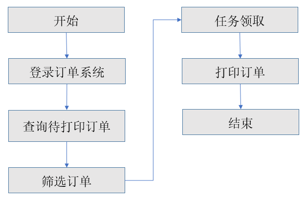
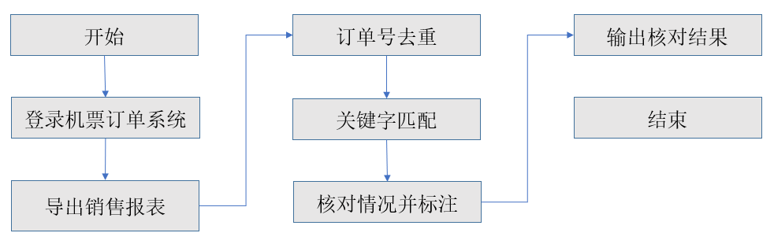

## 1.3.4 RPA在物流行业的应用

对于物流行业来说每天有大量的包裹需要进行处理的，不单单处理包裹还需要处理表格数据、创建装运订单、将文档中的信息重新键入数据库、下载报告以及将有价值的信息输入CRM或ERP系统、进行文件上传等操作，如果我们单独的依靠人力处理难免力有不逮的时候，我们可以借助RPA流程自动化处理的方式来帮助我们提高工作效率，节约成本以及更好的工作。
  以物流订单打印为例，某物流公司每日有6000多份物流订单需要处理，占用了3个全职人员每天16小时轮岗值守来处理物流订单，如此大的业务量，一旦没及时处理，就会导致丢单。有机器人自动值守后，不再需要任何人工值守了。原来的3人仅留1人来抽查审核机器人的处理质量和效率，其它2人被释放出来从事订单分析与优化等更高附加值的工作。

图1.3.4-1 物流订单打印

以航空订单核对为例，某航空公司有A1、A2两条业务线，支持多渠道、多支付方式，销售和退票订单巨大，每天的数据量在50000条左右，需要4名专职人员，且订单遗漏、错误处理会导致客户投诉，对航空公司业务快速发展和品牌形象均有不良影响。
  应用RPA后，人工触发机器人工作后，机器人会自动登录机票订单系统，导出销售订单和退票订单，识别和标注关键字，输出核对结果，发送给业务人员。整体业务效率提升超过200倍，原来的4人已有3人完全释放出来，从事机票价格趋势分析、分销渠道和客户管理等更高附加值的工作。

 

图1.3.4-2 航空订单核对

## links
   * [目录](<preface.md>)
   * 上一节: [RPA在HR行业的应用](<01.3.3.md>)
   * 下一节: [RPA在医疗行业的应用](<01.3.5.md>)