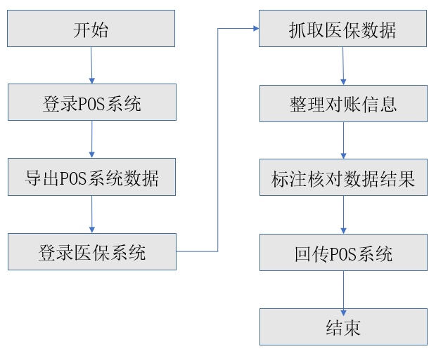

## 1.3.5 RPA在医疗行业的应用

以医保对账为例，某全国连锁药店在全国有2000多家门店，是医保定点药店，因此每天要处理大量医保对账业务，占用的人工时是100人*10天/月，且数据传递主要靠截图和肉眼识别再录入，工作效率低且数据准确性差。

应用RPA后，机器人在总部就可集中处理全国2000多家门店的医保对账，只要手动触发，机器人将自动登陆POS系统、医保系统、下载报表、识别和抓取数据、正确数据直接处理，可疑数据发送给业务人员，人工审核。原来全国需要100人，现在仅需2-3人来处理可疑和异常数据即可，减少了80%以上的机械重复工作。

图1.3.5-1 医保对账

## links
   * [目录](<preface.md>)
   * 上一节: [RPA在物流行业的应用](<01.3.4.md>)
   * 下一节: [RPA的发展趋势](<01.4.md>)