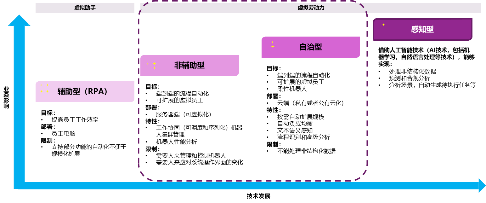

## 1.4 RPA的发展趋势

现代RPA技术包含三大关键技术，屏幕抓取、业务流程自动化管理和人工智能。2000年左右，随着一些企业对自动化的需求增多，出现了主营RPA产品的初创公司。首先是Blue Prism于2003年发布了其第一款RPA产品，然后UiPath和Automation Anywhere也相继发布了各自的自动化库。此后十多年时间，出现了很多RPA企业。RPA行业的发展一直不温不火，因为RPA的快速部署、不破坏原生系统、投资更少的特点，逐渐成为更多企业解决业务流程自动化的重要数字化工具。

在人工智能影响下对自动化的需求逐渐增长，机器人流程自动化应用一般分为以下几个阶段，如下图所示。

 

图1.4-1 RPA技术发展

1、辅助型RPA

涵盖了现有的全部的桌面自动化软件操作，用以提高工作效率，部署在员工PC机上，缺点是不支持端到端的自动化和难以成规模应用。

2、非辅助型RPA

涵盖了目前机器人流程自动化的主要功能要求，实现端到端的自动化和成规模的虚拟劳动力，具有工作协调，机器人几种管理，机器人性能分析等功能，部署在虚拟机上，缺点是需要人工控制和管理RPA软件机器人的工作。

3、自治性RPA

涵盖了目前机器人流程自动化最期望的主要功能要求，实现端到端的自动化和成规模多功能虚拟化劳动力，弹性伸缩，动态负载均衡，情景感知，高级分析，和工作流等功能，部署在云服务器（虚拟机）上，缺点是无法处理非结构化数据。

4、感知型RPA

涵盖了未来机器人流程自动化（下一代RPA软件机器人）需要涵盖的功能要求，使用人工智能AI和机器学习等技术，实现处理非结构化数据，预测规范分析，自动任务接受处理等功能。

与人工智能结合的感知型RPA是RPA技术的发展重点。除此以外，RPA技术的发展还呈现如下明显的趋势：

（1）RPA与AI相互融合：2020年开始，RPA将会更多的融入人工智能、机器学习和认知计算等智能技术，以优化更复杂的业务流程，RPA+AI的模式将会成为RPA产品常态。借助智能技术的综合作用，RPA的自动化的潜力将得到重大发展。

（2）RPA上云与商城模式：RPA上云能够服务更多具有跨域、跨网需求的客户。而上云后的RPA将变成一个SaaS平台，便进一步催生了RPA商城的诞生。在RPA商城，开发者将RPA机器人、插件、模板发布到市场，RPA商业合伙伙伴以及企业用户可以下载应用。这种模式，既能节省RPA厂商的资源成本，又能让RPA产品在各个领域迅速落地，还有益于RPA产品的快速迭代与完善。重要的是，它还能为企业节省IT资源的投入以及免于技术团队搭建，按需订阅的方式又能满足企业的弹性需求。

（3）行业垂直型RPA兴起：除了通用型RPA，一些领域的相关企业服务机构正在针对一些行业做垂直型RPA，例如主要面向金融体系相关业务，或者专注于解决能源与资源行业的业务流程管理。

（4）低代码技术降低使用难度：低代码+RPA，可以减少手写代码编写量，加快业务应用程序交付，同时能够降低开发门槛、以及培训和部署的初始成本。低代码代表的RPA未来发展趋势，2020年以后，将会有更多RPA产品，推出低代码或无代码编辑器。

（5）RPA卓越中心建设：想要顺利实施RPA，获得最佳“机器人速度”，以及为企业后续的RPA部署打下良好基础，关键在于建立一个结构良好且人员配置完善专门用于实施自动化的研究中心或者职能部门。这个职能部门，主要用于研究哪些自动化技术可用于解决不同的业务问题，同时推动技术兼容性，集成和基本实践。在RPA领域，这个部门就是RPA卓越中心(Center of Excellence，COE)。有数据显示，2019年有40%左右的企业与组织将建立了自动化中心，并在集中式协调中心或人才中心方面投入大量资金。可以预见，2020年以后将会有更多引入RPA的企业建立COE。

总的说来，RPA技术和相关市场正在蓬勃发展。全球机器人流程自动化 (RPA) 市场规模，预计从2017到2022年将以30.14％的成长率发展。预计到2024年，全球RPA市场规模将实现61.3%的年复合增长率，亚太地区的市场增速更将在2021年达到181％。

在“人口红利”逐渐消失的现在，人工成本不断的增加，无形之中使得 RPA 流程自动化机器人技术已成为众多国内企业解决人力资源缺失的有效方法。 

2018年起，随着RPA概念在中国的全面引入，RPA市场在国内已呈现井喷之势。在财务、金融、通讯、制造业、人力资源等领域，RPA已经成为企业数字化转型的重要推手。乐观估计，到2021年，亚洲第一RPA市场将非中国莫属。

## links
   * [目录](<preface.md>)
   * 上一节: [RPA在医疗行业的应用](<01.3.5.md>)
   * 下一节: [为什么要自己写一个RPA](<01.5.md>)