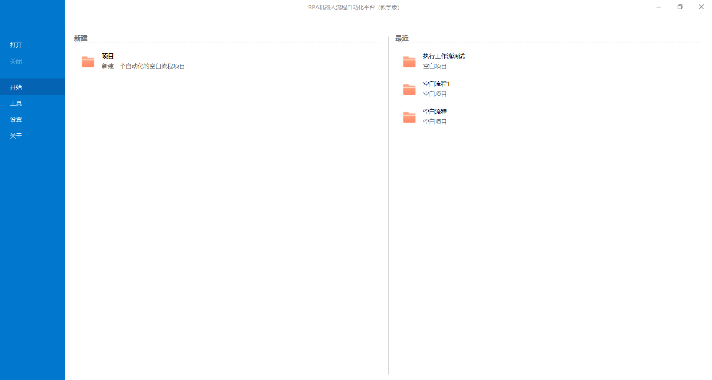
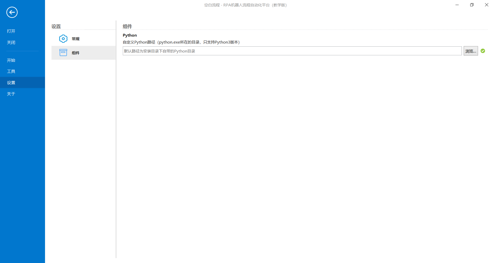
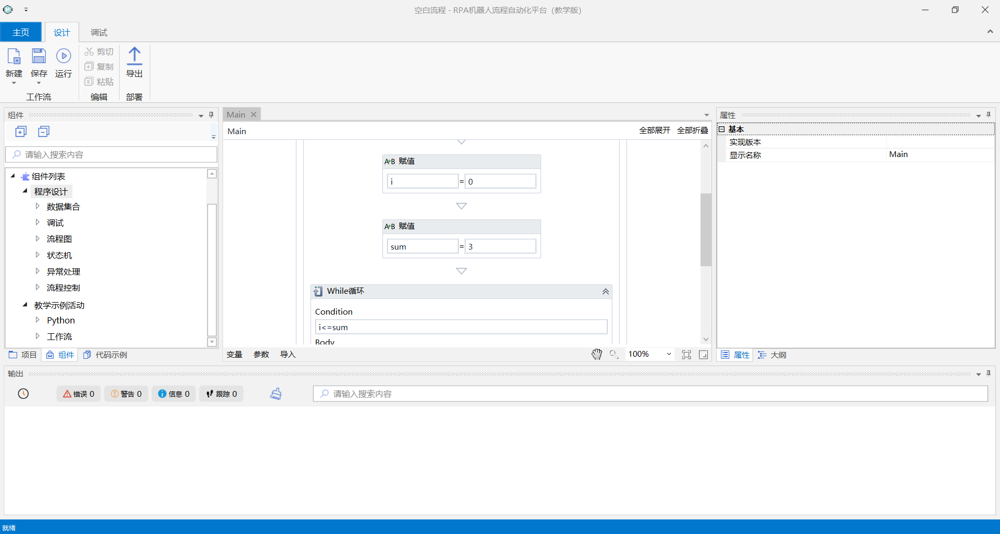
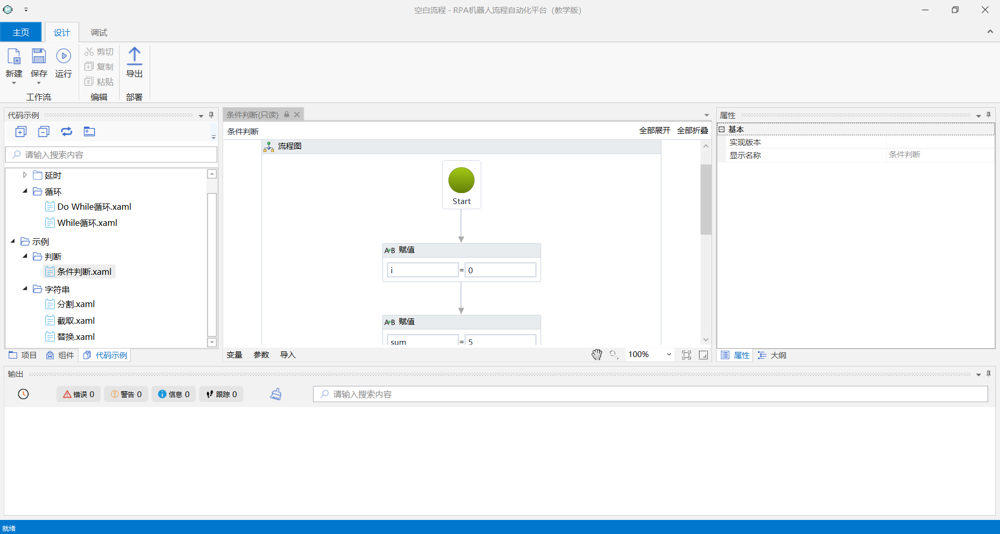
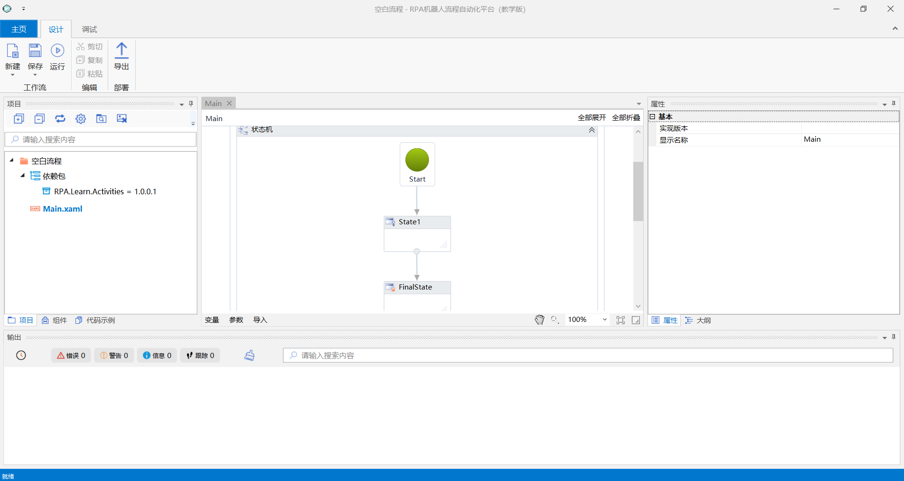
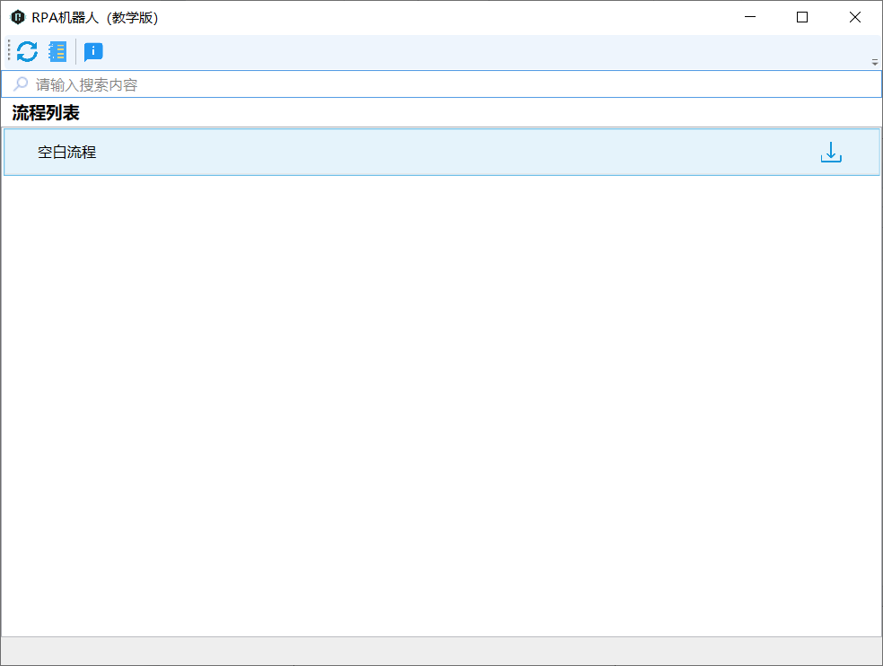
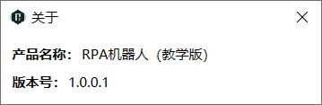

## 1.7 RPAStudio介绍

RPAStudio软件是一种机器人流程自动化技术，通过配置机器人自动化软件模拟和人类在软件系统中交互的动作来执行业务流程。RPAStudio软件机器人运行时像人类操作应用程序一样，中间不需要用户交互操作。RPAStudio软件根据规则与其他系统交互，根据需要执行各种重复性任务。一个RPAStudio软件机器人可以7*24不间断进行工作，为企业节省成本，提高工作效率。

RPAStudio适用于财务税务、人力资源、金融业、制造业、信息技术、运营销售等重复劳动率高的行业。机器人执行效率远高于人工操作，出错率极低。

环境：Windows；.Net 4.6.1以上

编译：使用源代码以VS 2015编译运行二进制文件

目前支持系统组件：While循环、赋值、条件判断等；执行工作流文件及执行Python脚本等；

RPAStudio中可扩展UI自动化：Windows窗口、Swing窗口、IE浏览器UI自动化；

浏览器自动化：IE、Chrome、Firefox浏览器；

应用程序集成：Word、Excel、CSV、Mail、数据库（Sql server、Mysql、Orcale）、FTP、Python（Python3）以及更多...

RPAStudio设计器页面展示如下：

 

RPAStudio设计器----开始页面

 

RPAStudio设计器----设置页面

 

RPAStudio设计器----主页面（序列图设计流程）

 

RPAStudio设计器----主页面（流程图设计流程）

 

RPAStudio设计器----主页面（状态机设计流程）

RPARobot执行器页面展示如下：

 

RPARobot执行器----主页面

 

RPARobot执行器----版本信息

## links
   * [目录](<preface.md>)
   * 上一节: [选择哪种技术方案来实现RPA](<01.6.md>)
   * 下一节: [开发环境Visual Studio 2015的搭建](<02.1.md>)