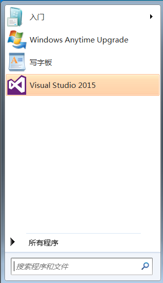

## 2.1 开发环境Visual Studio 2015的搭建

RPA的开发工具这里使用的是Microsoft Visual Studio 2015（以下简称VS 2015），微软为了更好地支持Win10程序的开发，发布了VS 2015。VS 2015支持开发人员编写跨平台的应用程序，从Windows到Mac、Linux甚至是可以编写iOS和Android代码。

VS 2015有三个版本，分别是社区版（Community）、专业版（Professional）、企业版（Enterprise）。其中社区版是免费提供的，其余两个版本都要收费，并且对于大部分程序开发，这三个版本的区别并不大，免费的社区版一样可以满足需求，所以这里推荐大家使用社区版。接下来将为大家介绍VS 2015的安装过程：

1、下载安装包

  在微软官方网站进行VS 2015社区版的下载。

2、解压安装包

下载完成后，接下来就是对VS 2015的安装，可以解压安装，也可以用ISO虚拟光盘加载安装，这里选择解压安装，双击解压出来的vs_community.exe进行安装，如图2.1-1所示。

 

图2.1-1 解压后的文件

3、开始安装，会出现等待页面（需要几分钟），如图2.1-2所示。

 

图2.1-2 等待页面

4、初始化安装程序，如图2.1-3所示。

 

图2.1-3 初始化安装程序

5、安装警告

如果计算机配置不恰当，VS安装程序会出现警告，这里出现的警告是由于电脑没有安装Internet Explorer 10，忽略该警告，点击“继续”，如图2.1-4所示。

 

图2.1-4 安装警告

6、选择安装位置和安装类型

接下来就是选择安装位置和安装类型，这里选择默认安装，也可以在自定义中选择C#进行安装，点击“安装”，如图2.1-5所示。

 

图2.1-5 选择安装位置和类型

7、等待安装，如图2.1-6所示。

 

图2.1-6所示

8、安装包丢失或损坏

Win7或Win8系统可能会出现安装包丢失或损坏情况，原因是microsoft root certificate authority 2010、microsoft root certificate authority 2011两个证书未安装，自行搜索安装，安装完成以后，点击“重试”，如图2.1-7所示。

 

图2.1-7 安装包丢失或损坏

9、接下来就是等待漫长的安装过程，如图2.1-8所示。

 

图2.1-8 等待安装

10、安装完成，重启计算机，如图2.1-9所示。

 

图2.1-9 安装完成

11、安装成功

重启电脑以后，程序里面可以看到安装成功的Visual Studio 2015，如图2.1-10所示。

 

图2.1-10 安装成功

12、打开Visual Studio 2015

打开安装成功的Visual Studio 2015，首先是登录账号，有账号的在可以选择登录账号，这里介绍暂时先不登录，点击“以后再说”，如图2.1-11所示。

 

图2.1-11 登录

13、开发和主题设置

设置Visual Studio 2015的开发设置和主题颜色，这里开发设置选择Visual C#，主题颜色根据个人习惯进行设置即可，然后点击“启动Visual Studio”，如图2.1-12所示。

 

图2.1-12 开发和主题设置

14、Visual Studio 2015加载准备，如图2.1-13所示。

 

图2.1-13 Visual Studio 2015准备

15、打开后的Visual Studio 2015界面如2.1-14所示。

 

图2.1-14 Visual Studio界面

16、安装到此处，RPA的开发环境VS 2015已经搭建完成了，关于VS 2015里面的布局可按照个人习惯直接拖拽即可。

## links
   * [目录](<preface.md>)
   * 上一节: [RPAStudio介绍](<01.7.md>)
   * 下一节: [C#语言介绍](<02.2.1.md>)