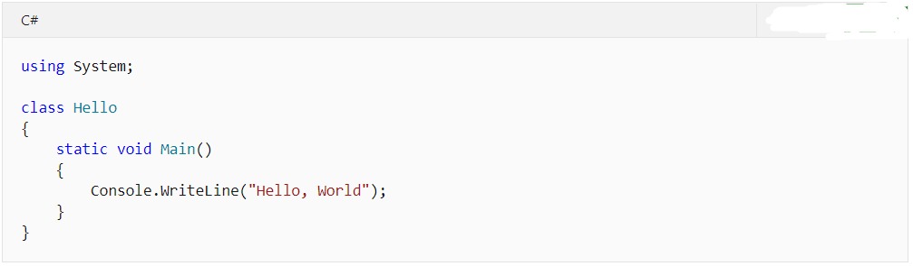

## 2.2.3 Hello Word示例

“Hello, World”程序历来都用于介绍编程语言。下面展示了此程序的C#代码，如图2.2.3-1所示。

 

图2.2.3-1 C#语言

“Hello World”程序始于引用 System命名空间的 using 指令。命名空间提供了一种用于组织C#程序和库的分层方法，命名空间包含类型和其他命名空间。例如，System命名空间包含许多类型（如程序中引用的 Console类）和其他许多命名空间（如 IO Collections）。借助引用给定命名空间的using 指令，可以非限定的方式使用作为相应命名空间成员的类型。由于使用 using 指令，因此程序可以使用Console.WriteLine作为System.Console.WriteLine的简写。

“Hello World”程序声明的Hello类只有一个成员，即Main方法。 Main方法使用static修饰符进行声明。实例方法可以使用关键字 this引用特定的封闭对象实例，而静态方法则可以在不引用特定对象的情况下运行。按照约定，Main静态方法是C#程序的入口点。

程序的输出是由System命名空间中Console 类的WriteLine方法生成。 此类由标准类库提供。默认情况下，编译器会自动引用标准类库。

## links
   * [目录](<preface.md>)
   * 上一节: [.Net体系结构](<02.2.2.md>)
   * 下一节: [WPF介绍](<02.3.1.md>)