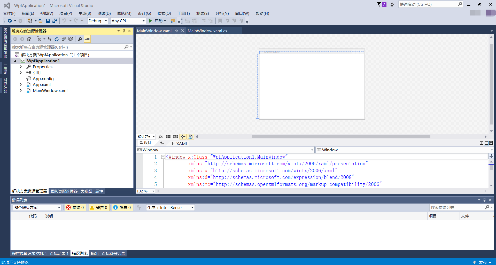
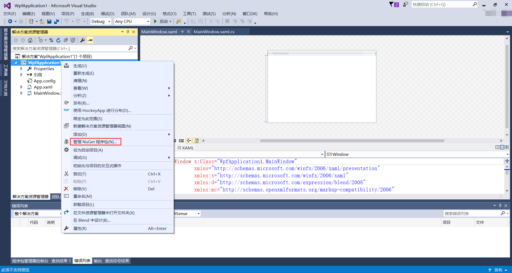
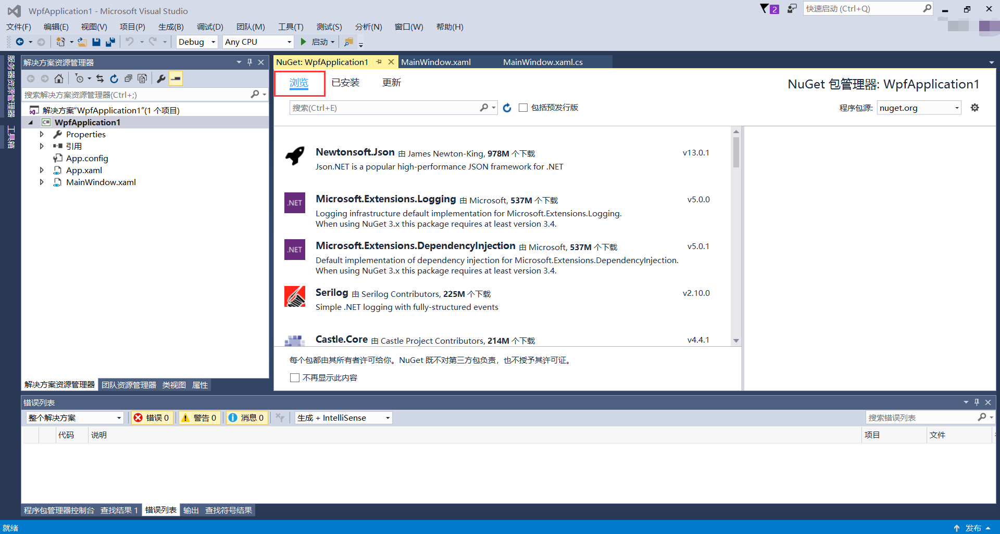
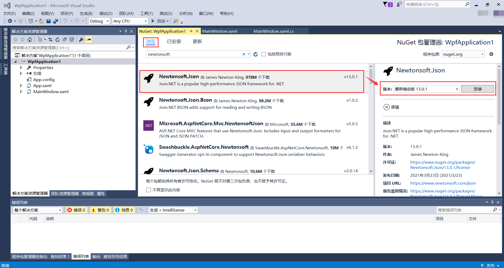
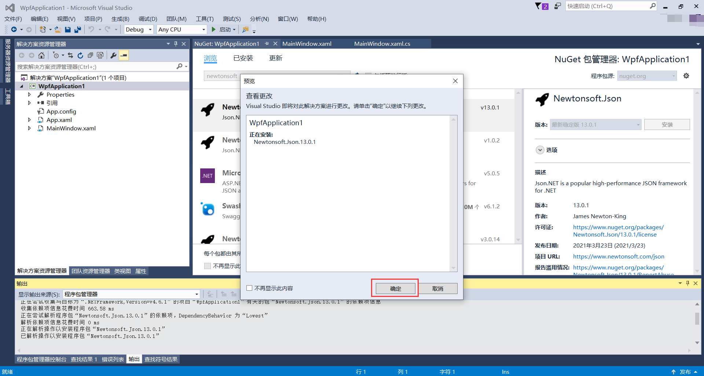
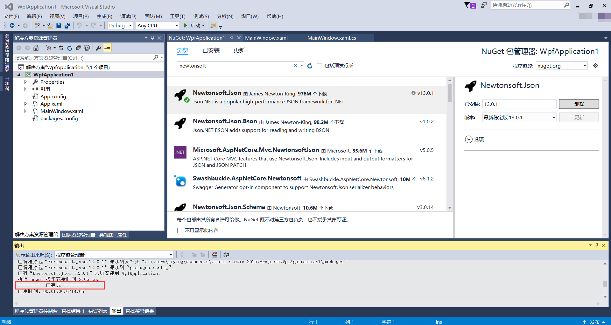

## 2.4 第三方Nupkg包的安装

NuGet是免费、开源的包管理开发工具，专注于在.Net 应用开发过程中，简单地合并第三方的组件库。

当需要分享开发的工具或是库，需要建立一个Nuget package，然后把这个package放到Nuget的站点。如果想要使用别人已经开发好的工具或是库，只需要从站点获得这个package，并且安装到自己的Visual Studio项目或是解决方案里。NuGet能更方便地把一些dll和文件(如jquery)添加到项目中，而不需要从文件中复制拷贝。

第三方Nupkg包的安装过程如下：

1、现有刚建好的项目WpfApplication1，如下图2.4-1所示。

 

图2.4-1 现有项目

2、在项目上右键----》管理NuGet程序包（如有多个项目，选择需要安装第三方Nupkg包的项目即可），如图2.4-2所示。

 

图2.4-2 管理NuGet程序包

3、进入NuGet包管理界面，分为浏览、已安装和更新。浏览界面可以进行搜索安装需要的第三方Nupkg包，已安装中为项目中已经安装过的Nupkg包，更新为此项目中安装过的可更新的Nupkg包，如图2.4-3所示。

 

图2.4-3 NuGet包管理页面

4、安装第三方的Nupkg包在浏览界面进行搜索，例如安装解析Json的Newtonsoft.Json包，搜索出来选中以后，可以看到此包的详细信息，包括其版本。选择需要的版本然后点击右侧的安装，如图2.4-4所示。

 

图2.4-4 安装包

5、出现安装弹窗，点击“确定”，如图2.4-5所示。

 

图2.4-5 安装预览

6、等待一会，在输出控制台可以看到此包安装已完成的提示，如图2.4-6所示。

 

图2.4-6 安装已完成

## links
   * [目录](<preface.md>)
   * 上一节: [数据绑定](<02.3.3.md>)
   * 下一节: [简单例子的练习----校验用户登录](<02.5.md>)