## 2.5 简单例子的练习----校验用户登录

现在来实现一个简单的例子，设计一个用户登录的界面，并且进行简单的用户名和密码的校验。先将正确的用户名和密码拼接成Json字符串，再通过安装第三方解析Json的库，将字符串进行解析，最后点击登录按钮进行校验，具体实现步骤如下：

1、双击打开安装好的VS 2015，界面如图2.5-1所示。

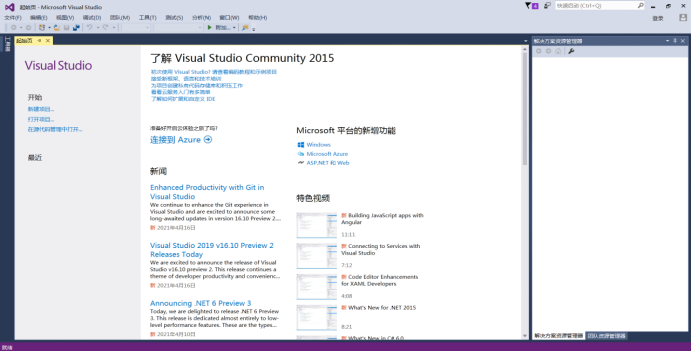 

图2.5-1 VS 2015界面

2、点击新建项目，选择.Net Framework4.6.1，模板选择Visual C#的WPF应用程序，设置应用程序名称、存放位置，点击确定即可，如图2.5-2所示。

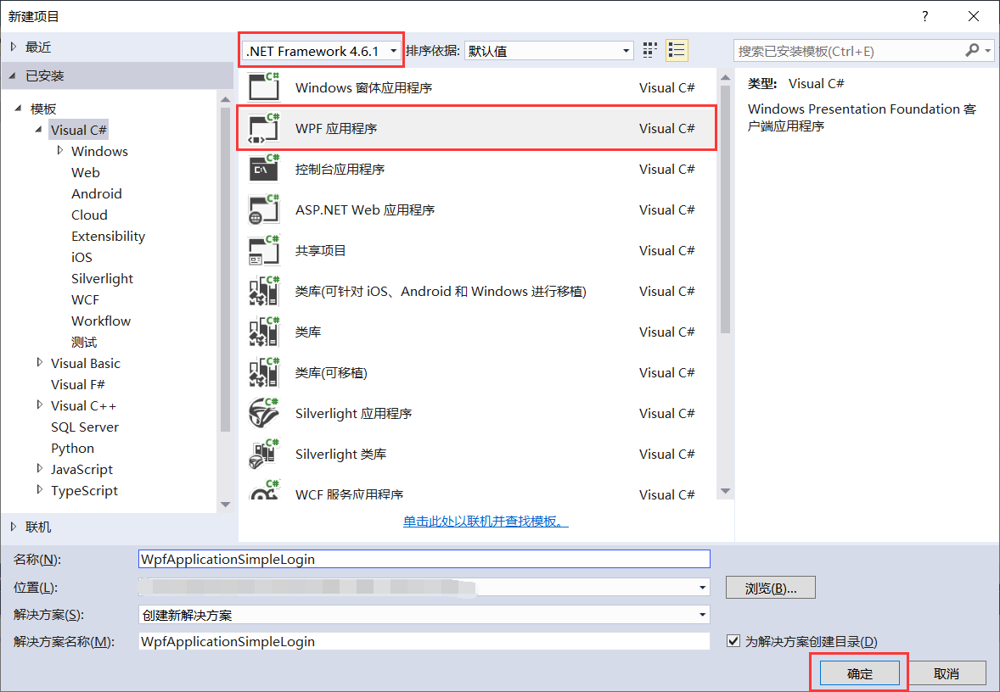 

图2.5-2 新建项目

3、新建好项目以后，界面如2.5-3所示。

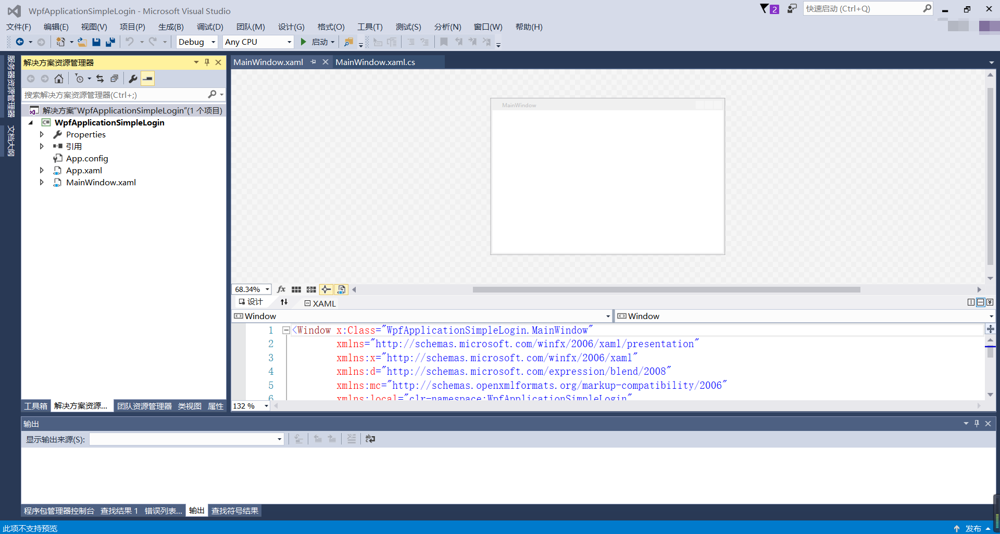 

图2.5-3 项目界面

4、具体项目文件结构如图2.5-4所示，其中App.xaml是设置应用程序的起始文件与资源。App.xaml.cs是App.xaml的后台文件，继承自System.Windows.Application，用于处理整个WPF应用程序的相关。MainWindow.xaml是WPF应用程序界面与xaml设计文件。MainWindow.xaml.cs是MainWindow.xaml文件的后台代码文件，继承自System.Windows.Window。

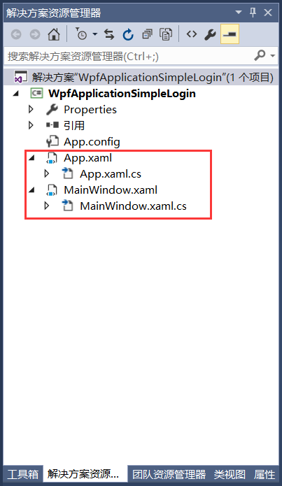 

图2.5-4 项目文件结构

5、打开App.xaml文件，其中“StartupUri”属性可以指定项目运行时的启动窗体，还可以定义需要的系统资源以及引入程序集等，如图2.5-5所示。

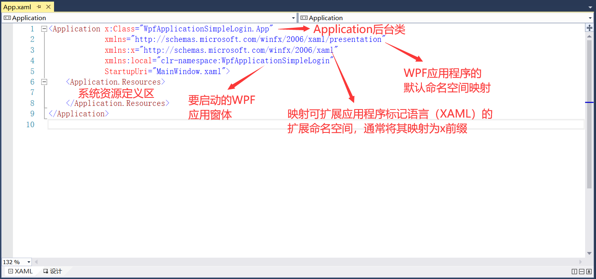 

图2.5-5 App.xaml文件

6、打开MainWindow.xaml文件，在MainWindow.xaml的设计窗体中我们修改Title为用户登录、高度设置为200，宽度设置为300，同时为了让Window窗体的大小不可随意调整，这里添加ResizeMode="NoResize"属性，并且设置窗体的出事位置在屏幕中央，添加WindowStartupLocation="CenterScreen"属性。如想再设置其他属性，查询Window的属性即可，如图2.5-6所示。

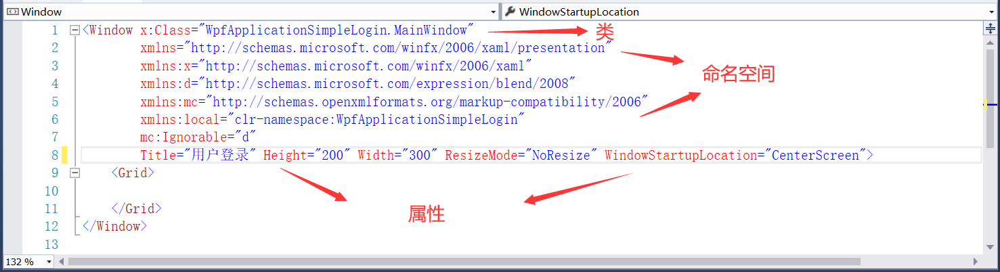 

图2.5-6 MainWindow.xaml文件

7、对属性设置以后就可以对窗体添加控件了，添加的控件可从工具箱中拖拽或双击或者是直接在xaml文件中直接手敲控件，刚安装的VS 2015的工具箱的位置如下：视图----》工具箱，如图2.5-7所示。

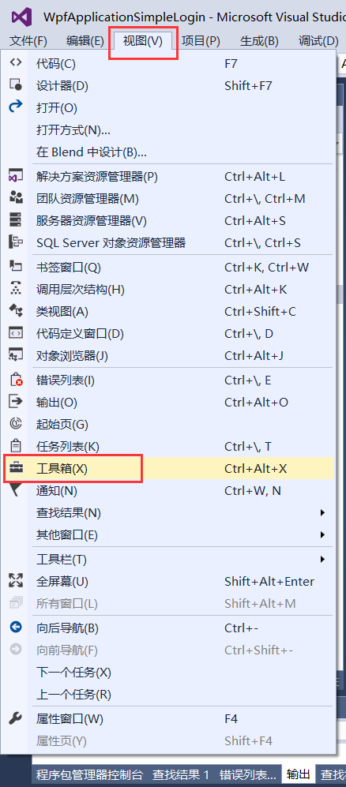 

图2.5-7 工具箱位置

8、工具箱展示如图2.5-8所示。

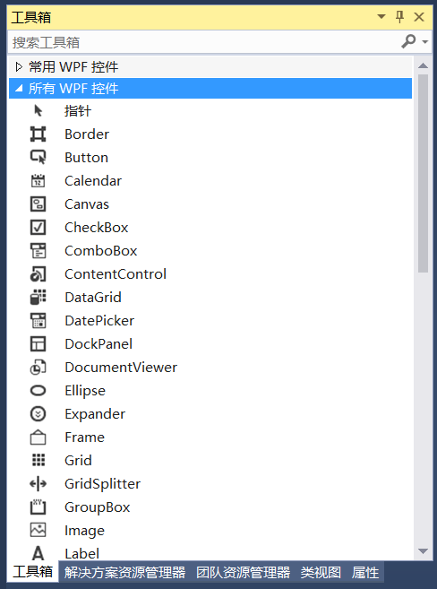 

图2.5-8 工具箱

9、现对窗体添加控件以及事件，这里使用手写控件的方法，根据设计的界面需要添加两个TextBlock、一个文本框TextBox、一个密码框PasswordBox和一个登录按钮Button。为了更好的设计布局，这里我们根据控件大致将界面分为三行两列，且使用Grid进行布局，如图2.5-9所示。对行列的高度和宽度设置，其中第一列来放置TextBlock，所以设置宽度为Auto来自动适应文本的宽度，其余设置为*按照比列分配即可。

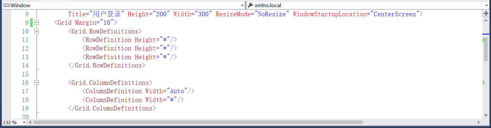

图2.5-9 设置行列

10、根据行列进行添加控件，如图2.5-10所示。

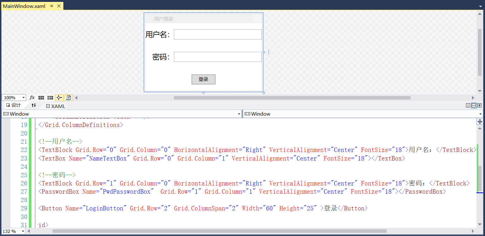

图2.5-10 控件

11、布局调整还以后，需要进行用户名和密码的校验，首先要添加一个json文件，文件内容为正确的用户名和密码的字符串，如图2.5-11所示。且设置文件的属性“如果较新则复制”复制到输出目录，如图2.5-12所示。

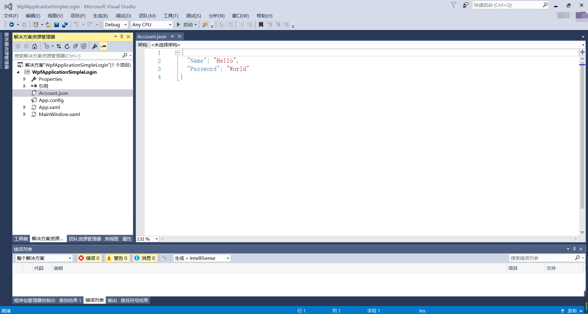

图2.5-11 json文件

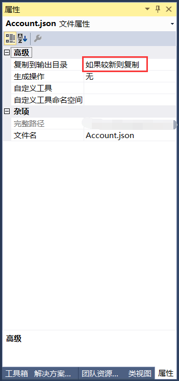

图2.5-12 json文件属性设置

12、安装第三方解析Json的NuGet包，如图2.5-13所示。

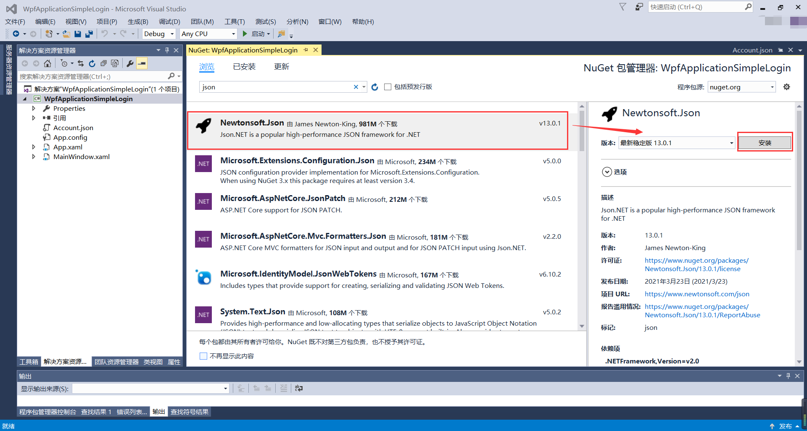

图2.5-13 安装Newtonsoft.Json包

13、字符串解析后需要转换到实体属性，这时要新建一个类AccountInfo，如图2.5-14所示。类中存放的是用户名和密码的字段，如图2.5-15所示。

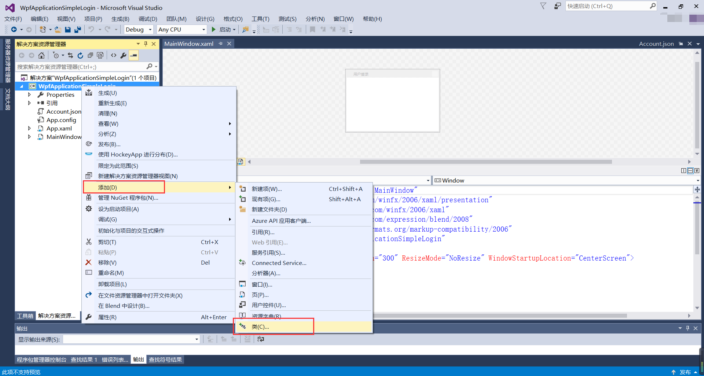

图2.5-14 新建类

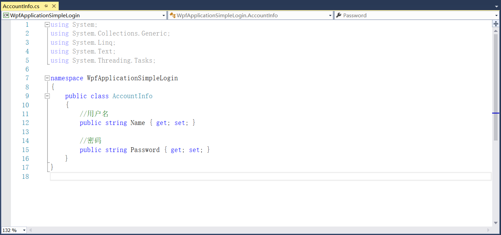

图2.5-15 用户名和密码字段

14、这些都调整好以后，接下来就是为Button按钮添加Click事件来校验用户名和密码是否正确。如果正确弹出“登录成功！”的对话框，不正确弹出“登陆失败，请检查！”的对话框。在xaml文件中添加的Click事件，如图2.5-16所示。

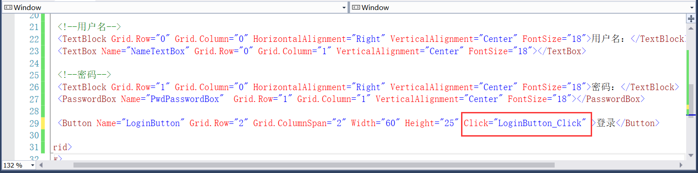

图2.5-16 添加Click事件

15、Click事件如图2.5-17所示。

图2.5-17 Click事件7

16、点击全部保存，在解决方案上右键----》重新生成解决方案，如图2.5-18所示。

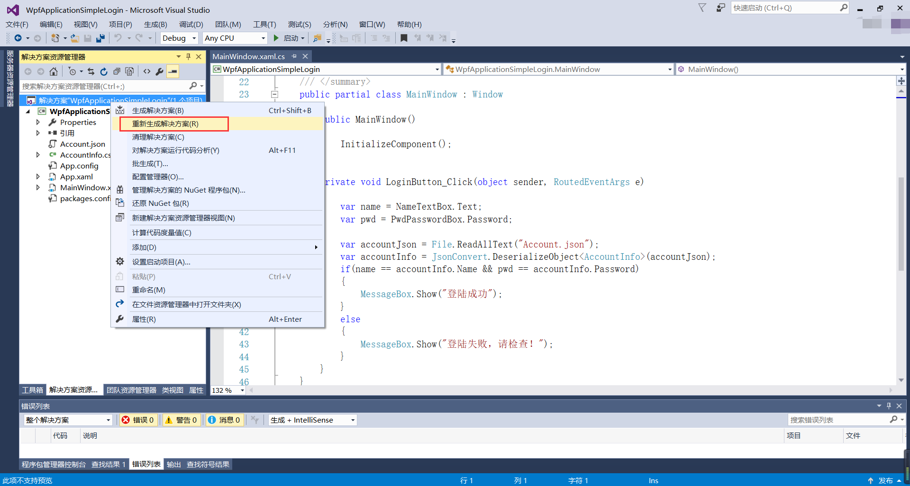

图2.5-18 生成解决方案

17、重新生成完以后，点击启动，界面如图2.5-19所示。

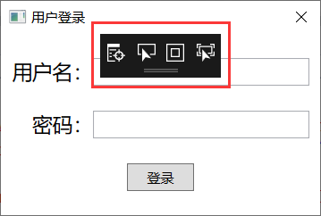

图2.5-19 登录界面

18、由上图可以发现，界面带了一个黑色的窗口，这是用于调试界面的，平时用不到的话我们可以关掉，方法：调试----》选项，关闭“启用XAML的UI调试工具”，如图2.5-20所示。

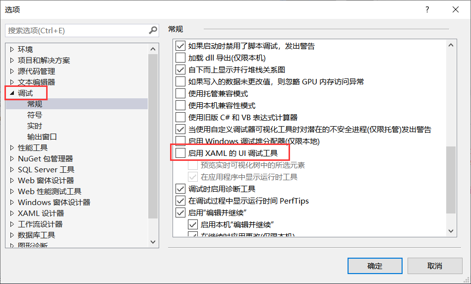

图2.5-20 关闭调试工具

19、关闭后在重新编译运行，效果如图2.5-21所示。

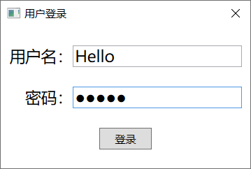

图2.5-21 界面

20、校验成功界面如图2.5-22所示，失败界面如图2.5-23所示。

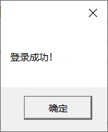

图2.5-22 登录成功

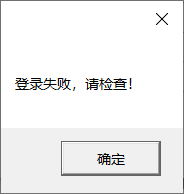

图2.5-23 登录失败

21、那么一个简单的校验用户登录的界面就写好了，赶紧去试试吧！

## links
   * [目录](<preface.md>)
   * 上一节: [第三方Nupkg包的安装](<02.4.md>)
   * 下一节: [新建MiniRPA项目](<03.1.md>)