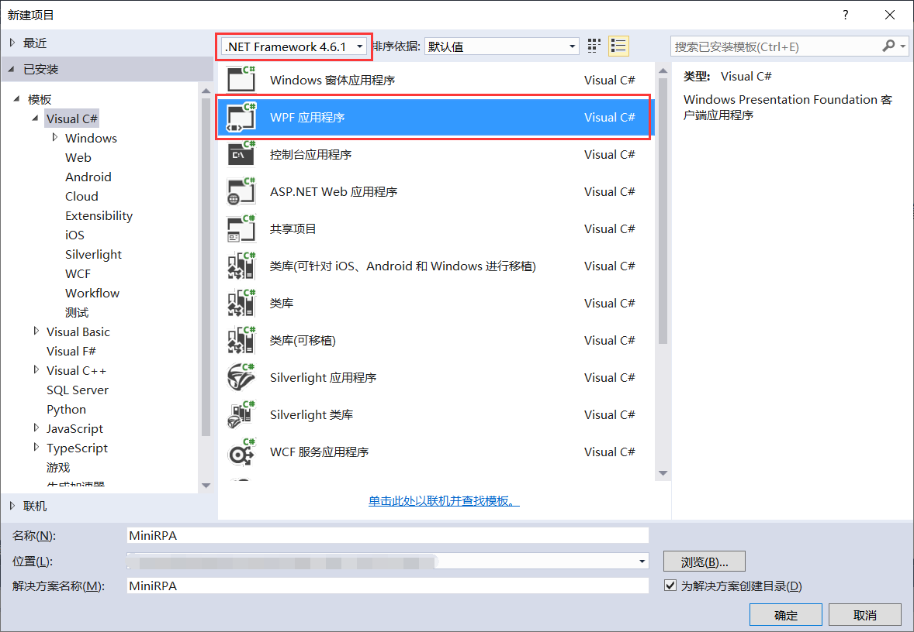

## 3.1 新建MiniRPA项目

打开VS 2015新建项目，选择.Net Framework4.6.1，模板选择Visual C#的WPF应用程序，设置项目的存放路径、设置应用程序名称为MiniRPA，然后点击确定即可完成新建项目，如图3.1-1所示。

 

图3.1-1 新建RPA项目

## links
   * [目录](<preface.md>)
   * 上一节: [简单例子的练习----校验用户登录](<02.5.md>)
   * 下一节: [设计MiniRPA界面布局](<03.2.0.md>)