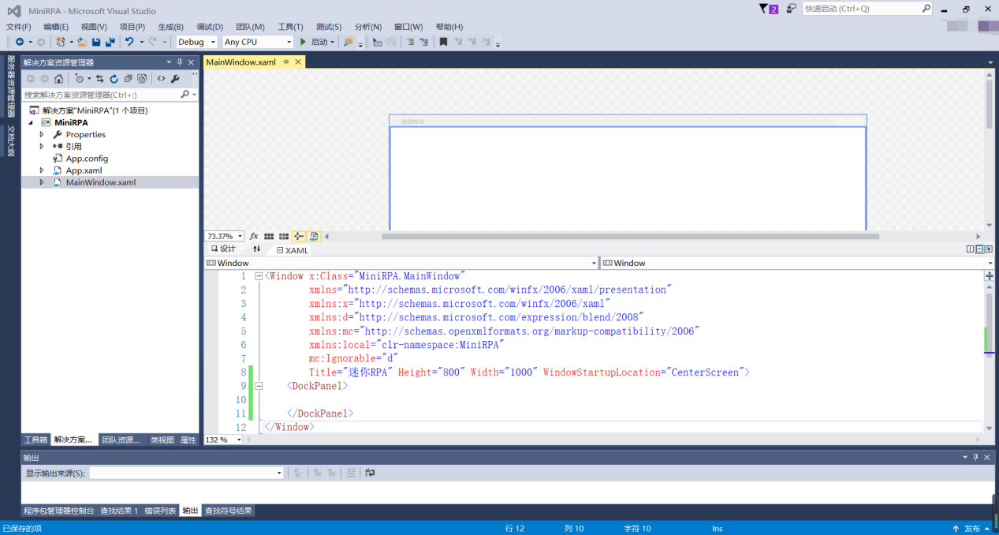
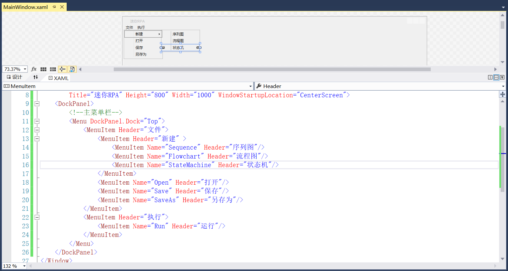

## 3.2.1 菜单栏

1、为MainWindow.xaml文件添加布局设计，修改Window窗体的Title以及高度和宽度，并且设置运行时窗体的初始位置在屏幕中央。由于此界面的布局较多，本着简单快捷的目的，这里使用DockPanel来代替Grid，虽然Grid也可以使用，但是还要设置行列等比DockPanel稍复杂些，以使用DockPanel为例，如图3.2.1-1所示。

图3.2.1-1 迷你RPA界面

2、在此界面的最顶端添加主菜单栏，菜单栏包括文件和执行。其中文件中可以新建（序列图、流程图、状态机）、打开、保存、另存为，如图3.2.1-2所示。

图3.2.1-2 菜单栏

## links
   * [目录](<preface.md>)
   * 上一节: [设计MiniRPA界面布局](<03.2.0.md>)
   * 下一节: [工具栏](<03.2.2.md>)