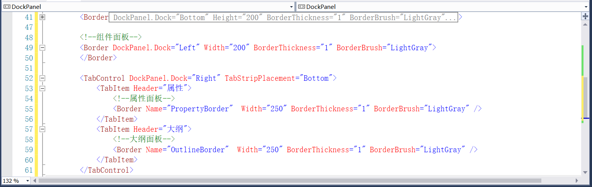

## 3.2.5 组件、属性、大纲面板

现在顶部和底部的布局已经完成了，再来设计左侧的组件面板，以及右侧的属性和大纲面板，并且设置属性边框厚度和边框颜色等，如图3.2.5-1所示。

图3.2.5-1 组件、属性、大纲面板

## links
   * [目录](<preface.md>)
   * 上一节: [输出窗口](<03.2.4.md>)
   * 下一节: [设计面板](<03.2.6.md>)