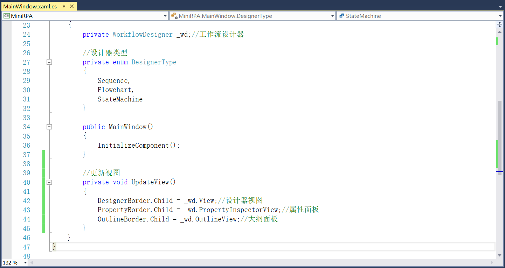
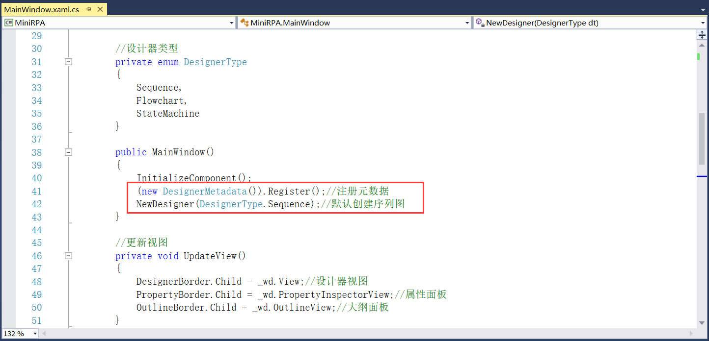

## 3.3 序列图、流程图和状态机的实现

1、RPA新建的流程文件一共有序列图、流程图和状态机三种，首先在MainWindow.xaml.cs文件中添加这三种类型的枚举DesignerType，如图3.3-1所示。

图3.3-1 新建类型枚举

2、接下来就是新建这三种类型的功能实现，但是不管是新建序列图还是流程图，都涉及到设计面板、属性以及大纲面板的视图更新，这里我们先写对这几个面板的更新实现。

（1）添加程序集的引用

首先需要用到设计器WorkflowDesigner类，添加程序集System.Activities.Presentation的引用，如图3.3-2所示。

图3.3-2 引用程序集

（2）更新视图

添加工作流设计器的字段，并且编写更新试图的代码，其中DesignerBorder、PropertyBorder、OutlineBorder分别为控件设计面板、属性面板和大纲面板的Name，如图3.3-3所示。

图3.3-3 更新视图

3、序列图、流程图和状态机的功能实现。

（1）添加对System.Activities程序集的引用，如图3.3-4所示。

图3.3-4 应用程序集

（2）新建流程图、序列图和状态机的功能实现，且在每次新建后都要更新视图，如图3.3-5所示。注意在新建的时候ActivityBuilder要赋个名字，否则参数设置将无法正常使用，Name可以更改为有意义的名称，但因要作为主文件，一般取名为Main。

图3.3-5 新建流程文件

（3）新建的方法写好以后接下来就是实现菜单栏中三种不同类型的调用，首先在xaml文件中对这三种新建类型进行添加Click事件，如图3.3-6所示。

图3.3-6 Click事件

（4）在对应的Click事件中调用前面步骤（2）写的NewDesigner方法，如图3.3-7所示。

图3.3-7 调用方法

（5）三种新建的类型就到此添加好了，那么最后一步就是在窗体初始化时默认创建序列图和注册元数据，如图3.3-8所示。注册元数据时需要添加对System.Activities.Core.Presentation程序集的引用，如图3.3-9所示。

图3.3-8 默认创建序列图

图3.3-9 添加引用

（6）程序运行后效果如图3.3-10所示。

图3.3-10 效果展示

## links
   * [目录](<preface.md>)
   * 上一节: [界面布局效果展示](<03.2.7.md>)
   * 下一节: [系统组件显示](<03.4.md>)