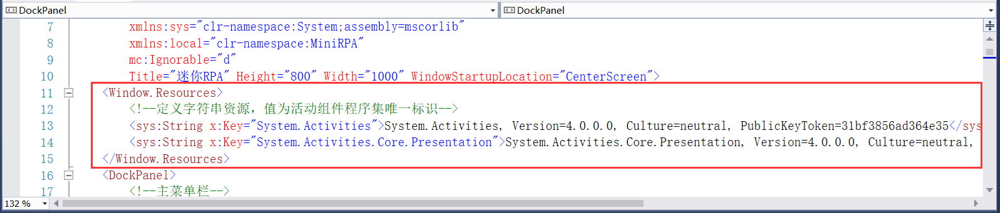

## 3.4 系统组件显示

此RPA项目的组件将介绍如何显示系统自带的组件，像While、Do While、If等组件。具体组件显示步骤如下：

1、在xaml文件中引入System.Activities.Presentation.Toolbox和System的命名空间，输入xmlns:然后为此取名称再从提示框中引入即可，如图3.4-1所示。

图3.4-1 引入命名空间	

2、系统自带的组件名称默认全为英文，如果想更改为中文这里就要定义资源，这里定义System.Activities和System.Activities.Core.Presentation，其中后者为状态机使用程序集，如图3.4-2所示。定义的资源值为活动组件程序集的唯一标识，其中唯一标识可以通过代码来获取，代码如图3.4-3所示，输出的结果如图3.4-4所示。

图3.4-2 定义资源

图3.4-3 获取程序集唯一标识

图3.4-4 唯一标识

3、显示系统组件，至于要添加系统的哪些组件，在引入的程序集 System.Activities右键----》在对象浏览器中查看，如图3.4-5所示。系统中的组件基本上大部分都可以在System.Activities.Statements中找到，但是状态机的相关组件结束状态FinalState是在System.Activities.Core.Presentation中，系统组件显示如图3.4-6所示。其中需要注意的是，有些组件使用的时候需要选择参数类型，像组件Switch<T>如图3.4-7所示，在xaml文件中的写法如图3.4-8所示。

图3.4-5 查看对象

图3.4-6 系统组件显示

图3.4-7 选择参数类型的组件

图3.4-8 xaml中选择参数类型组件

4、其他系统组件的添加方式同理，添加完系统组件的界面如图3.4-9所示。

图3.4-9 系统组件显示

5、组件使用方法就是选中组件拖拽到设计面板中的Sequence中，如图3.4-10所示。

图3.4-10 组件使用

## links
   * [目录](<preface.md>)
   * 上一节: [序列图、流程图和状态机的实现](<03.3.md>)
   * 下一节: [XAML文件的打开、保存和另存为](<03.5.md>)