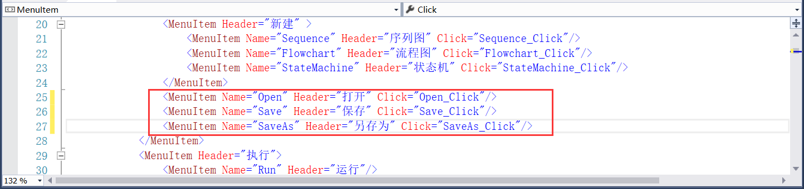
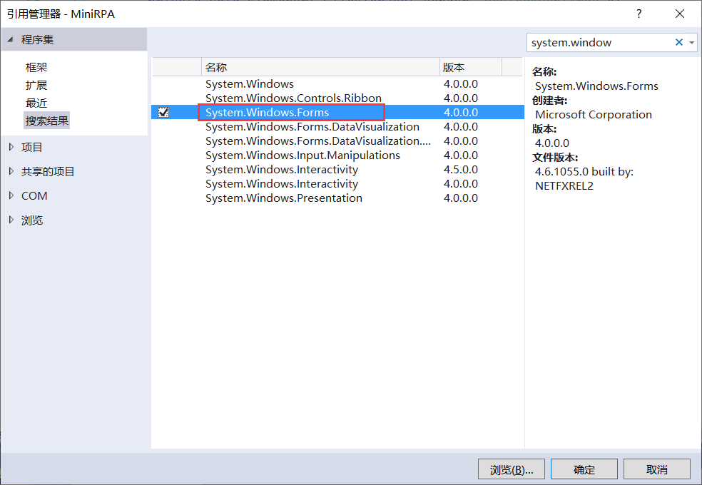
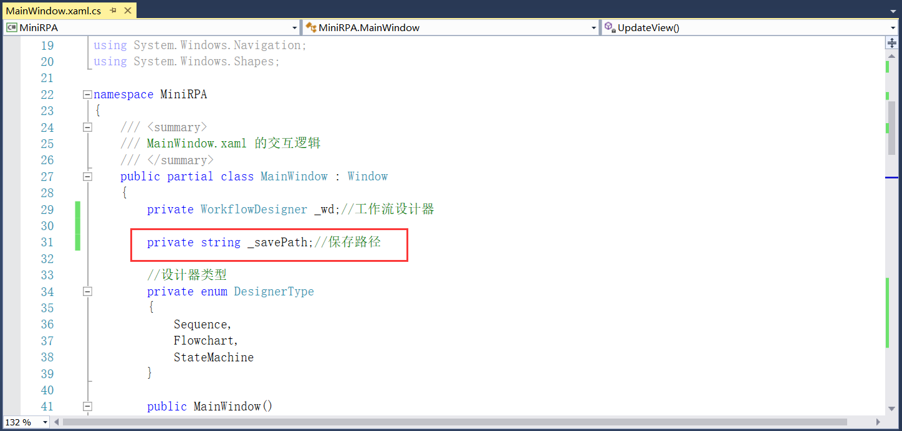
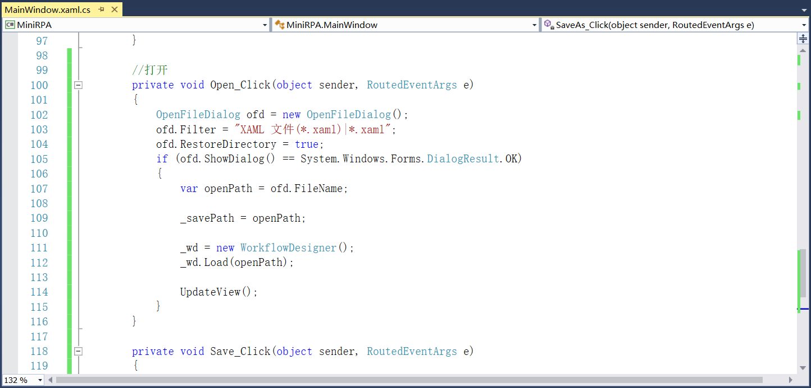
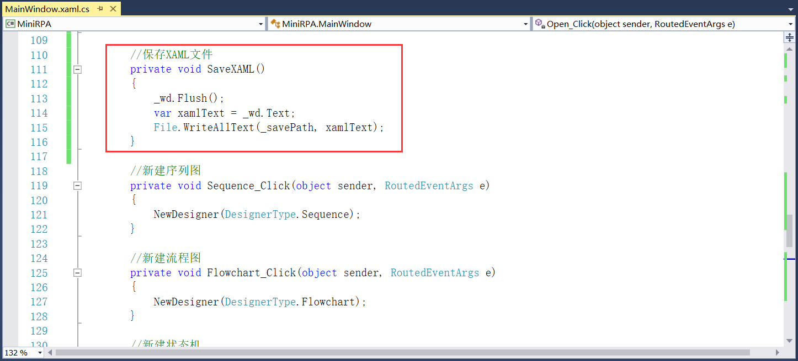
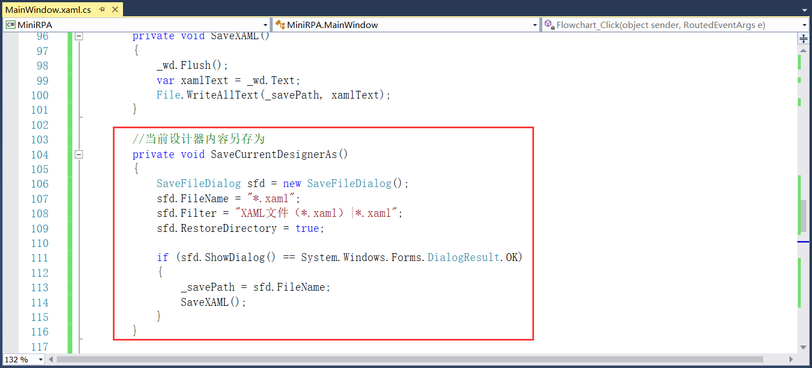
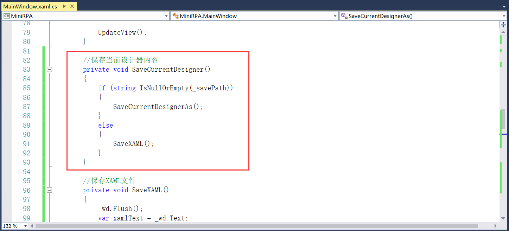
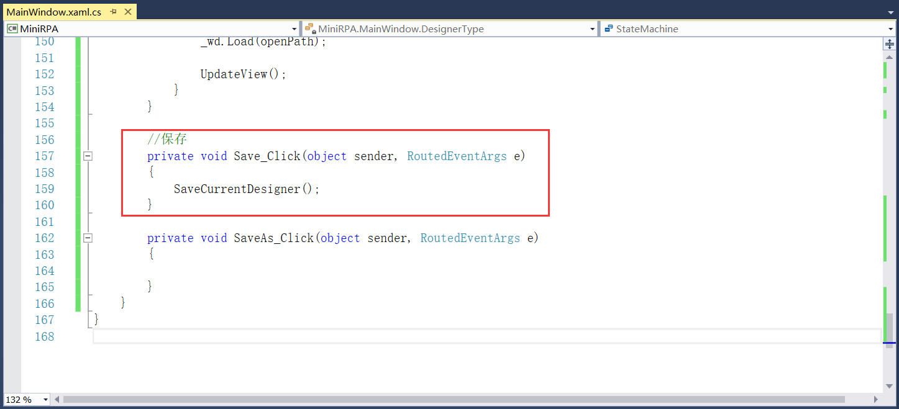
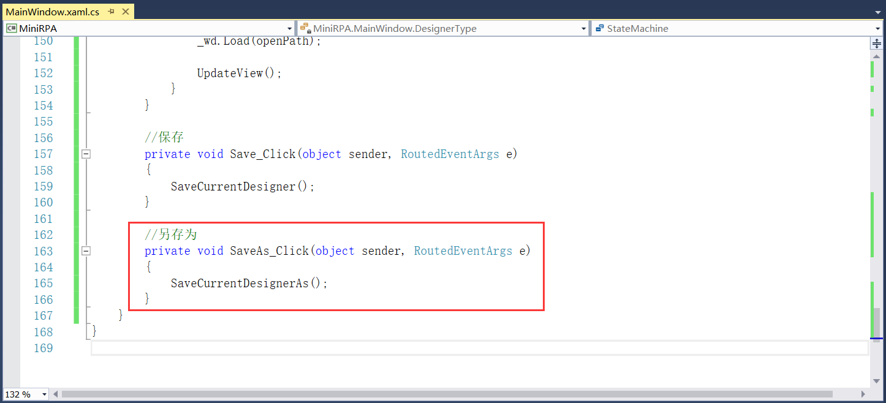
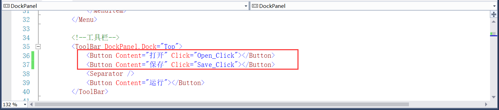

## 3.5 XAML文件的打开、保存和另存为

菜单栏中的打开、保存功能和工具栏中的打开、保存功能一样，在写Click事件直接复用即可。

1、在xaml文件中添加打开、保存和另存为的Click事件，如图3.5-1所示。

图3.5-1 添加Click事件

2、打开功能。

（1）打开文件需要用到System.Windows.Forms程序集，添加程序集如图3.5-2所示。

图3.5-2 添加引用

（2）定义全局保存路径的字段，后续保存和另存为会用到，如图3.5-3所示，

图3.5-3 定义路径字段

 （3）设计器中打开的是xaml文件，且打开一个文件后要更新视图，代码如图3.5-4所示。

图3.5-4 打开

3、保存功能。

如果运行程序后直接点击保存，而不是打开了一个xaml文件再点击保存，那么此时保存文件是没有路径的，无法进行，这时候保存就变成了另存为。如果路径为空时点击保存就等同于是另存为，如果有路径的话就直接保存文件即可。

（1）先写路径不为空时保存文件的方法，如图3.5-5所示。

图3.5-5 路径不为空时保存

（2）接着就是文件另存为的方法，另存为时也要保存当前的xaml文件，如图3.5-6所示。

图3.5-6 文件另存为

（3）根据路径是否为空分为两种情况，结合这两种情况代码如图3.5-7所示。

图3.5-7 保存当前设计器内容

（4）保存文件的Click事件如图3.5-8所示。

图3.5-8 保存的Click事件

4、另存为功能。
  直接调用我们上述步骤写的另存为方法即可，如图3.5-9所示。

图3.5-9 另存为

5、工具栏的打开、保存功能，直接复用上述的事件即可，如图3.5-10所示。

图3.5-10 工具栏打开和保存

## links
   * [目录](<preface.md>)
   * 上一节: [系统组件显示](<03.4.md>)
   * 下一节: [工作流运行和输出](<03.6.md>)