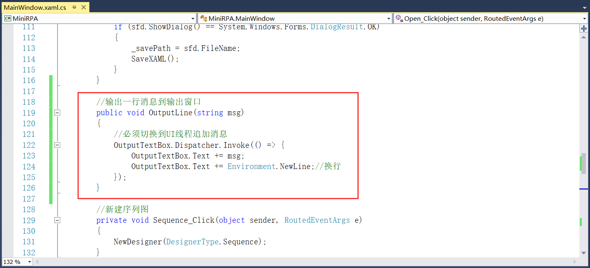

## 3.6 工作流运行和输出

菜单栏下的运行和工具栏中的运行为同一功能，一个实现另一个直接复用即可。运行流程时，需要先清空输出面板的内容，然后打印“工作流执行开始”日志，接着就是校验工作流是否有错误，如有错误则输出错误信息，工作流执行完成时再打印“工作流执行结束”日志。	

1、在xaml文件中为运行添加Click事件，如图3.6-1所示。

图3.6-1 添加Click事件

2、先写输出消息到输出窗口的方法，如图3.6-2所示，其中OutputTextBox为输出窗口的Name。

图3.6-2 输出消息

3、接下来就是工作流在运行过程中出现异常的消息输出处理，如图3.6-3所示。

图3.6-3 异常信息

4、工作流执行结束时的消息输出，如图3.6-4所示。

图3.6-4 工作流结束信息

5、除了这些输出信息以外，系统组件中的输出行WriteLine需要重定向输出到输出面板，此组件的部分源码如图3.6-5所示。源码中根据GetExtension重定向，如果不进行重定向，TextWriter为空会执行Console.Out。本章所新建的RPA项目为Windows应用程序，如不进行重定向时，可修改为控制台应用程序，修改方法为：项目右键----》属性----》应用程序，如图3.6-6所示。

图3.6-5 WriteLine源码

图3.6-6 控制台应用程序

6、执行工作流的功能实现如图3.6-7所示（没有重定向WriteLine组件、项目输出类型为控制台应用程序）。

图3.6-7 运行功能（WriteLine没有重定向）

7、重新编译程序，点击运行，然后将组件输出行拖拽到设计面板，填写“测试”然后点击界面上的执行，工作流开始运行，输出窗口输出开始和结束的日志，如图3.6-8所示。而此时输出的内容没有显示在输出面板，在程序运行的黑窗口中，如图3.6-9所示。或者直接在输出行WriteLine组件的属性中TextWriter中填写System.Console.Out效果是一样的。

图3.6-8 输出行

图3.6-9 输出的信息

8、但为了方便使用我们更希望输出行WriteLine组件的输出信息到输出窗口，此时我们就需要对组件进行重定向。现需要新建一个类RedirectToOutputTextWriter，继承自TextWriter，且字符集编码为UTF8，再重写WriteLine方法，如图3.6-10所示。

图3.6-10 重定向

9、在执行功能的代码中进行重定向，如图3.6-11所示。

图3.6-11 WriteLine重定向

9、此时就完成了对组件的重定向，输出信息会输出到输出窗口，将RPA项目再修改回Windows应用程序，重新进行编译运行，组件输出效果如图3.6-12所示。

图3.6-12 重定向后输出效果

## links
   * [目录](<preface.md>)
   * 上一节: [XAML文件的打开、保存和另存为](<03.5.md>)
   * 下一节: [变量面板](<03.7.1.md>)