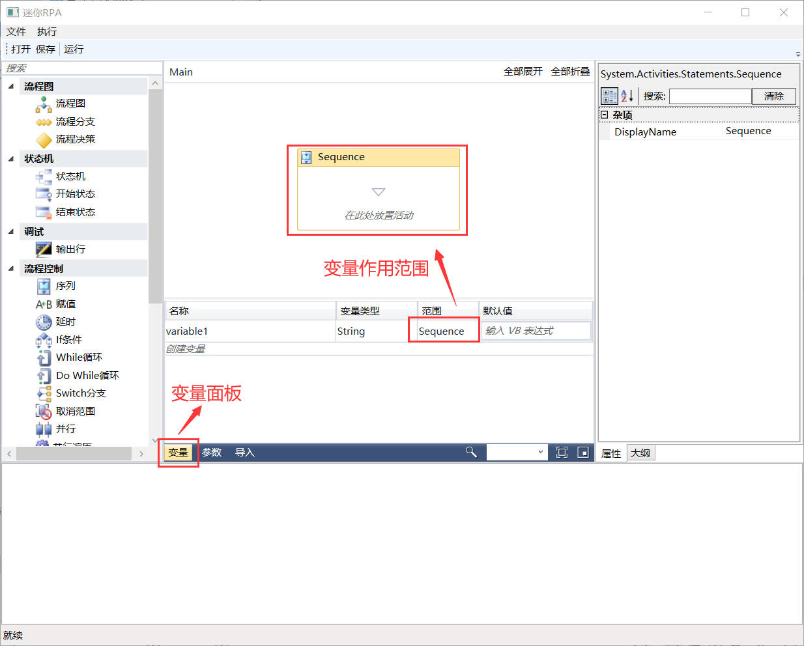
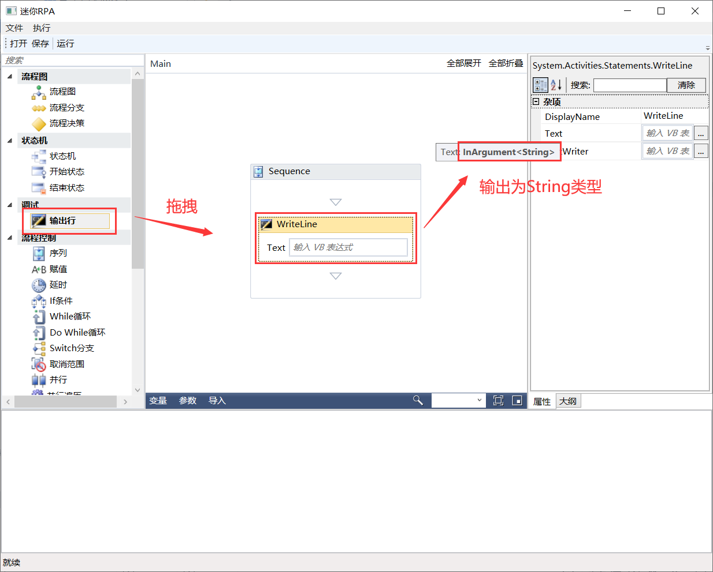
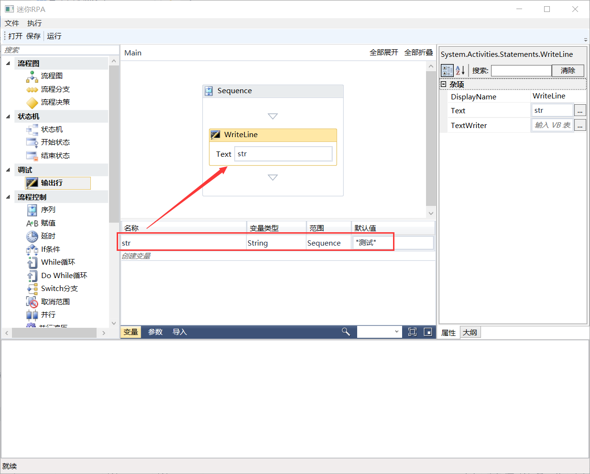
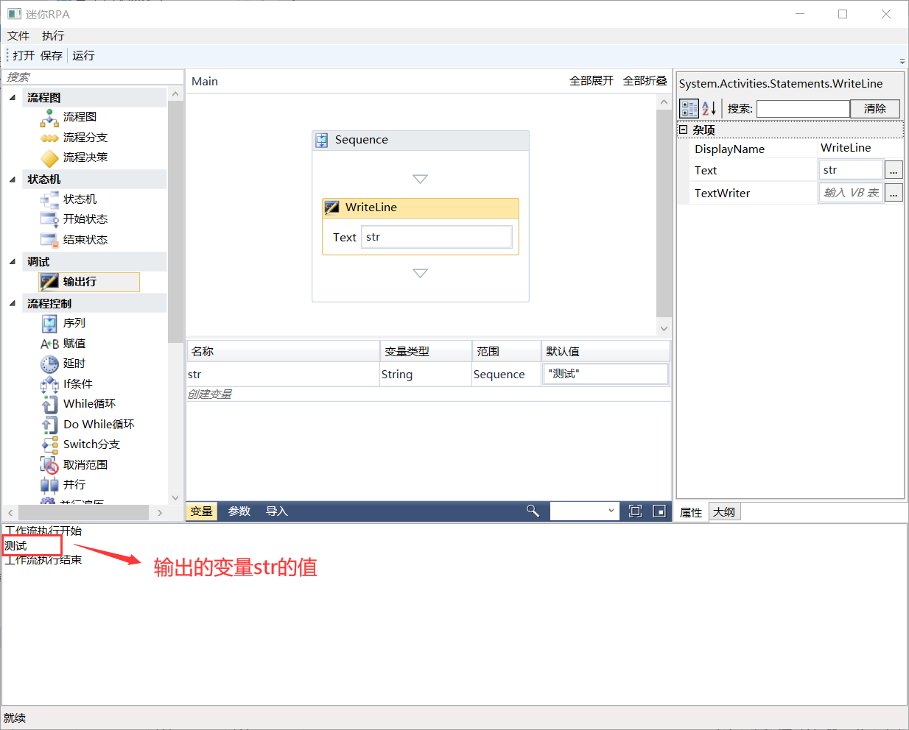

## 3.7.1 变量面板

变量主要用于存储数据，它在RPA中扮演重要的数据传递角色，是RPA编程不可或缺的一部分。由变量名称、变量类型、范围和变量的值组成，变量的值支持多种数据类型，包括文本、数字、数据表、时间和日期、UiElement到任何.Net变量类型。常用变量类型如下：

◆ boolean（布尔值）类型：用于存储true或者false变量，主要用于判断做出决策，从而更好的控制流程。

◆ int32（整数）类型：主要用于存储数字信息。主要用于执行方程式后者比较，传递重要数据。

◆ string（字符串）类型：用于存储文本信息。注意：RPA-IPA中的所有字符串都必须放在双引号之间。

◆ object（对象）类型：即通用类型，用于存储任意类型的信息。

◆ Array of [T]变量：主要存储相同类型的多个值。

◆ Datetime（日期时间）变量：用于存储有关任何日期和时间的信息。

◆ DataTable（数据表）变量：用于存储二维数据结构的DataTable数据，具有行和列的属性。

◆ 更多······

◆ 注意：其中List<T>类型需要进行初始化，格式为List<of T>，在变量的默认值处进行初始化即可。

一般变量名称的前缀带类型的简写，如字符串变量前缀带str，整数变量前缀带i，格式为：类型的简写+变量属性或者动作。变量范围：变量可用的区域即作用域，例如特定活动，默认情况下它们在整个项目中都可用。默认值：变量的默认值。如果此字段为空，则变量将使用其类型的默认值进行初始化，例如对于Int32，默认值为0，变量面板如图3.7.1-1所示。

图3.7.1-1 变量面板

具体使用步骤如下：

（1）添加输出行组件，将此拖拽到设计面板，选中此组件可以看到属性中的Text为String类型，如图3.7.1-2所示。

图3.7.1-2 组件属性

（2）我们可以直接把内容用双引号括起来，也可以通过变量的方式将此值输出到输出窗口，这里介绍下通过变量的方式来输出。首先需要创建一个变量，取名为str并且变量类型为String，默认值为”测试”，再把str变量填至组件的Text属性，如图3.7.1-3所示。

图3.7.1-3 String类型变量

（3）点击运行即可查看输出内容，如图3.7.1-4所示。

图3.7.1-4 运行

（4）其他类型的变量使用方法同上述一致。

## links
   * [目录](<preface.md>)
   * 上一节: [工作流运行和输出](<03.6.md>)
   * 下一节: [参数面板](<03.7.2.md>)