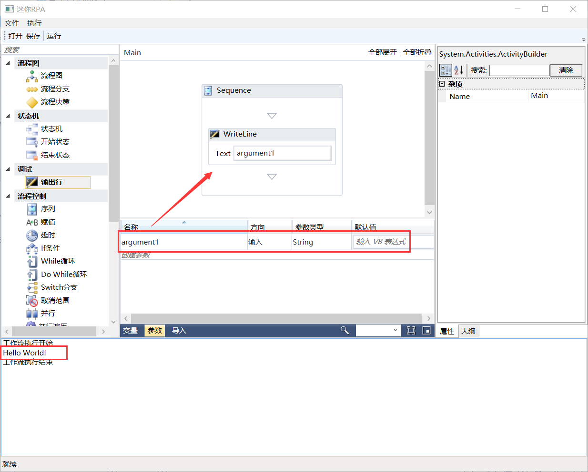

## 3.7.2 参数面板

用于将数据从一个流程文件传递到另一个流程文件。在全局意义上，它们类似于变量，因为它们动态地存储数据并传递给它。变量在活动之间传递数据，而参数在自动化之间传递数据。因此，它们使你能够一次又一次地重用自动化。

1、参数有指定的传递方向（输入、输出、输入/输出、属性），它告诉应用程序存储在它们中的信息应该放在哪里。

但在此项目中还未引入子流程，这里先简单介绍参数的使用，需要在运行工作流时添加参数传值的代码，如图3.7.2-1所示。

图3.7.2-1 参数传值

2、重新进行编译，运行程序，参数创建方法与变量使用类似，不同的地方是多了方向的选择以及没有了范围可言。现创建一个输入的参数并赋值，点击运行后结果如下，如图3.7.2-2所示。

图3.7.2-2 输入方向参数

3、创建一个输出的参数在现有的RPA项目与输入效果一样，输出类型的参数不可直接设置默认值，可以使用赋值组件进行赋值。除了这种输入赋值方法外，还可通过代码直接赋值，如图3.7.2-3所示，将argument1参数赋值为Hello World！。

图3.7.2-3 代码参数赋值

4、重新编译程序后运行，创建一个argument1的参数，不需进行赋值，方向输入或输出，点击运行结果如图3.7.2-4所示。

图3.7.2-4 代码参数输出

## links
   * [目录](<preface.md>)
   * 上一节: [变量面板](<03.7.1.md>)
   * 下一节: [导入面板](<03.7.3.md>)