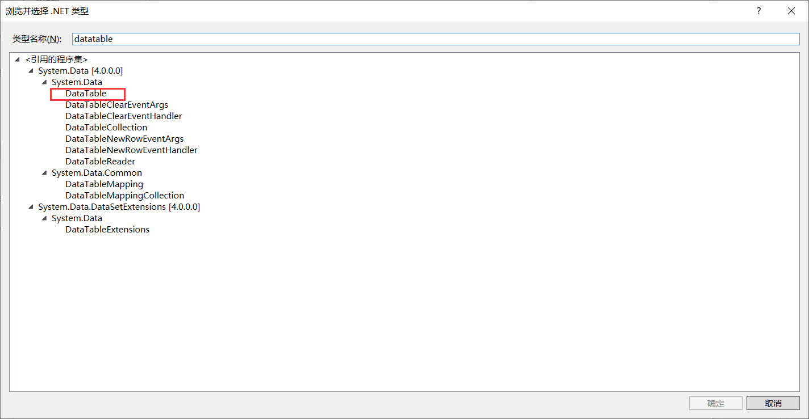
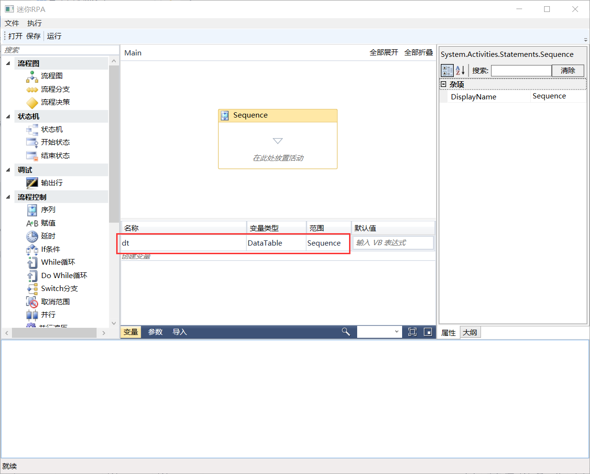
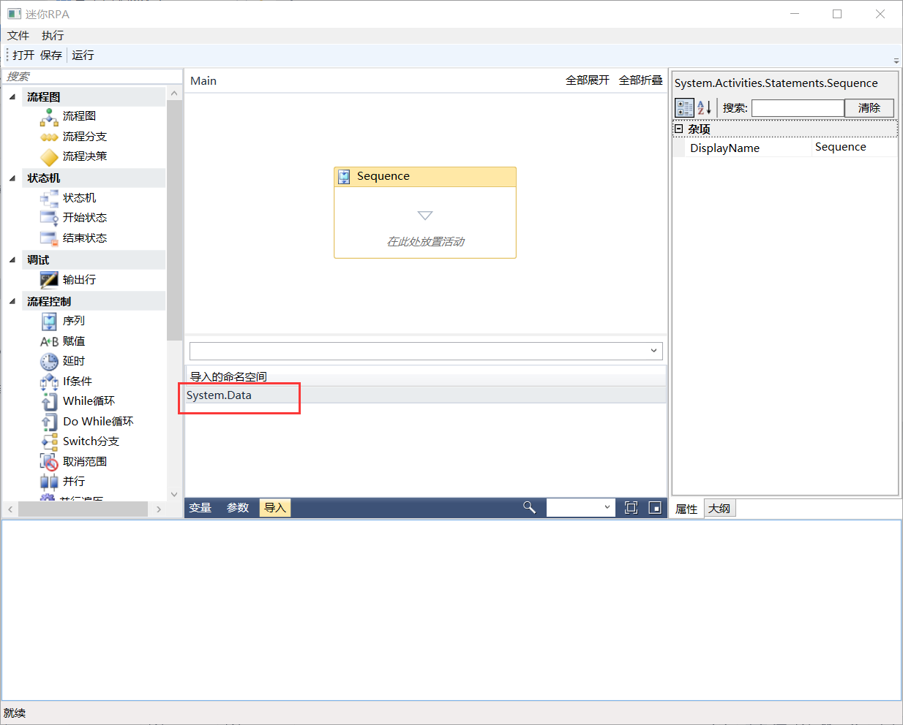
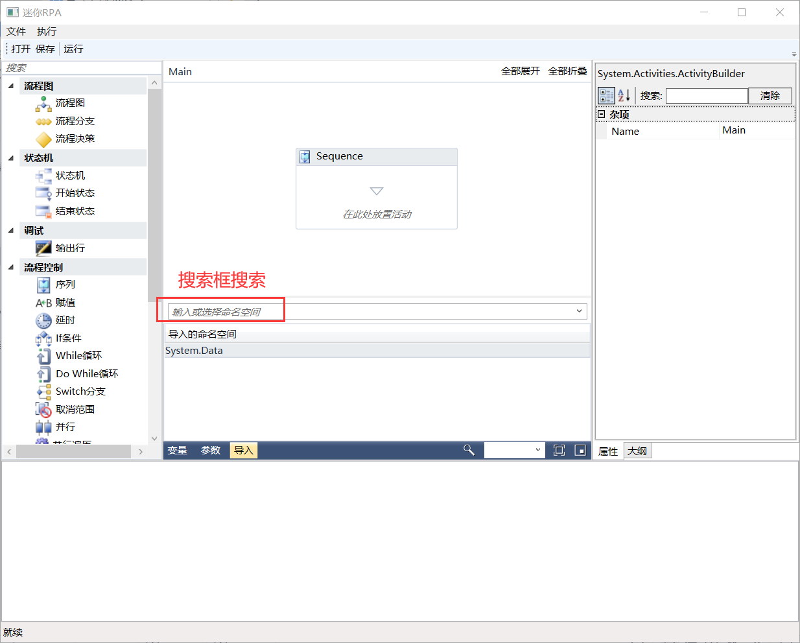

## 3.7.3 导入面板

1、导入面板中，在搜索框中输入关键字搜素相应的命名空间以导入命名空间，目的是为了使用.Net库中的各种变量类型和函数。例如创建一个Datatable类型的变量，变量类型----》浏览类型----》搜索Datatable，如图3.7.3-1所示，并且需要的System.Data的命名空间会自动导入。

图3.7.3-1 Datatable类型变量

2、创建好的变量如图3.7.3-2所示。

图3.7.3-2 变量

3、自动导入的所需要的命名空间如图3.7.3-3所示，如果需要导入其他的命名空间，可直接在导入面板的搜索框中搜索，然后会出现下拉列表进行选择即可，如图3.7.3-4所示。

图3.7.3-3 自动导入命名空间

图3.7.3-4 选择命名空间

## links
   * [目录](<preface.md>)
   * 上一节: [参数面板](<03.7.2.md>)
   * 下一节: [设计器中使用语法----VB.Net语法](<03.8.md>)