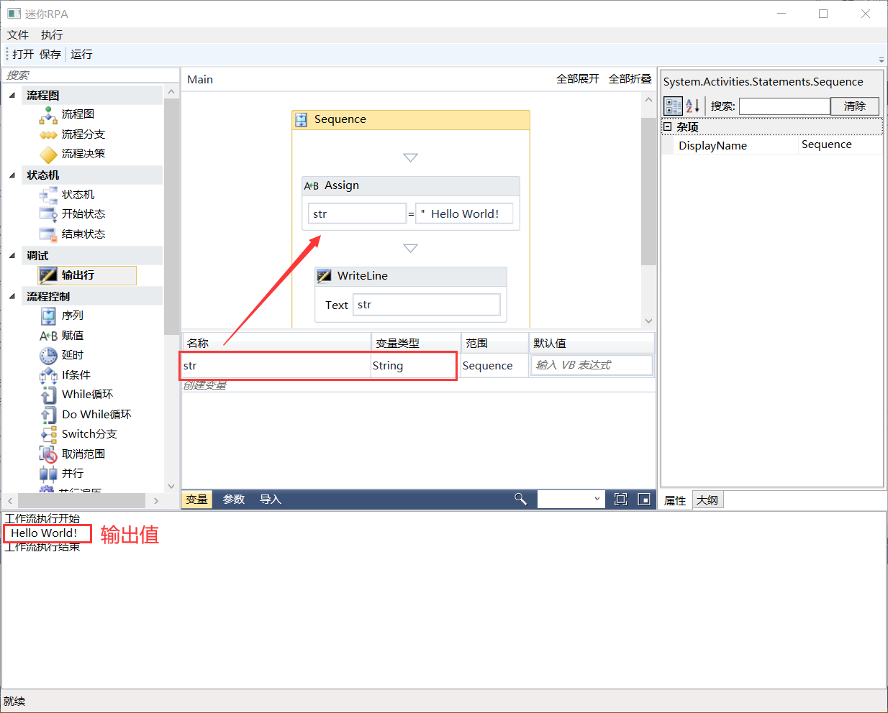
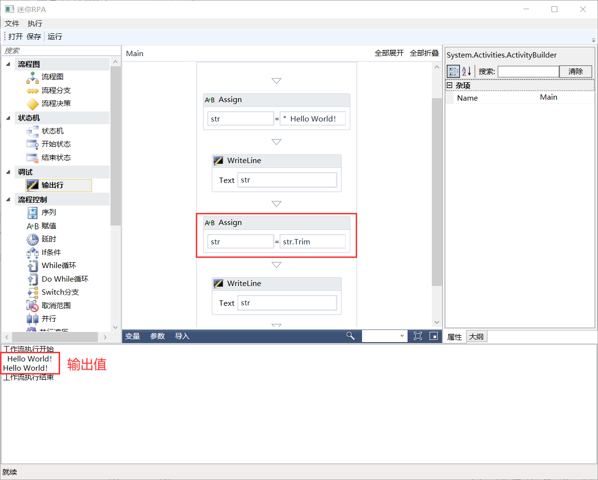
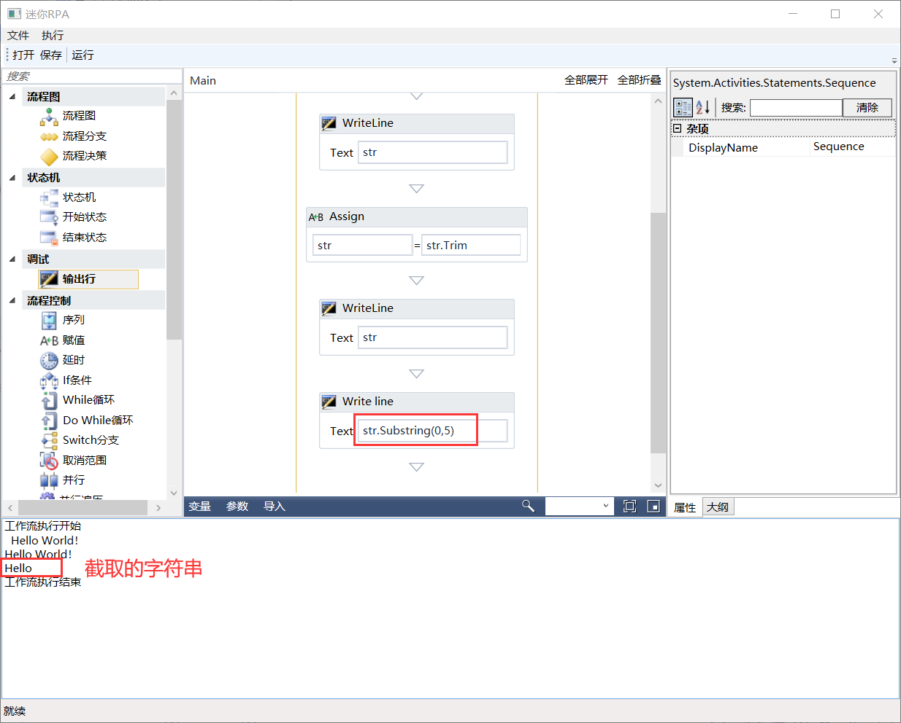
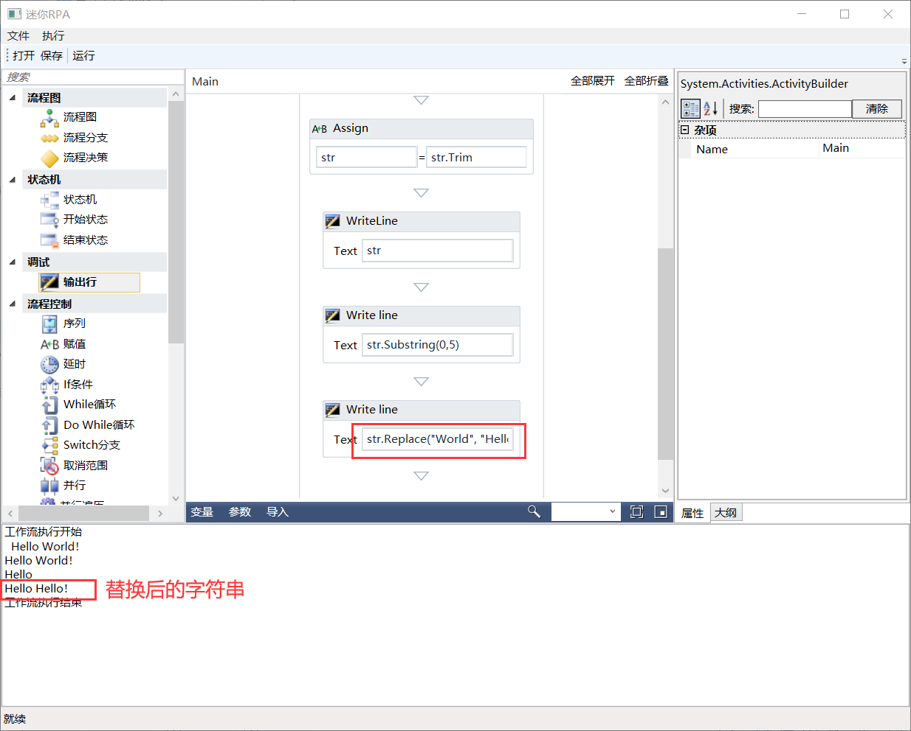

## 3.9 操作练习

现构造这样一个功能的流程，有一个string类型的变量，赋值为"  Hello World!  "，并且在为其去掉前后空格，接着再截取出Hello字符串，最后将World在替换成Hello，实现步骤如下：

（1）创建一个string类型的变量，可以使用赋值组件进行赋值，并且使用输出行组件打印查看，如图3.9-1所示。

图3.9-1 str赋值

（2）为字符串去除前后空格可以使用Trim语法，如图3.9-2所示。

图3.9-2 去除空格

（3）截取字符串时可以使用Substring截取，如图3.9-3所示。

图3.9-3 截取字符串

（4）替换字符串内容可以使用Replace函数，如图3.9-4所示。

图3.9-4 替换字符串

（5）以上就是一个简单的流程设计了，赶快动手试试吧！

## links
   * [目录](<preface.md>)
   * 上一节: [设计器中使用语法----VB.Net语法](<03.8.md>)
   * 下一节: [为什么要用MVVM](<04.1.md>)