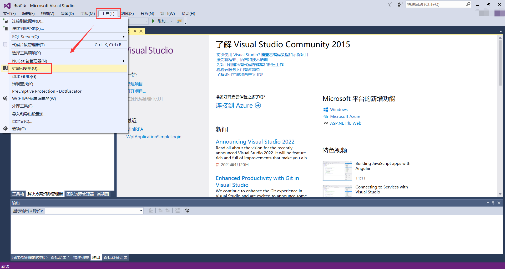
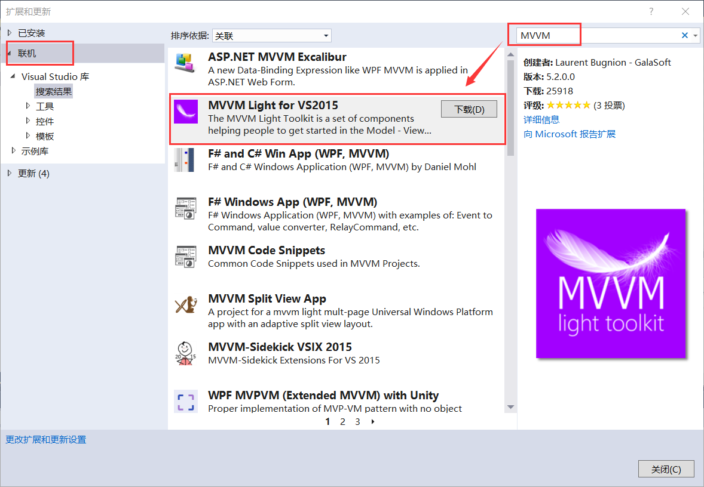
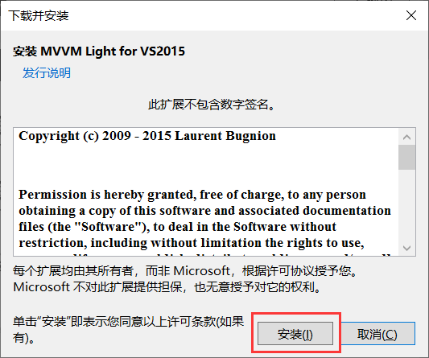
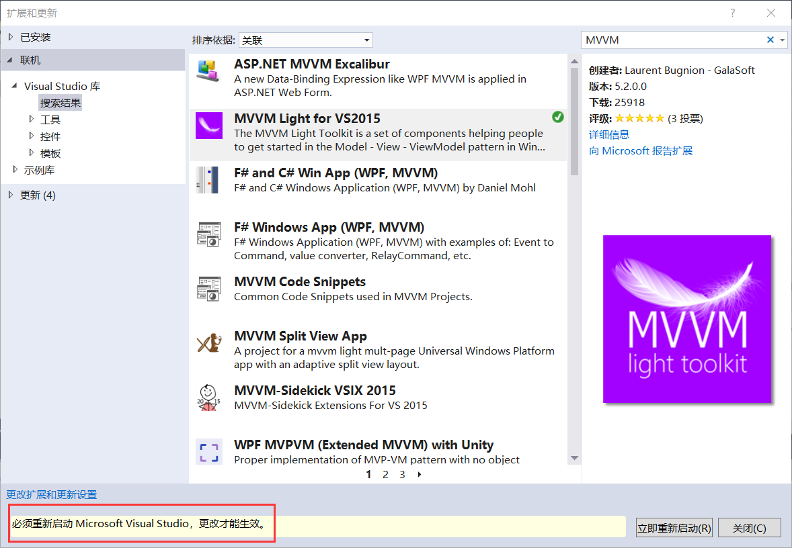
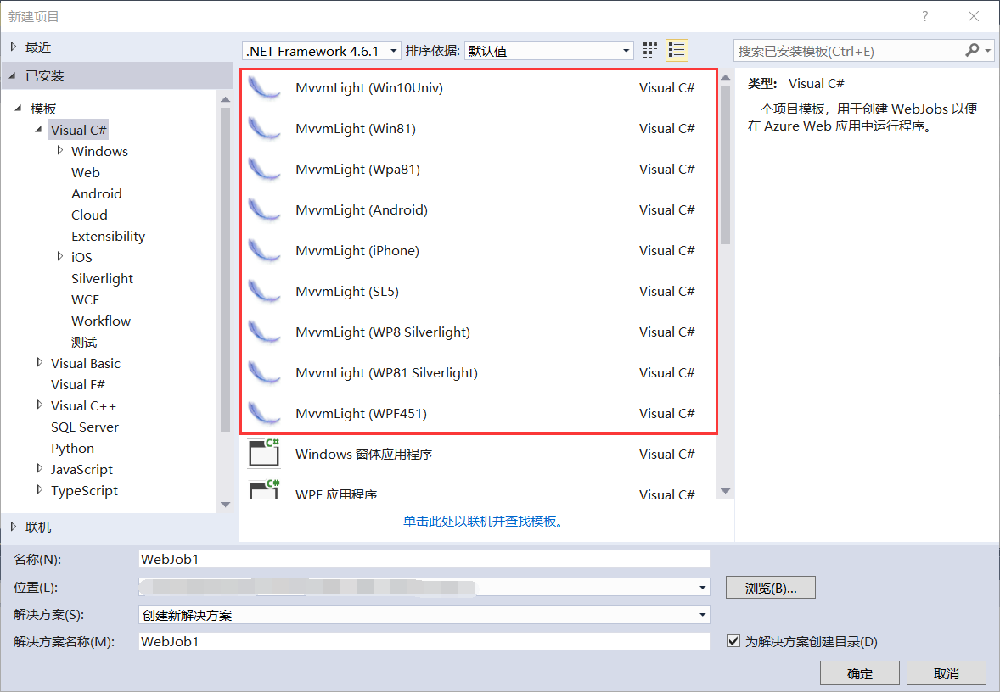

## 4.2 引入轻量级的MVVM开发框架

MVVM Light该工具包的主要目的是加速在Windows Universal、WPF、Silverlight、Xamarin.iOS、Xamarin.Android和Xamarin.Forms中创建和开发MVVM应用程序。

MVVM Light工具包可帮助我们将视图与模型分离，从而创建更清洁、更易于维护和扩展的应用程序。它还可以创建可测试的应用程序，并允许我们拥有更薄的用户界面层。该工具包特别强调了所创建应用程序的可设计性（即将用户界面打开和编辑到Blend中的能力）。

那么如何引入轻量级的MVVM的开发框架呢？详细步骤如下：

1、打开VS 2015，在菜单栏找到工具----》扩展和更新，如图4.2-1所示。

图4.2-1 扩展和更新

2、在联机栏中，搜索MVVM选择MVVM Light for VS2015，点击下载，如图4.2-2所示。

图4.2-2 安装MVVM Ligth工具包

3、加载一会继续点击安装，如图4.2-3所示。

图4.2-3 点击安装

4、安装完成以后，会有重新启动VS2015的提示，点击立即重新启动即可，如图4.2-4所示。

图4.2-4 重新启动VS 2015

5、安装完成以后，新建项目时可方便快捷的创建模板或ViewModel，安装效果如图4.2-5所示。

图4.2-5 MVVM模板列表

## links
   * [目录](<preface.md>)
   * 上一节: [为什么要用MVVM](<04.1.md>)
   * 下一节: [新建MVVM示例项目](<04.3.md>)