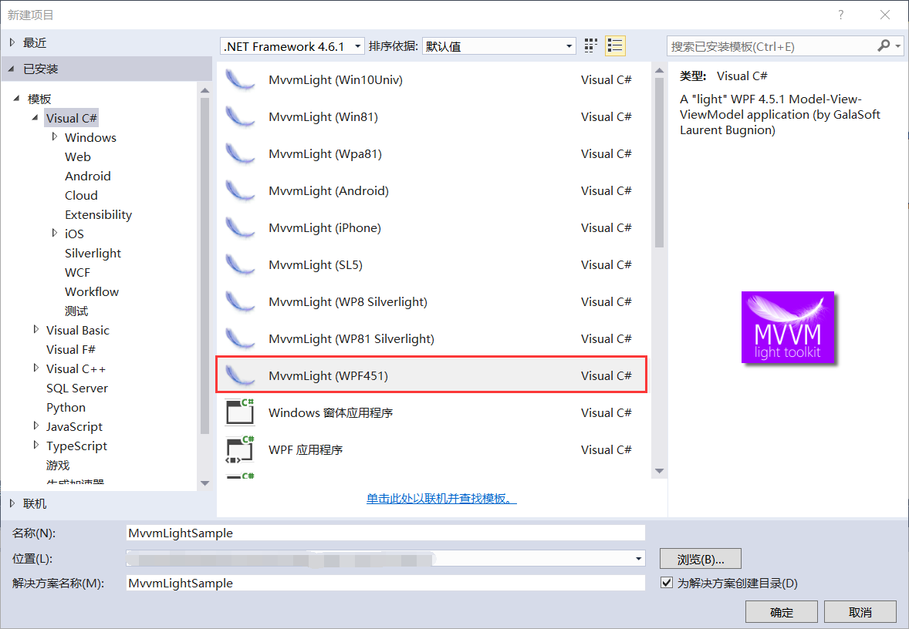
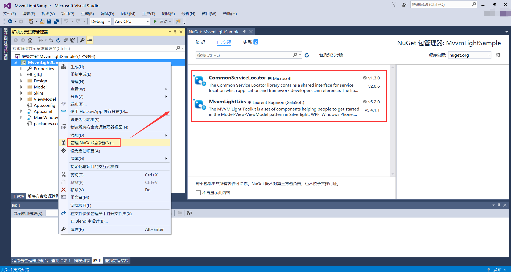
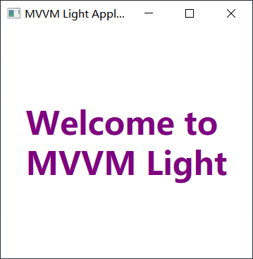

## 4.3 新建MVVM示例项目

1、新建项目，使用的为.Net Framework4.6.1，模板选择Visual C#的MvvmLigth（WPF451），选择最接近.Net4.6.1的模板来创建，设置项目的存放路径、设置应用程序名称为MvvmLightSample，然后点击确定即可完成新建项目，如图4.3-1所示。

图4.3-1 新建MVVM Ligth项目

2、由于前面已经安装了MVVM Ligth的工具包，此时新建后查看NuGet包，已经自动安装好了所用包，如图4.3-2所示。

图4.3-2 NuGet包

3、对程序进行编译，然后点击运行，效果如图4.3-3所示。

图4.3-3 MVVM界面

## links
   * [目录](<preface.md>)
   * 上一节: [引入轻量级的MVVM开发框架](<04.2.md>)
   * 下一节: [数据绑定](<04.4.md>)