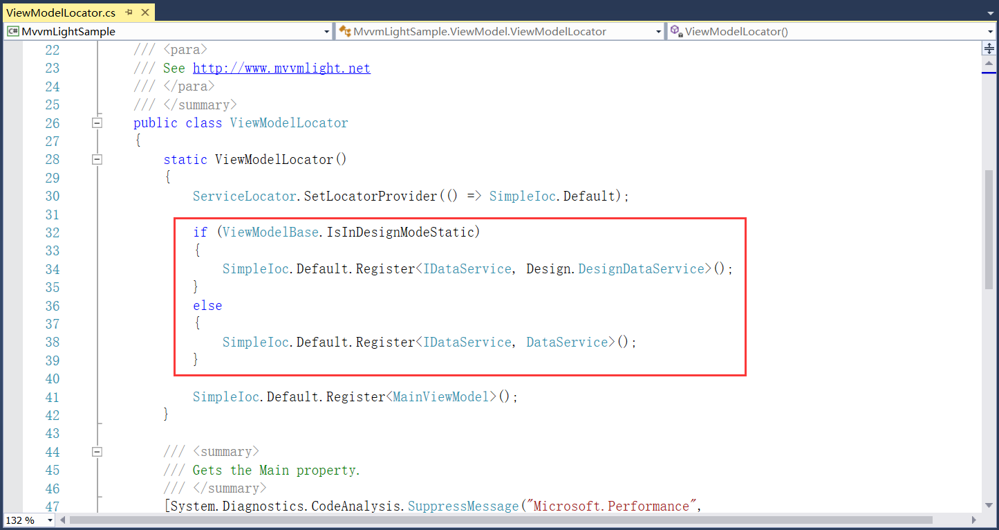

## 4.4 数据绑定

1、App.xaml里面创建了一个Locator资源，对应的是ViewModelLocator类，如图4.4-1所示。

图4.4-1 Locator资源

2、ViewModelLocator类提供ViewModel定位，如图4.4-2所示实现了MainViewModel的定位，通过简单的IOC依赖注入器来实现。

图4.4-2 ViewModel定位

3、主窗体MainWindow的DataContext数据绑定，绑定的是Locator里的Main，也就是最终绑定到的是ViewModelLocator类的Main方法，该Main方法返回的是MainViewModel类。如图4.4-3所示。

图4.4-3 数据绑定

4、如图4.4-4所示，绑定的其实就是MainViewModel。

图4.4-4 绑定的MainViewModel

5、ViewModel类的实现，如图4.4-5所示界面里的Text显示什么内容是通过ViewModel里的WelcomeTitle属性值来控制的，如图4.4-6所示。

图4.4-5 Text属性

图4.4-6 ViewModel类的实现

6、如图4.4-7所示是数据的赋值。

图4.4-7 数据赋值

7、数据赋值分为设计状态和运行状态，如图4.4-8所示

图4.4-8 设计状态和运行状态

8、在设计状态时会绑定数据源到DesignDataService，这个服务类里将值赋为Welcome to MVVM Light [design]，如图4.4-9所示。所以在设计状态时我们看到的是如图4.4-10所示的样子。

图4.4-9 数据赋值

图4.4-10 设计状态

9、在运行状态时，通过IOC来将绑定数据源到DataService，在这个服务类里将值赋为Welcome to MVVM Light，如图4.4-11所示。实际运行时效果是不带[design]这个字符串的，如图4.4-12所示。

图4.4-11 数据赋值

图4.4-12 运行状态

## links
   * [目录](<preface.md>)
   * 上一节: [新建MVVM示例项目](<04.3.md>)
   * 下一节: [代码片段](<04.5.md>)