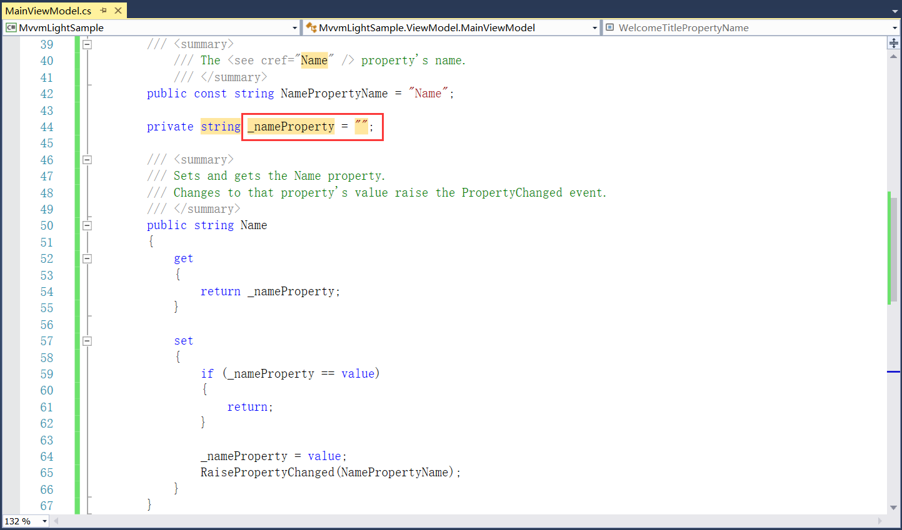

## 4.5 代码片段

1、安装MVVM LIGHT的VS扩展插件时，代码片段管理器中会有相应的代码片段，如图4.5-1所示。主要用到的就mvvmipc和mvvmrelay等，如图4.5-2所示。

图4.5-1 代码片段管理器

图4.5-2 代码片段

2、代码片段快速生成属性或命令，比如我们想生成一个Name属性，通过设置该Name属性来改变界面的显示。在MainViewModel直接敲mvvmi，然后tab键选择第一个mvvmipc，如图4.5-3所示。

图4.5-3 代码片段快速生成属性

3、接着再敲一次tab键可快速自动生成属性，如图4.5-4所示。

图4.5-4 生成属性

4、再把属性名修改为Name，然后点击空白处或者敲tab键完成属性名的修改，如图4.5-5所示。

图4.5-5 属性名修改

5、将此属性类型修改为string类型，点击空白处或者敲tab键完成类型的修改，如图4.5-6所示。

图4.5-6 类型修改

6、然后再将其改成友好的名字_nameProperty，点击空白处或按tab键，最后将false改为空字符串即可完成整个属性的定义，如图4.5-7所示。

图4.5-7 名称和值的修改

7、同理，按钮类的事件处理也是类似语法，比如mvvmrelay，输入mvvmr，如图4.5-8所示。然后敲两下tab键，生成事件处理命令，如图4.5-9所示。Mvvmrelay有多个不同的选择，有带参数，有不带参数的，可根据需要灵活运用。

图4.5-8 输入mvvmr

图4.5-9 生成的事件

## links
   * [目录](<preface.md>)
   * 上一节: [数据绑定](<04.4.md>)
   * 下一节: [创建WPF项目](<04.6.0.md>)