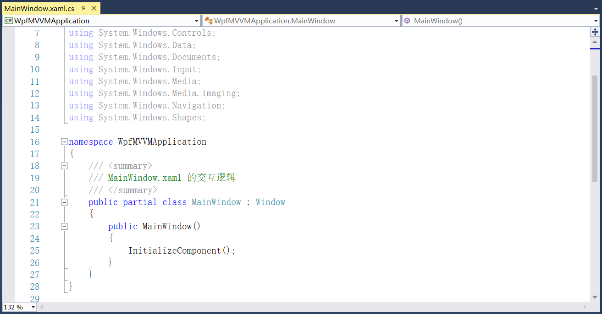
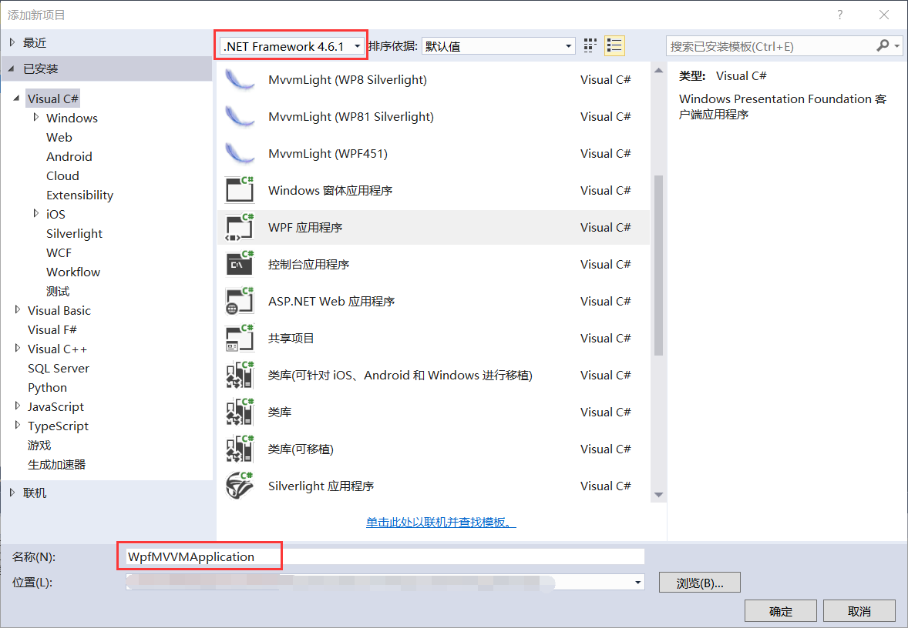
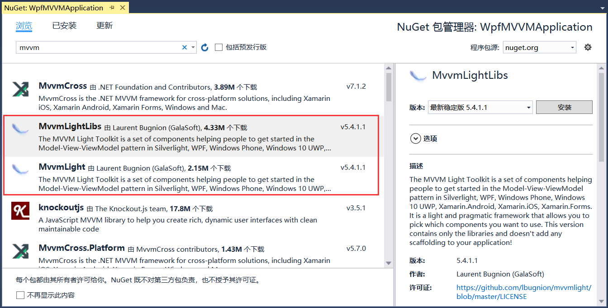
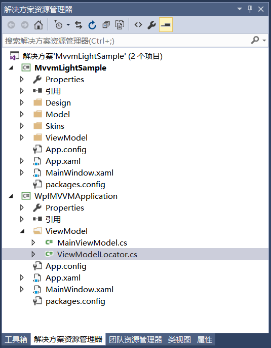
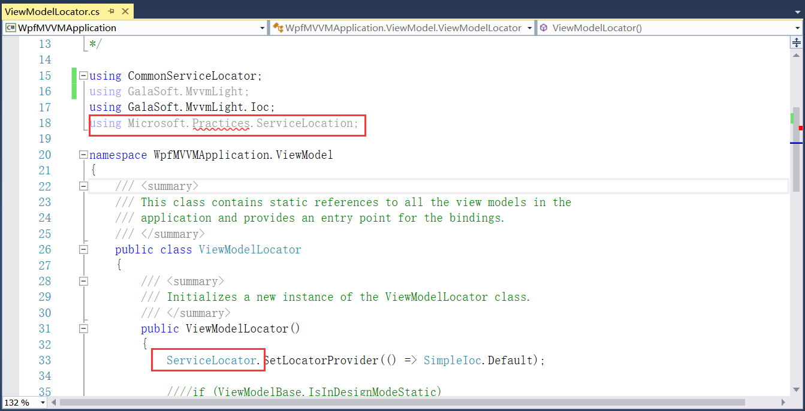
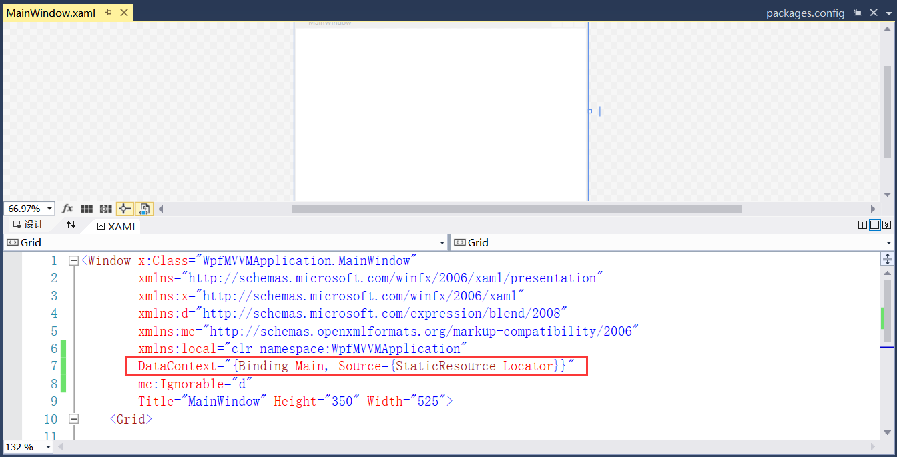
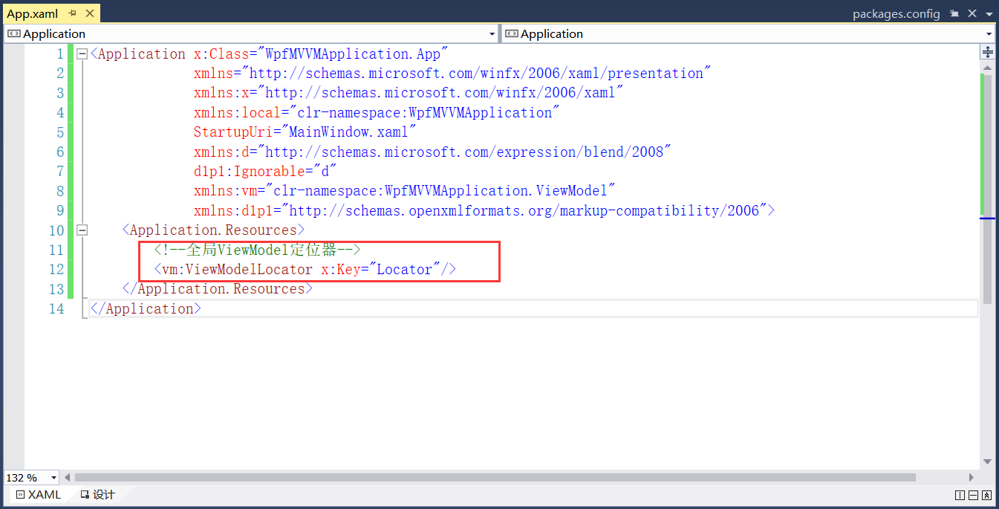
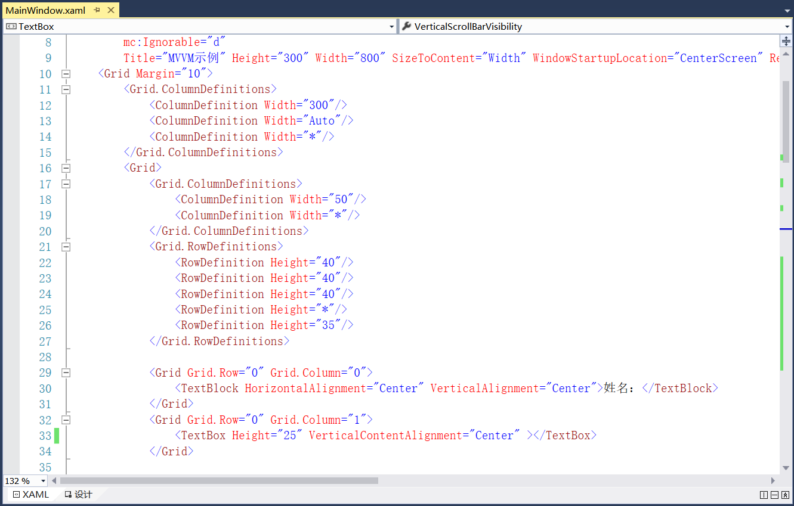
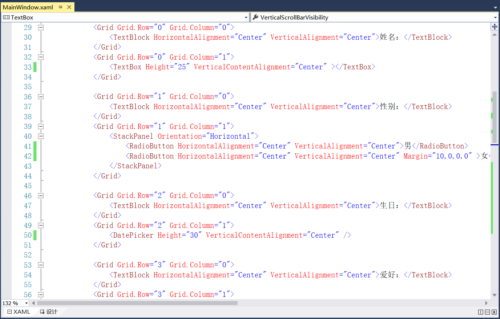
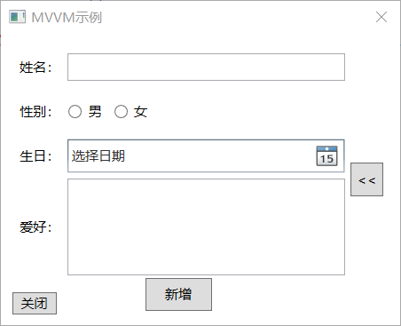

## 4.6 创建WPF项目

新建WPF应用程序项目，通过引用MVVM示例中App.xaml以及MainViewModel等来实现，并且需要安装MVVM所使用的NuGet包。如果是用MVVM方式实现界面，界面对应 的这个.xaml.cs文件理应不要自己添加任何代码，只保留VS生成的代码，这样便于后期界面变化时更换界面更容易，界面和实现彻底分离开，如图4.6-1所示。

图4.6-1 界面对应的.xaml.cs文件

1、在同一解决方案下新建WPF应用程序项目WpfMVVMApplication，选择.Net Framework4.6.1框架，如图4.6-2所示。

图4.6-2 创建项目

2、安装MVVM所使用的NuGet包，安装MvvmLightLibs和MvvmLight，如图4.6-3所示。

图4.6-3 安装NuGet包

3、安装后的项目文件如图4.6-4所示。

图4.6-4 项目文件

4、打开ViewModelLocator.cs文件，代码报错，命名空间引用using CommonServiceLocator，然后将其不使用的命名空间删掉即可，如图4.6-5所示。然后重新编译，否则App.xaml文件会报错，原因是找不到ViewModelLocator文件。

图4.6-5 文件报错问题

5、DataContext绑定，如图4.6-6所示。

图4.6-6 DataContext绑定

6、全局ViewModel定位器，可对其命名空间换行排版，如图4.6-7所示。

图4.6-7 全局ViewModel定位器

2、更改窗体Title属性以及添加可以自动调整自身大小以适应内容大小的属性SizeToContenta。在MainWindow中添加布局，总体布局整体上一分为三，左边输入姓名、性别、生日、爱好，然后可以新增此个人信息到右边的界面中，在右边界面可以对新增的信息进行搜索，中间的布局就是Button按钮（其实是两个不一样的Button按钮，只不过是在同一个位置，其中一个显示另一个就隐藏），用来控制右侧界面的展开和折叠。先来添加左边的布局，如图4.6-8和图4.6-9所示，这里展示一部分，详细布局请查看代码。

图4.6-8 布局

图4.6-9 布局

注意的是：其中TextBox这些字段进行双向绑定，并且属性添加UpdateSourceTrigger=PropertyChanged数据进行实时触发，如不添加需要将鼠标焦点移除按Enter键才可触发。中间界面的是两个Button按钮，放在同一位置，其中显示的>>不能直接这样设置内容，需要转义，可输入<<。并且在输入爱好时允许换行TextWrapping="Wrap"。

8、对程序编译运行，并将WpfMVVMApplication设为启动项目，效果如图4.6-10所示。

图4.6-10 界面展示

## links
   * [目录](<preface.md>)
   * 上一节: [代码片段](<04.5.md>)
   * 下一节: [转换器](<04.6.1.md>)