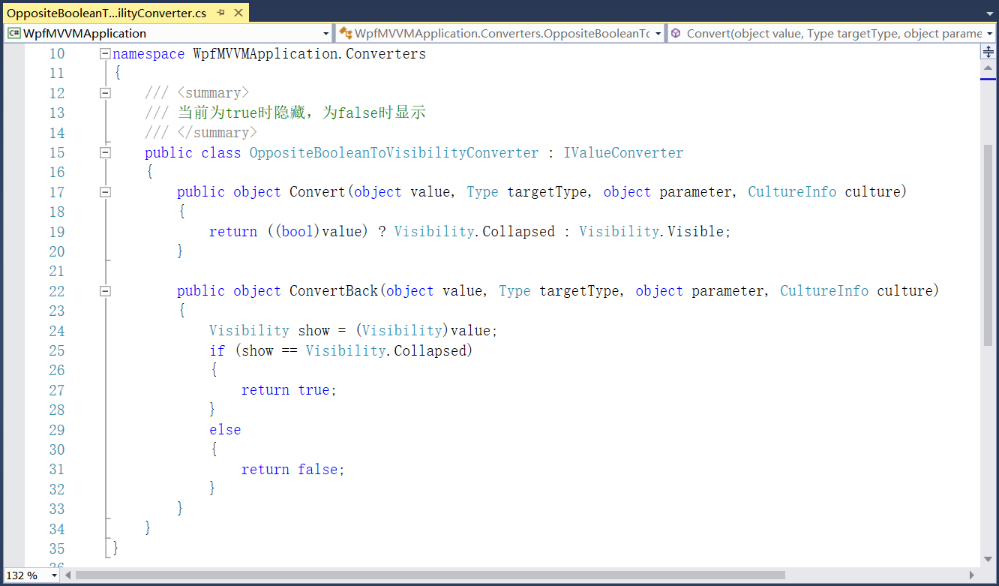
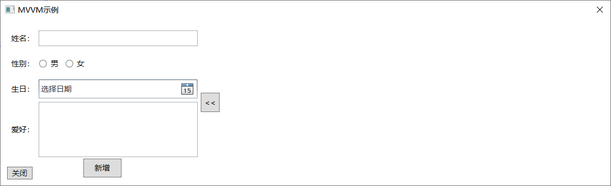

## 4.6.1 转换器

9、接着上述项目的代码继续添加转换器，为了可以将源数据和目标数据之间进行特定的转化，左侧界面和右侧界面之间的Button按钮，来实现右侧界面的下显示与折叠。

（1）首先在项目下新建新一个文件夹，文件夹下新建两个类BooleanToCollapsedVisibilityConverter和OppositeBooleanToCollapsedVisibilityConverter，这是右侧界面的展示和折叠（窗体大小跟着变化，而不是窗体大小不变内容隐藏），如图4.6-11所示。

图4.6-11 添加类

（2）这两个类即为转换器的定义，继承接口IValueConverter，如图4.6-12和图4.6-13所示。Convert是进行源属性传给目标属性的特定转化，ConvertBack是进行目标属性传给源属性的特定转化。

图4.6-12 BooleanToCollapsedVisibilityConverter转换器

图4.6-13 OppositeBooleanToCollapsedVisibilityConverter转换器

（3）显示和隐藏的事件添加，中间布局两个Button的显示与隐藏，其中一个显示另一个就隐藏。因系统自带Boolean到Visibility的转换，所以这里只需要定义Visibility到Boolean的转换，则定义转换器OppositeBooleanToVisibilityConverter，如图4.6-14所示。

图4.6-14 OppositeBooleanToVisibilityConverter转换器

（4）在App.xaml文件中定义转换器资源，如图4.6-15所示。前两个为Button按钮显示与隐藏所使用的，后两个为右侧界面的展开与折叠所使用的。

图4.6-15 App.xml中添加转换器

（5）中间界面按钮的属性定义和添加事件处理命令，如图4.6-16和图4.6-17所示。

图4.6-16 定义属性

图4.6-17 显示和隐藏搜索界面命令

（6）右侧界面的展开和折叠的的命令事件绑定，以及右侧是否显示搜索界面的命令绑定，如图4.6-18所示。

图4.6-18 命令绑定

（7）重新编译程序运行，点击中间按钮，右侧界面可显示或折叠，如图4.6-19所示。右侧界面上将继续添加搜索框以及显示新增过的人员信息。

图4.6-19 右侧页面添加

10、在右侧界面上添加ListView列为姓名、性别、生日和爱好，以及搜索框的布局，如图4.6-20所示。

图4.6-20 右侧界面的布局

11、程序重新编译运行，效果如图4.6-21所示。

图4.6-21 整体布局效果

9、整个界面就是上图所示的样子，接下来就是对数据的绑定以及事件命令。先来添加右侧界面的属性，因为添加的是ListView所以使用ItemsSource的绑定方式。先在MainViewModel中添加搜索结果的绑定，且必须使用ObservableCollection集合，如图4.6-22所示。

图4.6-22 搜索结果

12、再具体进行属性的绑定，在ViewModel文件夹下添加MvvmViewModel文件SearchItemViewModel，该类继承自ViewModelBase，如图4.6-23所示。

图4.6-23 添加SearchItemViewModel

13、添加姓名、性别、生日和爱好的属性，使用代码片段快速添加属性可参考上一小节代码片段中的讲解，添加的属性如图4.6-24所示。

图4.6-24 定义属性

14、最后就是右侧界面的属性具体绑定，如图4.6-25所示。

图4.6-25 属性绑定

15、最后就是对左侧界面的属性绑定和命令绑定。在MainViewModel中添加姓名、性别、生日和爱好属性，如图4.6-26所示，其中性别为了更方便使用，以及国际化中男女叫法不一致，属性可定义为是否为男性如图4.6-27所示。

图4.6-26 一般属性定义

图4.6-27 定义性别属性

16、接着就是属性的绑定，如图4.6-28所示。

图4.6-28 绑定属性

17、左侧界面新增按钮的事件命令，新增人员信息以后然后清空填写的信息以便录入新数据。并且如果右侧界面在搜索着信息，而新添加的信息符合搜索条件要自动显示到搜索的数据当中，所以添加完以后要重新搜索一下，如图4.6-29所示，搜索代码如图4.6-30所示。

图4.6-29 新增命令

图4.6-30 搜索

18、绑定新增命令，如图4.6-31所示。

图4.6-31 绑定新增命令

19、重新编译运行，新增一条信息，如图4.6-32所示。

图4.6-32 新增信息

## links
   * [目录](<preface.md>)
   * 上一节: [创建WPF项目](<04.6.0.md>)
   * 下一节: [事件绑定](<04.6.2.md>)