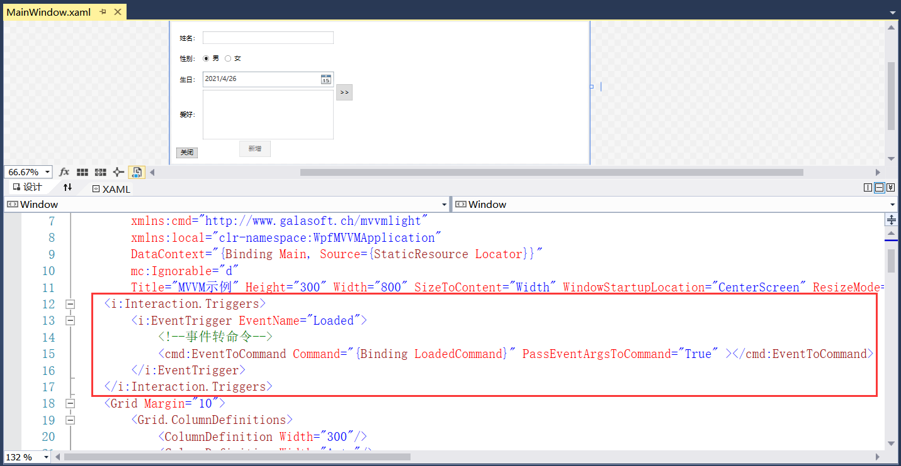
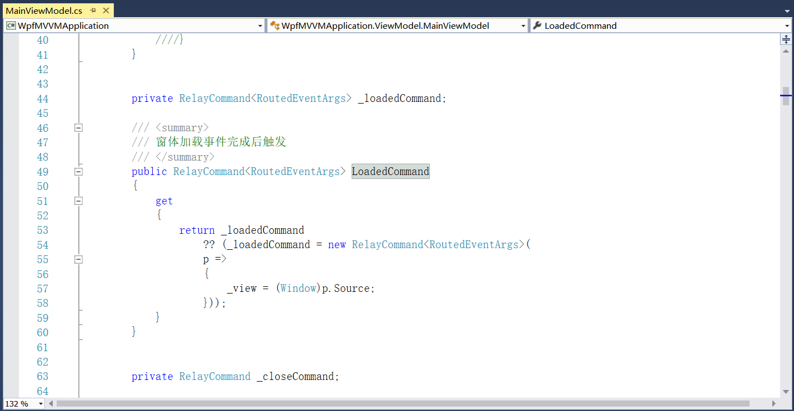
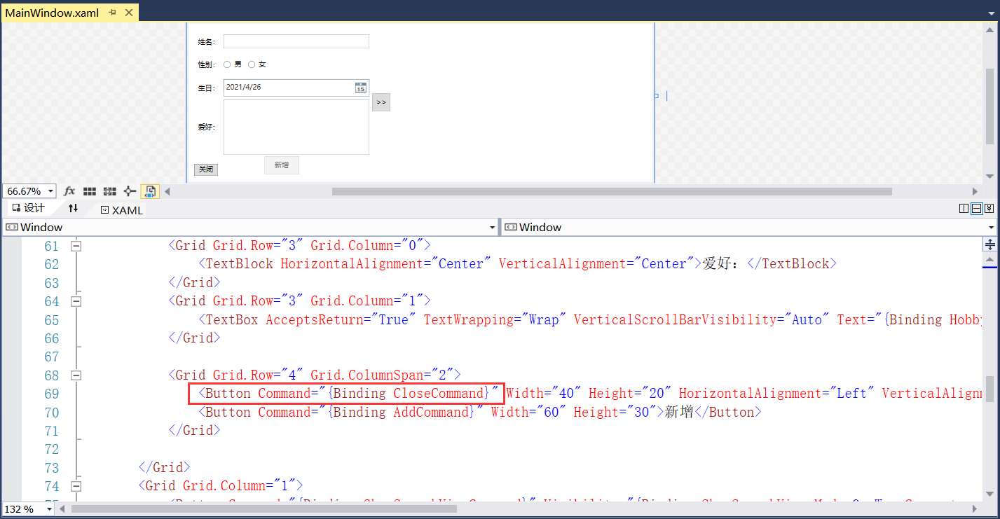
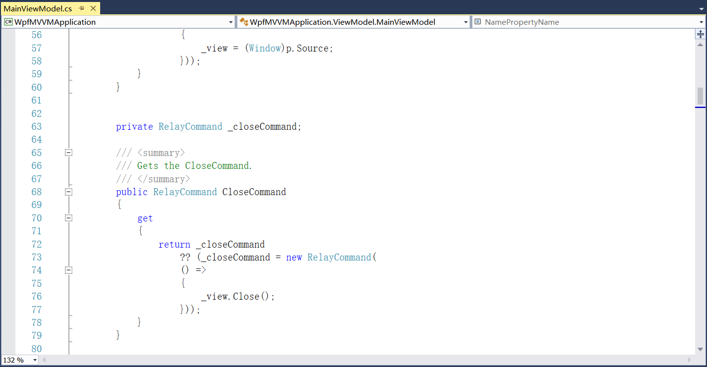

## 4.6.2 事件绑定

20、添加关闭按钮的命令，这里使用事件转换为命令，如图4.6-33所示，其为固定语法。

图4.6-33 事件转命令

21、窗体加载后的事件触发如图4.6-34所示，主要是为了后期调用Window的close方法。

图4.6-34 窗体加载后的事件触发

22、关闭按钮的命令绑定，如图4.6-35所示，实现代码如图4.6-36所示。

图4.6-35 关闭按钮命令绑定

图4.6-36 关闭命令

23、到此为止，项目就创建好了，具体相关语句可查看代码。

## links
   * [目录](<preface.md>)
   * 上一节: [转换器](<04.6.1.md>)
   * 下一节: [为什么要用IoC](<05.1.md>)