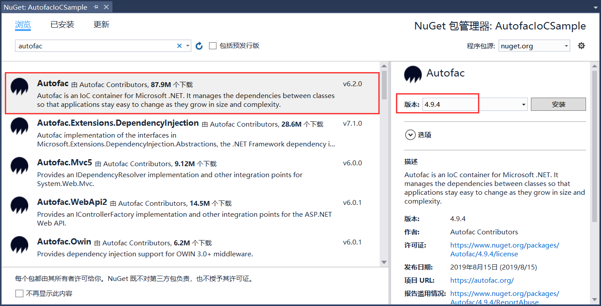
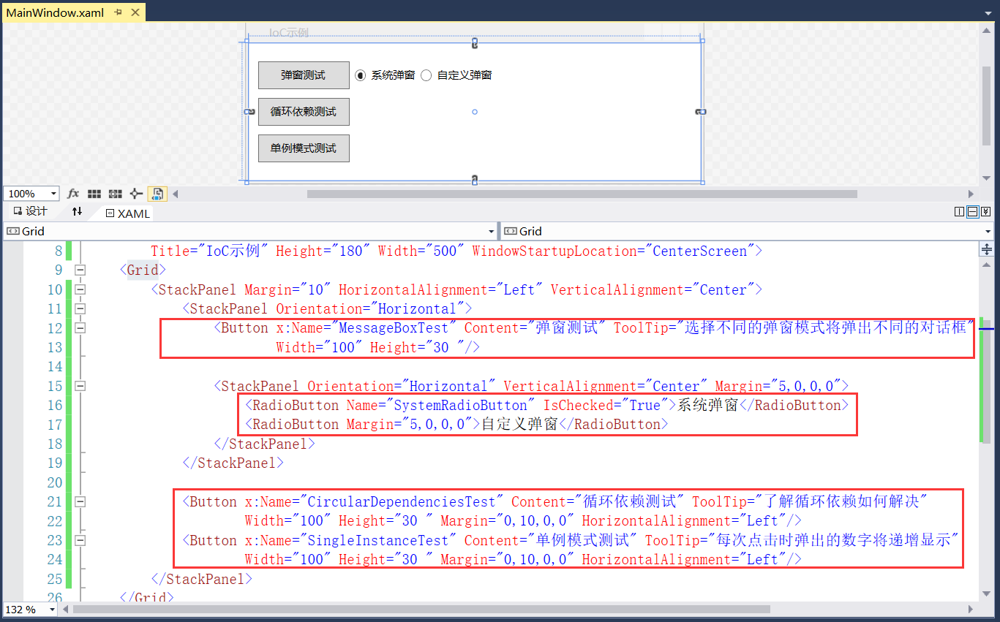
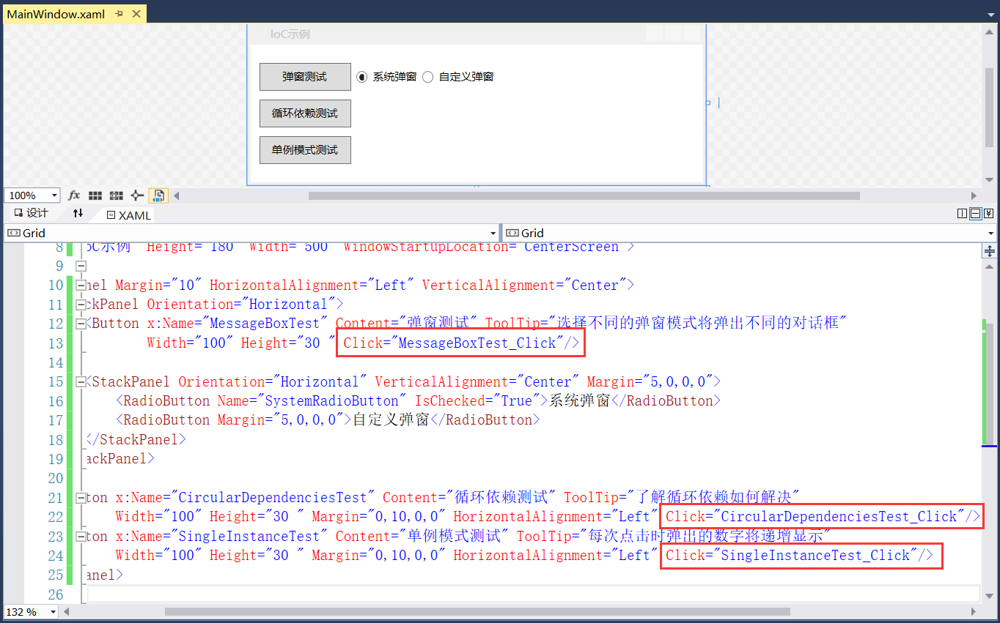
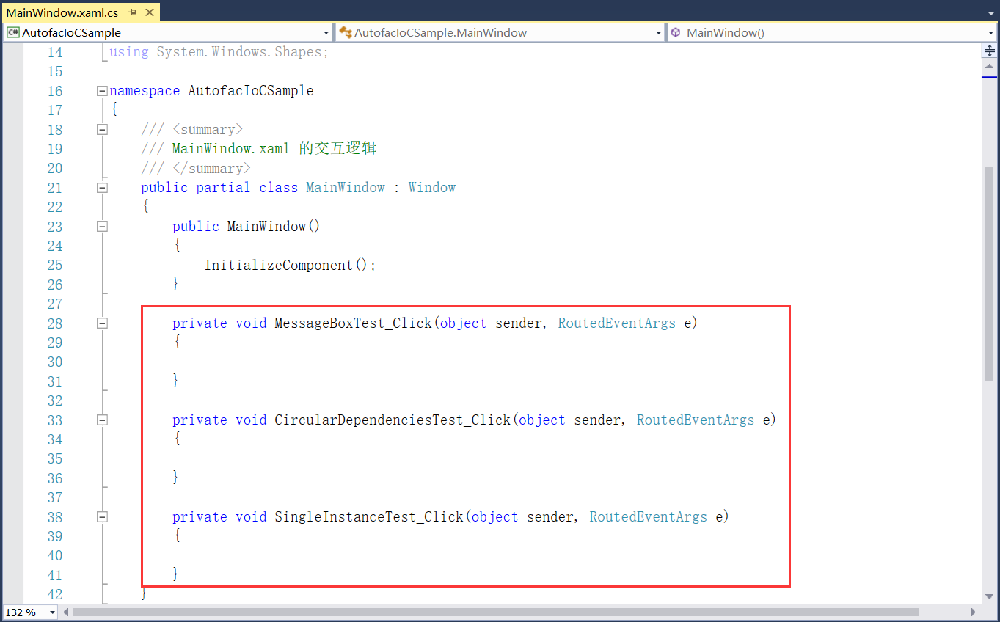
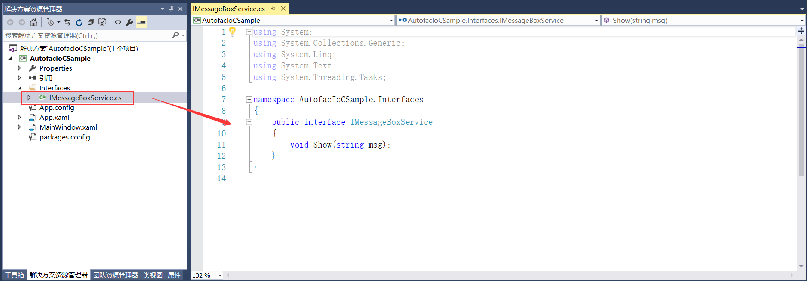
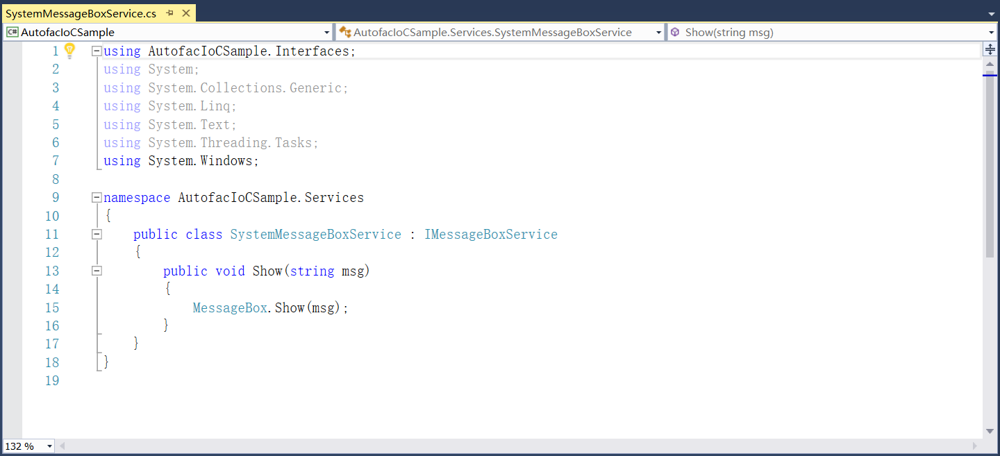
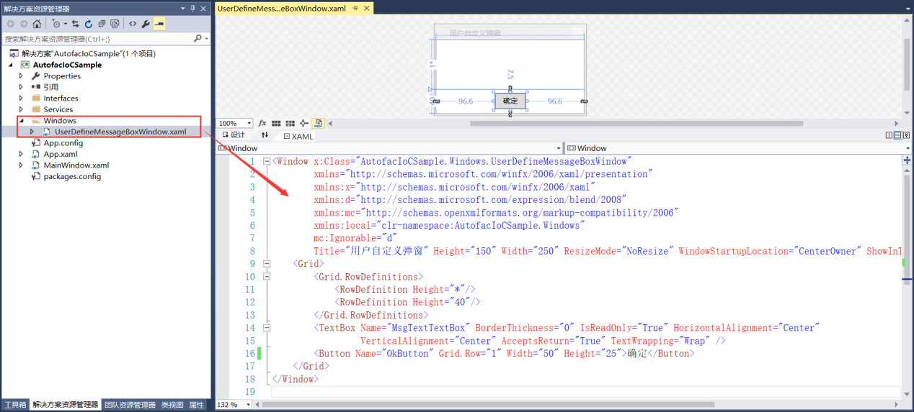
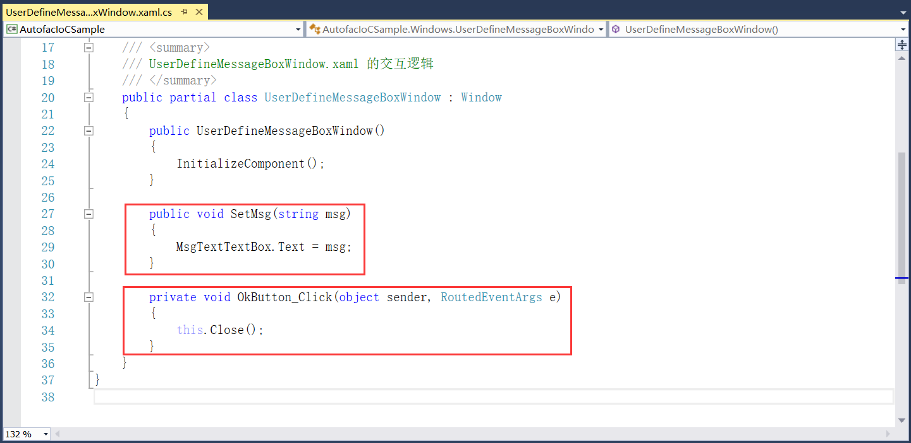
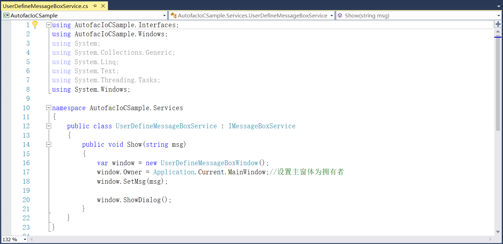

## 5.2.1 引入IoC框架

1、安装Autofac 4.9.4包，如图5.2-2所示。

图5.2-2 安装Autofac包

2、修改主窗体的属性Title为IoC示例，设置合适的高度和宽度，并且运行时的初始位置在屏幕中央。接着再添加三个Button按钮和一组RadioButton，为Button按钮添加提示使用属性ToolTip。并且第一个按钮的弹窗分为系统弹窗和自定义弹窗，其他两个按钮是循环依赖和单例模式，如图5.2-3所示。

图5.2-3 添加按钮

3、为按钮添加Click事件，如图5.2-4所示。

图5.2-4 添加Click事件

4、添加的Click事件在MainWindow.xaml.cs自动生成，如图5.2-5所示。

图5.2-5 生成的Click事件

5、弹窗测试添加事件。

（1）首先添加一个共用的接口IMessageBoxService，接口里面只定义Show方法，如图5.2-6所示。

图5.2-6 添加接口

 2）接下来定义系统弹窗所使用的类SystemMessageBoxService，继承上述所新建的接口，类里面必须实现接口的Show方法，如图5.2-7所示。这里区分系统弹窗和自定义弹窗为了后面的服务注册，直接可根据RadioButton的选择来动态的切换弹窗，不需要再去New一个。

图5.2-7 系统弹窗

（3）因为系统弹窗直接使用的是MessageBox，而自定义弹窗需要自己设计界面，因此新建一个文件UserDefineMessageBoxWindow.xaml用来设计布局，界面中添加TextBox和一个Button按钮，如图5.2-8所示。

图5.2-8 自定义弹窗

（4）为自定义窗口的按钮添加Click事件，并且为TextBox进行赋值，如图5.2-9所示。

图5.2-9 添加事件

（5）自定义窗体设计好以后再添加自定义窗体使用的服务类，也是继承IMessageBoxService接口，接着即使实现接口的Show方法，方法中设置此窗体为拥有者，最后进行ShowDialog即可，如图5.2-10所示。

图5.2-10 添加自定义弹窗服务

## links
   * [目录](<preface.md>)
   * 上一节: [新建IoC示例项目](<05.2.0.md>)
   * 下一节: [服务注册](<05.2.2.md>)