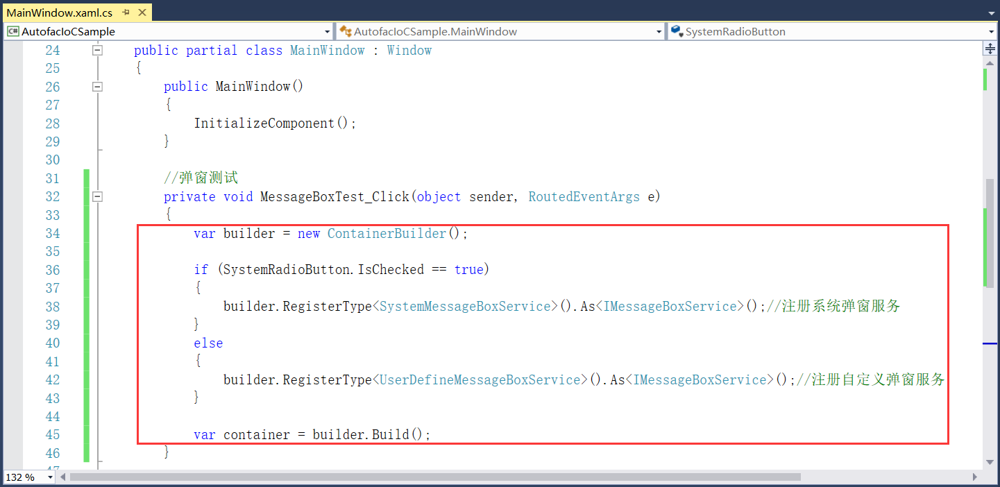

## 5.2.2 服务注册

（6）根据上述的项目代码继续添加服务注册。在应用程序启动时，需要创建一个ContainerBuilder并向其中注册组件或暴露一个或多个其它服务，可以采取其他的依赖关系。在Autofac中，可以通过以下方式进行注册，对于我们的示例应用程序，我们需要注册所有类并公开它们的服务（接口），以便可以很好地进行连接。还需要存储容器，以便以后可以用来解析类型，如图5.2-11所示。

图5.2-11 服务注册

## links
   * [目录](<preface.md>)
   * 上一节: [引入IoC框架](<05.2.1.md>)
   * 下一节: [服务解析](<05.2.3.md>)