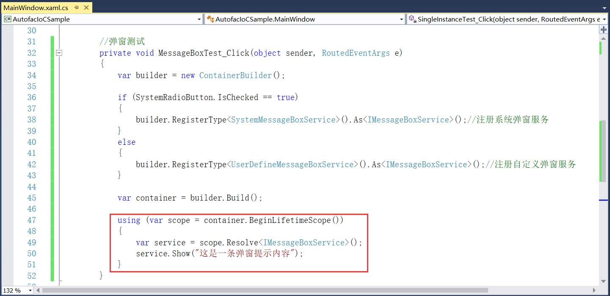
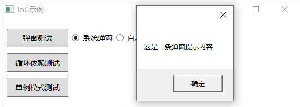
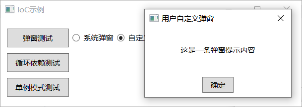

## 5.2.3 服务解析

（7）现在，我们有了一个容器，其中已注册了所有的类，并且它们在公开适当的服务，好让我们利用它。在应用程序执行期间，需要使用注册的类。可以通过从范围来解决它们来做到这一点。容器本身是整个生命周期的范围，从技术上讲，可以直接从容器中解决问题，但是不建议直接从容器中解析。

解析组件时，根据定义的实例范围，将创建该对象的新实例，解析一个组件大致等效于调用“new”以实例化一个类。从容器创建作用域，然后从中进行解析。完成组件解析后，处置子范围，一切都将清除。如图5.2-12所示实现Show方法以从范围中获取编写器，并在完成后处置该范围。

图5.2-12 服务解析

（8）这时弹窗测试就写好了，编译程序可查看结果，系统弹窗如图5.2-13所示，自定义弹窗如图5.2-14所示。

图5.2-13 系统弹窗

图5.2-14 自定义弹窗

## links
   * [目录](<preface.md>)
   * 上一节: [服务注册](<05.2.2.md>)
   * 下一节: [循环依赖](<05.2.4.md>)