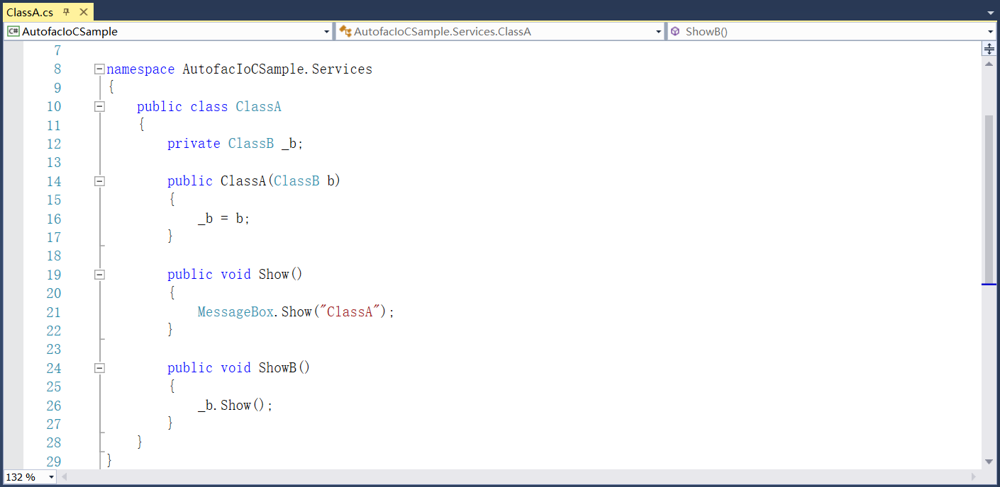
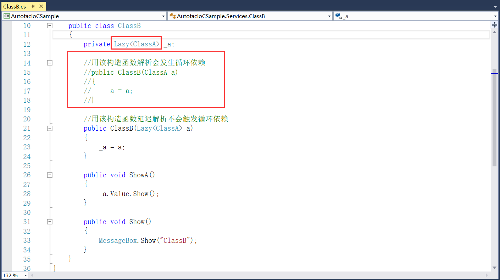
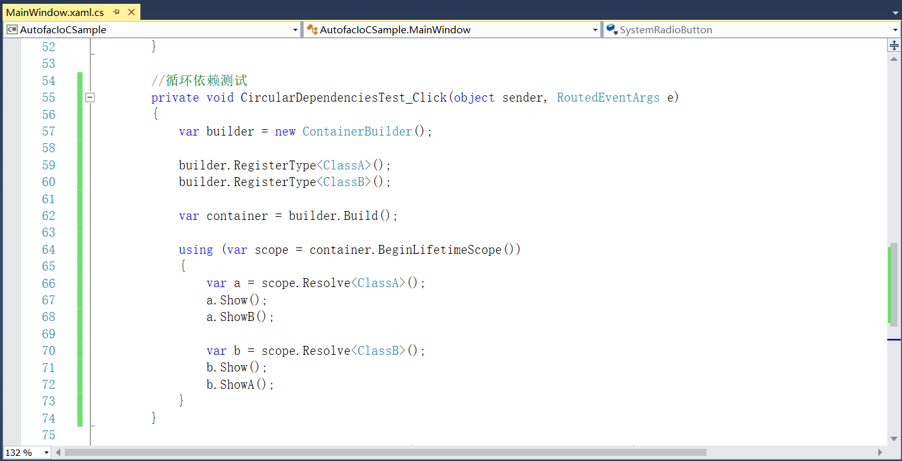
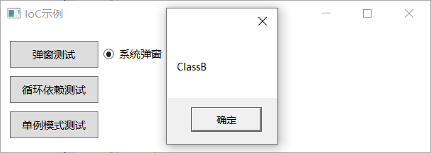

## 5.2.4 循环依赖

（9）添加服务ClassA和ClassB，ClassA中定义Show和ShowB方法，如图5.2-15所示。

图5.2-15 ClassA

（10）在ClassB中也定义Show和ShowA方法，但是这里的构造函数需要使用Lazy延时解析。上图中ClassA的构造函数中解析时会去找ClassB，如果ClassB的构造函数也如此定义，那么解析又会去找ClassA，这样一直是一个死循环，到最后堆栈溢出。所以在ClassB中需要使用Lazy进行延时解析，并且需要注意的是使用Lazy的时候必须使用Value才可以调用Show方法，如图5.2-16所示。

图5.2-16 ClassB

（11）为循环依赖测试添加事件，使用的服务注册和解析如同上述一致，不同的是这里没有统一的调用接口，代码如图5.2-17所示。

图5.2-17 循环依赖添加事件

（12）程序重新编译运行，出现的弹窗内容依次为ClassA、ClassB、ClassB、ClassA，如图5.2-18和图5.2-19所示。

图5.2-18 ClassA

图5.2-19 ClassB

## links
   * [目录](<preface.md>)
   * 上一节: [服务解析](<05.2.3.md>)
   * 下一节: [单例模式](<05.2.5.md>)