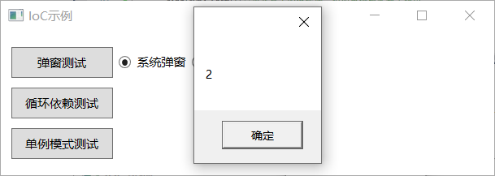

## 5.2.5 单例模式

（13）新建服务SingleInstanceClass，目的是为了每次单击按钮，数字就递增1，定义的Show方法如图5.2-20所示。

图5.2-20 新建SingleInstanceClass

（14）接下来就是实现单例模式，注意的是为了单例模式起作用，生存期不能释放，需要保存到类成员变量中，并且通过SingleInstance函数来注册该类型为单例模式。执行到第二次时，_singleInstancescope就不再为null，不会走if里面的代码，这样就不进行每次初始化，可以实现值的递增，代码如图5.2-21所示。

图5.2-21 单例模式

（15）重新编译程序运行，每次单击单例模式测试的按钮，弹窗的值就会递增1，效果如图5.2-22和图5.2-23所示。

图5.2-22 值为1

图5.2-23 值递增为2

## links
   * [目录](<preface.md>)
   * 上一节: [循环依赖](<05.2.4.md>)
   * 下一节: [为什么要使用AppDomain](<06.1.md>)