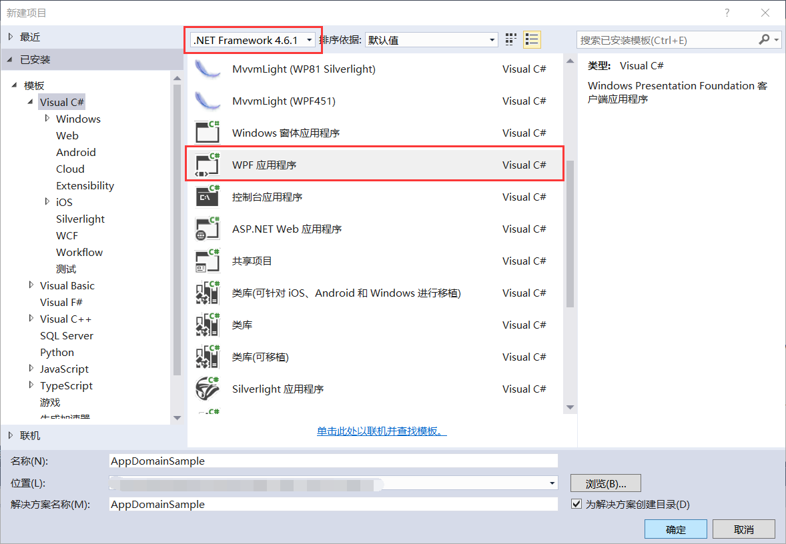

## 6.2 新建跨域示例项目

打开VS 2015新建项目，选择.Net Framework4.6.1，模板选择Visual C#的WPF应用程序，设置项目的存放路径、设置应用程序名称为AutofacIoCSample，然后点击确定即可完成新建项目，如图6.2-1所示。

图6.2-1 新建AutofacIoCSample项目

## links
   * [目录](<preface.md>)
   * 上一节: [为什么要使用AppDomain](<06.1.md>)
   * 下一节: [跨域的界面显示](<06.3.md>)