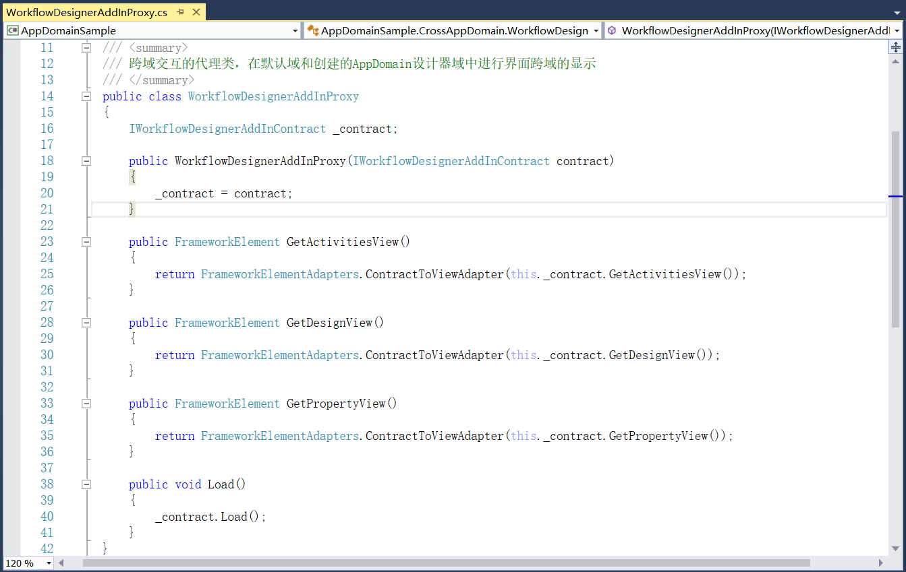

## 6.3 跨域的界面显示

1、搭建设计器的加载和卸载的界面布局，在MainWindow.xaml中修改窗体的Title为AppDomain示例，同时设置窗体的初始状态为最大化属性WindowState="Maximized"，如图6.3-1所示。

图6.3-1 窗体属性设置

2、对整体的布局分为两行，第二行再拆分为三列。在第一行添加四个Button按钮。加载设计器的按钮、卸载设计器的按钮、跨域获取字符串数据按钮和跨域获取自定义数据的按钮。注意的是：Grid在区分行列时，假如是第一行可不写Grid.Row，因为不写默认的就是第一行或者是第一列，如图6.3-2所示。

图6.3-2 添加按钮布局

3、添加整体布局的第二行控件，三列分别添加活动组件视图、设计视图和属性视图，Border设置边框颜色为灰LigthGray，边框的线条粗细为1，如图6.3-3所示。

图6.3-3 添加视图布局

4、程序重新编译运行，效果如图6.3-4所示。

图6.3-4 界面效果

5、主窗体的界面是在它自己默认的域中，加载设计器后是到它真实的域中，也就是跨域的界面显示。在该项目下新建名为CrossAppDomain的文件夹，再添加需要使用到的程序集，如图6.3-5所示。

图6.3-5 添加引用

6、先来处理活动组件的视图，为此视图添加活动组件，以便加载设计器时可以加载出此活动组件。在CrossAppDomain文件夹右键----》添加----》用户控件，添加名为ActivitiesView的用户控件，如图6.3-6所示。

图6.3-6 添加用户控件

7、用户控件是UserControl，在此界面里添加布局树形结构TreeView，如图6.3-7所示。

图6.3-7 用户控件添加布局

8、为了实现这些组件可以拖拽使用，添加MouseMove事件，如图6.3-8所示。

图6.3-8 添加MouseMove事件

9、添加组件拖拽的共用方法，后期不同的组件类型调用共用方法传不同的参数即可。首先是鼠标处于按下的状态才认为是拖拽，即设置为MouseButtonState.Pressed。而且必须为WorkflowItemTypeNameFormat格式才能让组件拖拽到设计器中，如图6.3-9所示。

图6.3-9 组件拖拽处理

10、在组件具体的MouseMove事件中，直接调用上述所写的方法ProcessActivityDrag，不同组件修改其类型即可，序列、输出行和延时分别是Sequence、WriteLine、Delay，如图6.3-10所示。

图6.3-10 MouseMove事件

11、活动组件视图的布局如上述所示，接着是对加载设计器和卸载设计器按钮添加Click事件，如图6.3-11所示。

图6.3-11 添加Click事件

12、在CrossAppDomain文件夹下添加IWorkflowDesignerAddInContract的接口，定义跨域交互时的接口。定义获取组件视图、设计视图和属性视图以及加载默认设计器内容字段或方法，其中视图定义使用INativeHandleContract类型，如图6.3-12所示。

图6.3-12 跨域交互的接口定义

13、添加设计器的插件类WorkflowDesignerAddIn，在单独的AppDomain中创建，必须继承MarshalByRefObject来实现跨域的序列化传输，如不继承时在程序运行会报“未标记为可序列化”的异常，同时继承上述定义的IWorkflowDesignerAddInContract接口。

初始化时先进性元数据的注册，并且初始化WorkflowDesigner的类实例，接着就是对组件视图、设计视图和属性视图的实现，以及加载默认的设计器内容，使用Sequence，如图6.3-13所示。

图6.3-13 插件类添加

14、序列化传输过去以后，然后就是走代理进行界面跨域的显示。添加跨域交互的代理类，在默认域和创建的AppDomain设计器域中进行界面跨域的显示，定义FrameworkElement类的视图显示，如图6.3-14所示。

图6.3-14 界面跨域显示

15、最后就是加载和卸载设计器按钮的Click事件的实现。设置优化策略为MultiDomain，在加载程序时不同的应用程序域之间最大限度的共享nebula资源。并且创建名为WorkflowDesignerDomain的应用程序域，如图6.3-15所示。

图6.3-15 创建应用程序域

16、创建指定类型的新实例。CreateInstanceAndUnwrap函数的实现分为两步，第一步为CreateInstance(在应用程序域中创建一个类的实例，该类是通过程序集名称和类型来唯一确定)；第二步是Unwrap展开，被展开的类，也就是WorkflowDesignerAddIn，必须继承自MarshalByRefObject以支持跨应用程序域边界使用类型，如图6.3-16所示

图6.3-16 创建指定类型的新实例

17、将视图绑定在对应的位置，在相对应的位置显示视图，如图6.3-17所示。

图6.3-17 视图绑定

18、添加卸载设计器的Click事件，卸载的时候用Unload把整个域卸载，如图6.3-18所示。

图6.3-18 卸载设计器

19、程序重新编译运行，如图6.3-19所示；点击加载设计器如图6.3-20所示，且组件也可进行拖拽；点击卸载设计器，如图6.3-21所示。

图6.3-19 程序初始界面

图6.3-20 加载设计器

图6.3-21 卸载设计器

## links
   * [目录](<preface.md>)
   * 上一节: [新建跨域示例项目](<06.2.md>)
   * 下一节: [跨域的数据交互](<06.4.md>)