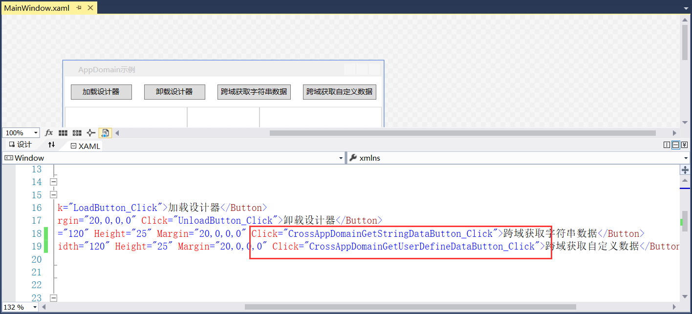

## 6.4 跨域的数据交互

1、跨域的数据交互在程序中的体现是跨域获取字符串数据按钮和跨域获取自定义数据按钮，先来添加这两个按钮的Click事件，如图6.4-1所示。

图6.4-1 添加Click事件

2、在IWorkflowDesignerAddInContract接口中定义GetStringData，如图6.4-2所示。

图6.4-2 接口定义

3、在插件类WorkflowDesignerAddIn中实现GetStringData方法进行序列化传输，如图6.4-3所示。

图6.4-3 插件类实现

4、在代理类WorkflowDesignerAddInProxy中添加GetStringData方法，用于跨域的数据交互，如图6.4-4所示。

图6.4-4 代理类实现

5、最后添加按钮的Click事件，如果没有创建应用程序域即没有加载设计器，就提示先加载后在获取，加载域可获取到数据，如图6.4-5所示。

图6.4-5 Click事件

6、重新编译程序运行，还没有加载设计器时点击按钮，效果如图6.4-6所示。加载设计器后再点击按钮，效果如图6.4-7所示。

图6.4-6 未创建域时的数据获取

图6.4-7 跨域获取数据

7、接下来就是跨域获取自定义的数据。首先在CrossAppDomain文件夹下创建一个名为UserDefineObject的类，并且必须要继承MarshalByRefObject，这样才能跨域交互。在类中定义字段Name和Age，如图6.4-8所示。

图6.4-8 自定义类型

8、IWorkflowDesignerAddInContract中定义跨域获取自定义数据的接口GetUserDefineObject，如图6.4-9所示。

图6.4-9 接口定义

9、在WorkflowDesignerAddIn插件类中实现GetUserDefineObject方法进行序列化传输，如图6.4-10所示。

图6.4-10 插件类实现

10、在代理类WorkflowDesignerAddInProxy中添加GetUserDefineData方法，用于跨域的数据交互，如图6.4-11所示

图6.4-11 代理类实现

11、最后是Click事件的实现，如果没有创建应用程序域时提示先加载在获取数据，加载域后可获取自定义类型的数据。其中弹窗的内容也可以使用string.Format，如图6.4-12所示。

12、重新编译程序运行，未创建域时即未加载设计器时的弹窗如图6.4-13所示，创建域后的自定义数据获取如图6.4-14所示。

图6.4-13 未创建域时的自定义数据获取

图6.4-14 跨域获取自定义数据

## links
   * [目录](<preface.md>)
   * 上一节: [跨域的界面显示](<06.3.md>)
   * 下一节: [为什么要使用界面库](<07.1.md>)