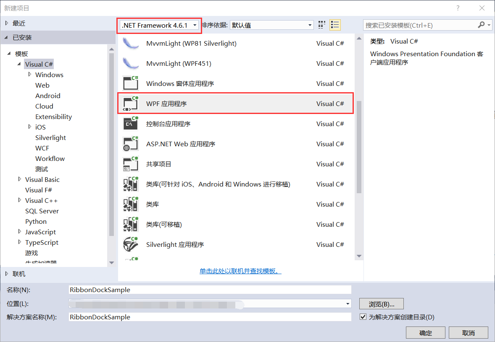

## 7.2 新建界面库示例项目

打开VS 2015新建项目，选择.Net Framework4.6.1，模板选择Visual C#的WPF应用程序，设置项目的存放路径、设置应用程序名称为RibbonDockSample，然后点击确定即可完成新建项目，如图7.2-1所示。

图7.2-1 新建项目

## links
   * [目录](<preface.md>)
   * 上一节: [为什么要使用界面库](<07.1.md>)
   * 下一节: [Ribbon界面库示例](<07.3.md>)