## 7.3 Ribbon界面库示例

1、首先安装所使用的库Fluent.Ribbon 6.1.0.326版本，如图7.3-1所示。

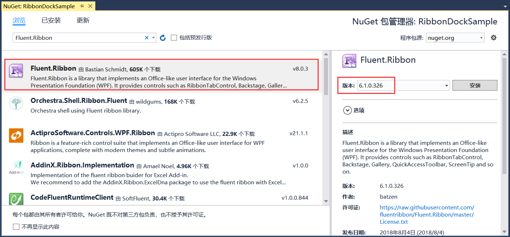

图7.3-1 安装Fluent.Ribbon包

2、安装以后，包管理器如图7.3-2所示，ControlzEx自动跟随Fluent.Ribbon一起安装。

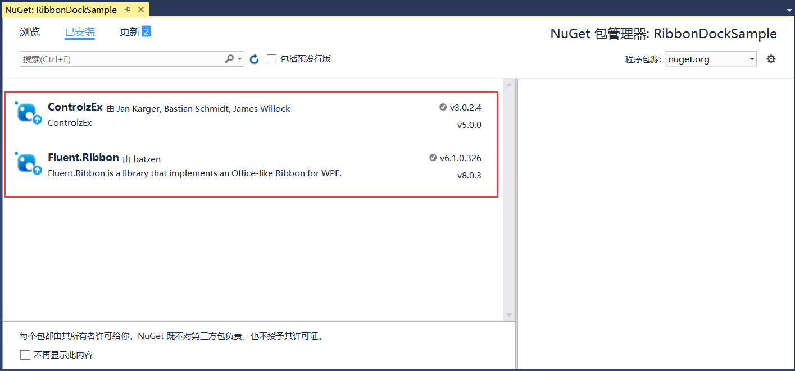

图7.3-2 NuGet包

3、修改主窗体的Title、宽度和高度属性，设置窗体在启动时默认位置在屏幕中央，添加Button按钮用来实现Fluent.Ribbon界面库，并为此按钮添加Click事件，如图7.3-3所示。

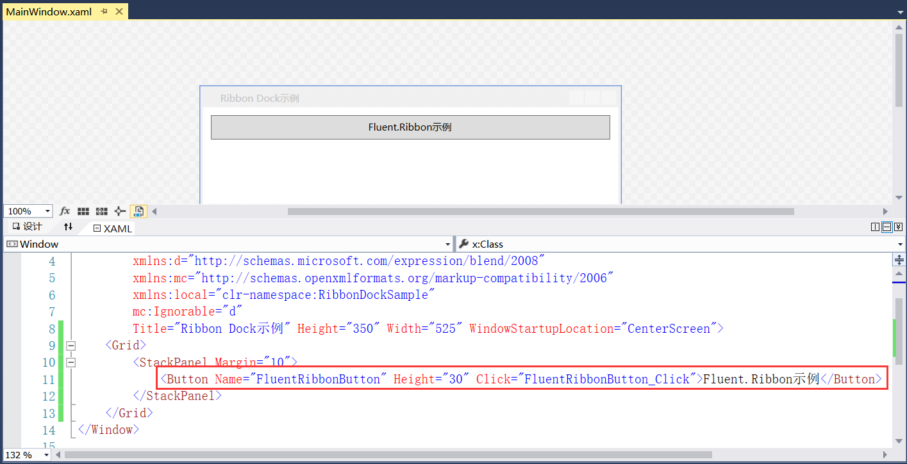

图7.3-3 添加Fluent.Ribbon界面库按钮

4、在此项目下新建一个名为Windows的文件夹，在文件夹下新建名为FluentRibbonWindow的窗口文件，如图7.3-4所示。

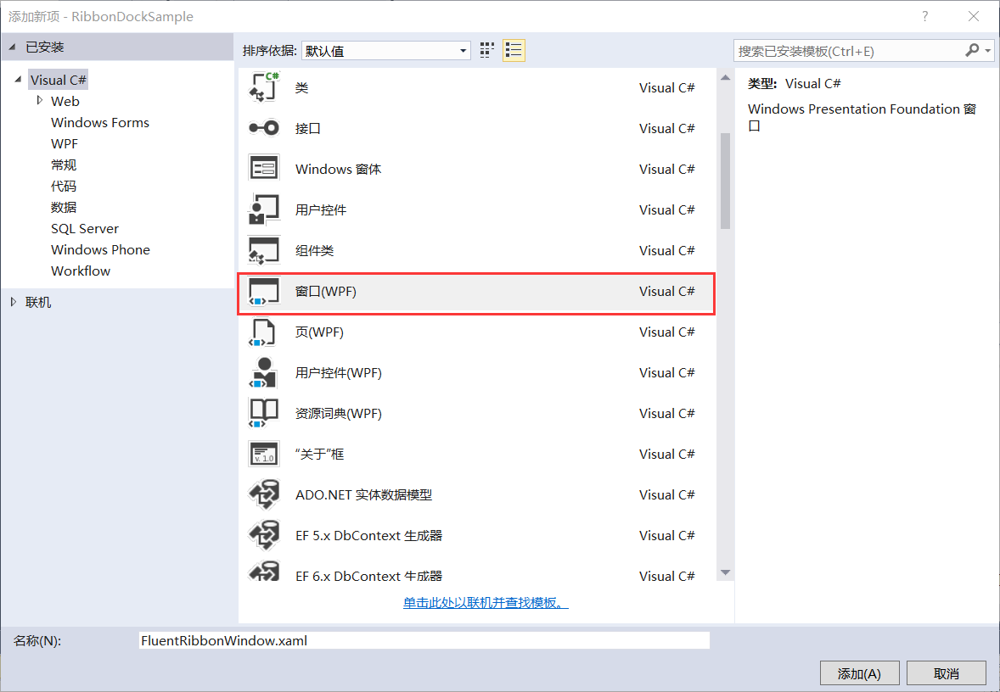

图7.3-4 新建窗口

5、因要使用Fluent.Ribbon库，在FluentRibbonWindow.xaml文件中引入此命名空间fluent，并将Window改为fluent:RibbonWindow，如图7.3-5所示。

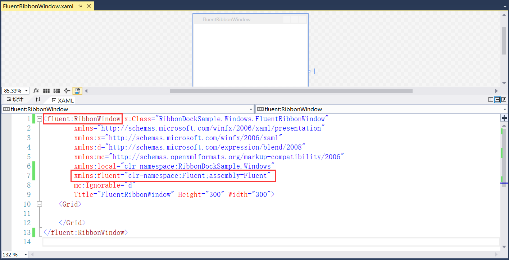

图7.3-5 添加命名空间

6、在xaml后台类的实现中修改为继承RibbonWindow，如图7.3-6所示。

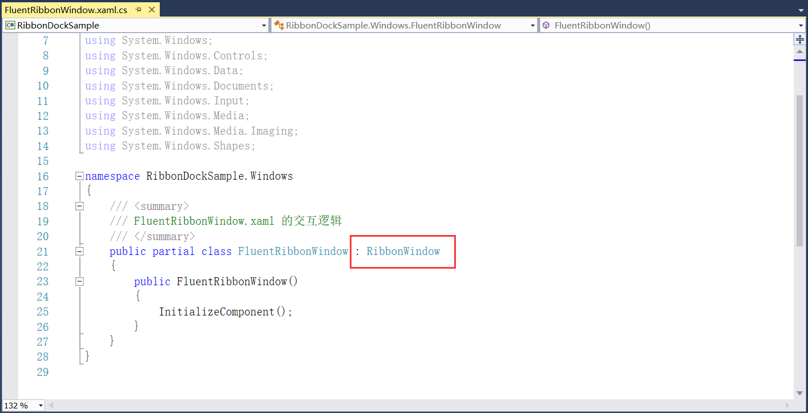

图7.3-6 后台类继承

7、修改窗体的Title、高度和宽度属性，以及设置窗体启动时为最大化，同时必须引用Fluent.Ribbon的样式，否则程序运行后会是一个黑窗口，如图7.3-7所示。

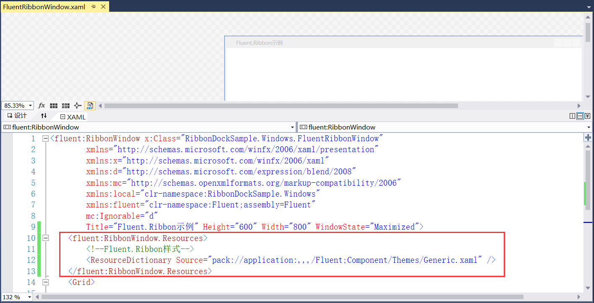

图7.3-7 设置窗体属性

8、将页面整体分为三行，并且把工具栏和菜单栏添加在第一行，设置可以快速访问菜单栏的属性，如图7.3-8所示。

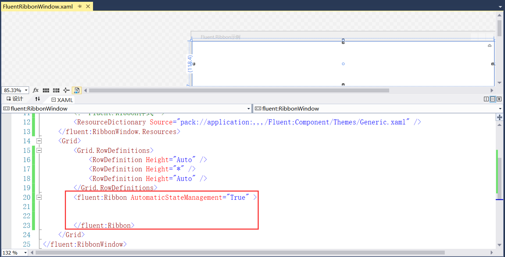

图7.3-8 划分行数

9、添加菜单栏Ribbon.Menu，第一个为开始按钮，点击开始按钮时想要跳到开始的界面，这里就需要为定义开始为一个后台按钮Backstage，如图7.3-9所示。

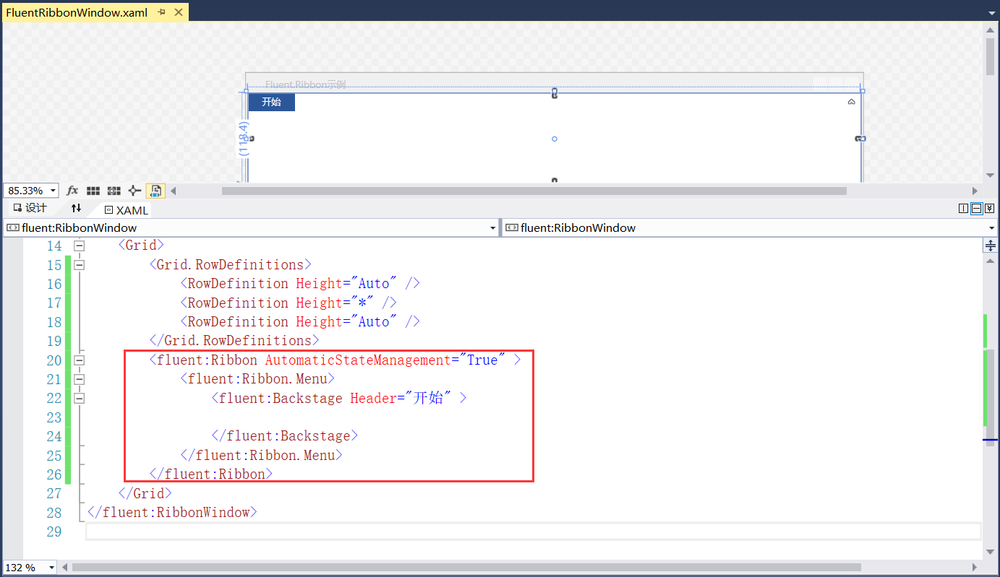

图7.3-9 后台按钮

10、在此后台按钮的界面添加选项卡控件BackstageTabControl，并且设置后退按钮可见，在选项卡中添加打开和关闭的Button按钮，并且在后面放一个分隔符，用来区分按钮和选项卡项。在后面接着添加开始、工具、设置和帮助选项卡的项。并且设置默认选择第三个选项卡，设置索引为SelectedIndex="3"，如图7.3-10所示。

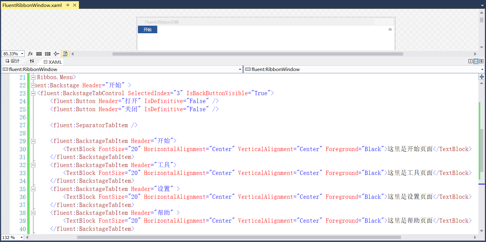

图7.3-10 选项卡

11、在主窗体的Click事件中跳转到此界面，代码如图7.3-11所示。

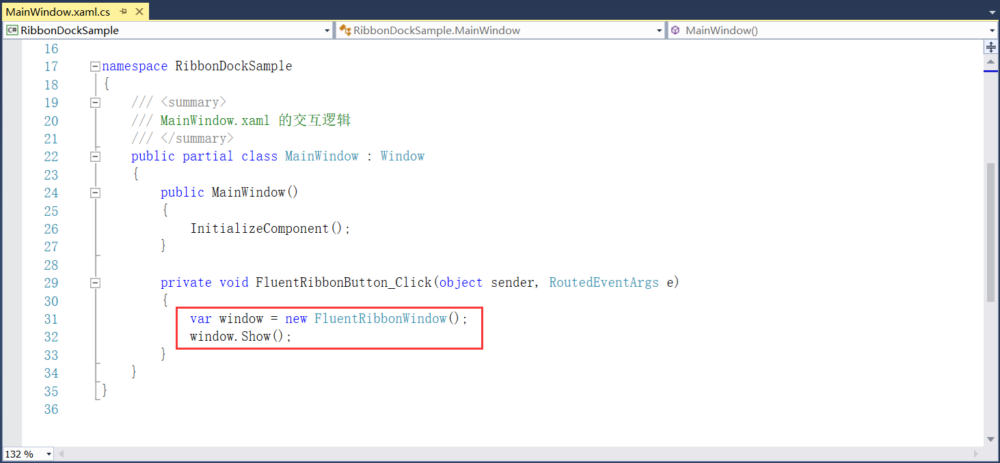

图7.3-11 Click事件的实现

12、重新编译程序运行，主窗体如图7.3-12所示；点击按钮界面如图7.3-13所示；点击菜单栏的开始效果如图7.3-14所示。

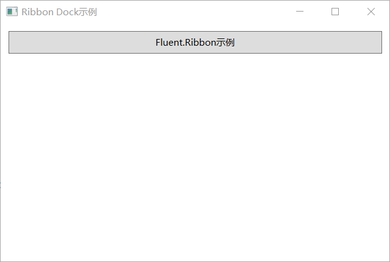

图7.3-12 主窗体界面

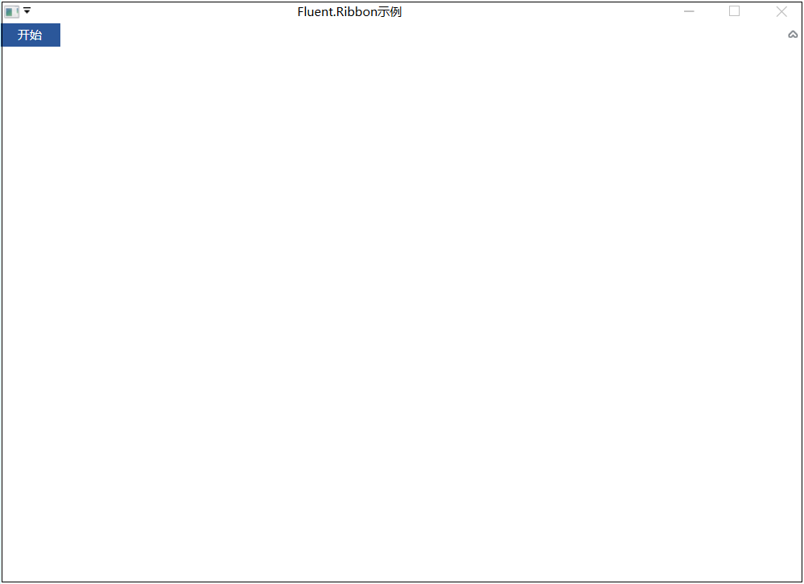

图7.3-13 Fluent.Ribbon界面

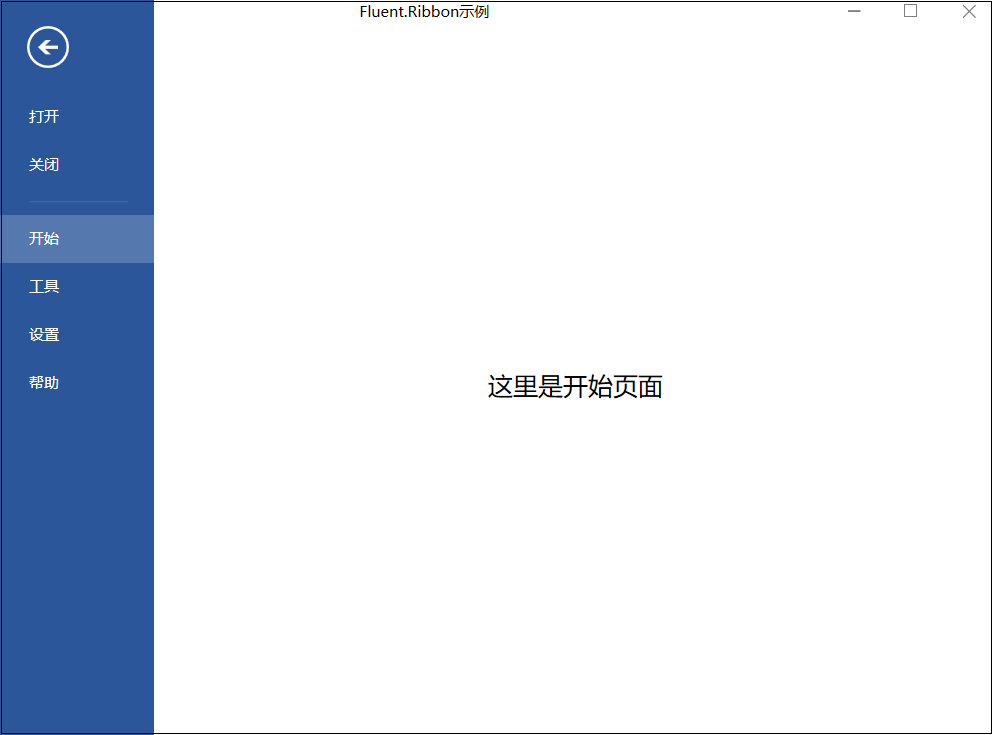

图7.3-14 菜单栏开始界面

13、继续添加菜单栏中的功能选项，接下来某些按钮会需要引用一些图标，因此我们在项目下新建文件夹Resources，再新建子文件夹Image用来存放可能会使用到的图标。添加图标时可右键文件夹----》添加----》现有项，此项目添加的图标如图7.3-15所示，仅供参考，且添加的图标在属性中属于Resource资源。

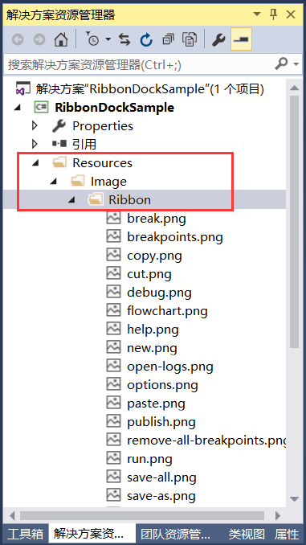

图7.3-15 图标

14、添加设计的功能选项卡，不需要进行回退，所以使用RibbonTabItem即可。并且在此Tab上进行分组，大概分为文件、编辑和部署三组，其每一组具体又包含的功能如下：

文件：新建（序列图、流程图和状态机）、保存（另存为和全部保存）、运行。
编辑：剪切、复制和粘贴。
部署：发布。

分组使用RibbonGroupBox，如图7.3-16所示。

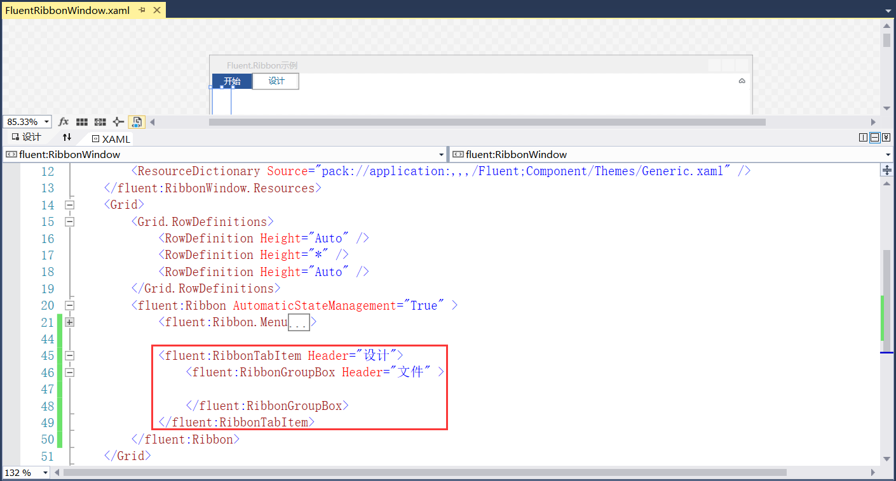

图7.3-16 选项卡分组

15、在添加按钮时主要注意区分，有的按钮点击以后是不触发事件只展开下来列表，有的按钮点击时会触发事件，点击下拉箭头也会展开列表。例如在此项目中新建按钮使用的是点击不触发事件，展开下拉列表，故使用DropDownButton。其中“pack://application:,,,”代表当前程序目录，此处设置图标时使用LargeIcon属性。在菜单项中添加序列图、流程图和状态机，如图7.3-17所示。

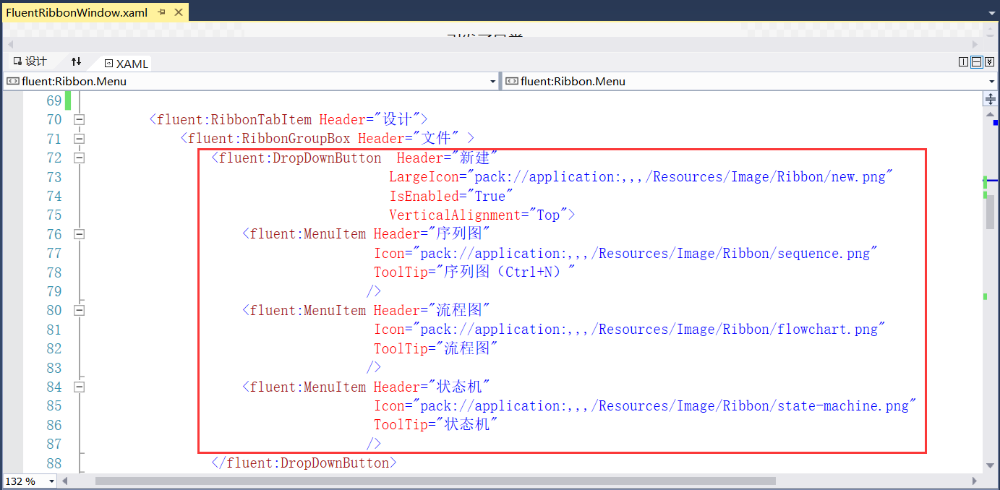

图7.3-17 添加新建

16、对于点击按钮触发事件并点击下拉箭头显示菜单项按钮，使用SplitButton，为了后期把保存按钮添加到快速访问中，所以这里在添加图标时，要添加大图标和Icon，如图7.3-18所示。

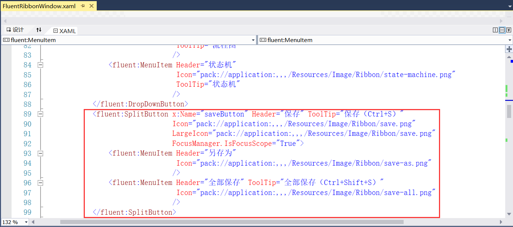

图7.3-18 添加保存

17、添加运行，如图7.3-19所示。

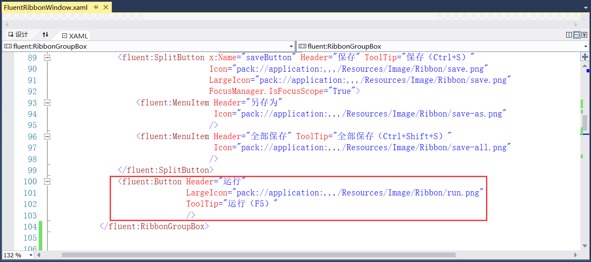

图7.3-19 添加运行

18、程序重新编译运行，点击新建按钮，效果如图7.3-20所示。点击保存按钮可直接触发事件（这里没有添加事件），点击下拉箭头展开菜单项，如图中点击新建效果一样。

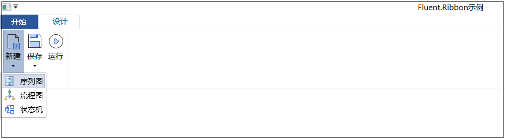

图7.3-20 效果展示

19、接下来就是编辑组中的剪贴、复制和粘贴按钮，使用Button按钮即可，如图7.3-21所示，其中SizeDefinition为定义尺码的大小。

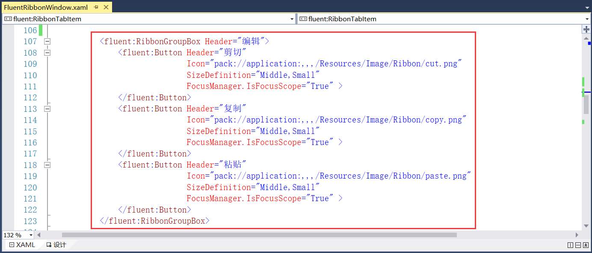

图7.3-21 编辑

20、程序重新编译运行，效果如图7.3-22所示。

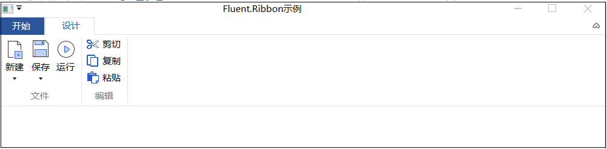

图7.3-22 效果展示

21、添加部署组的发布按钮，如图7.3-23所示。

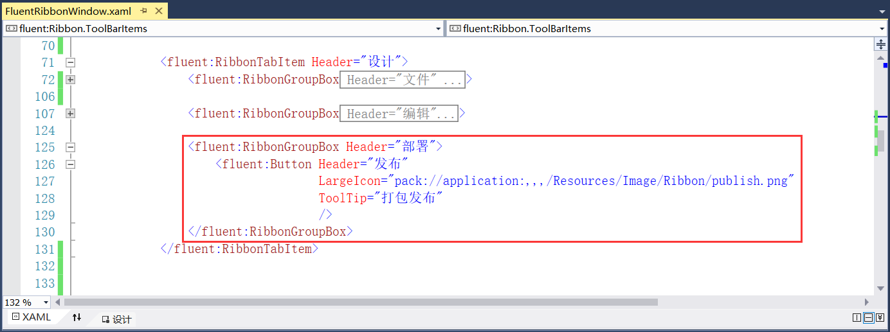

图7.3-23 部署

22、程序重新编译运行，效果如图7.3-24所示。

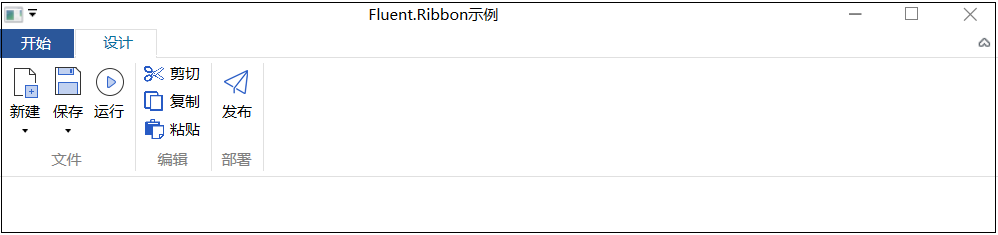

图7.3-24 效果展示

23、设计选项卡添加完了以后，接着再添加执行选项卡，并且在此Tab上进行分组，大概分为启动、调试和日志三组，其每一组具体又包含的功能如下：

启动：运行、停止。

调试：中断、逐语句、逐过程、校验、断点（切换断点、清除所有断点）。

日志：打开日志。

  界面设计用法同上述一致，代码如图7.3-25和图7.3-26所示。

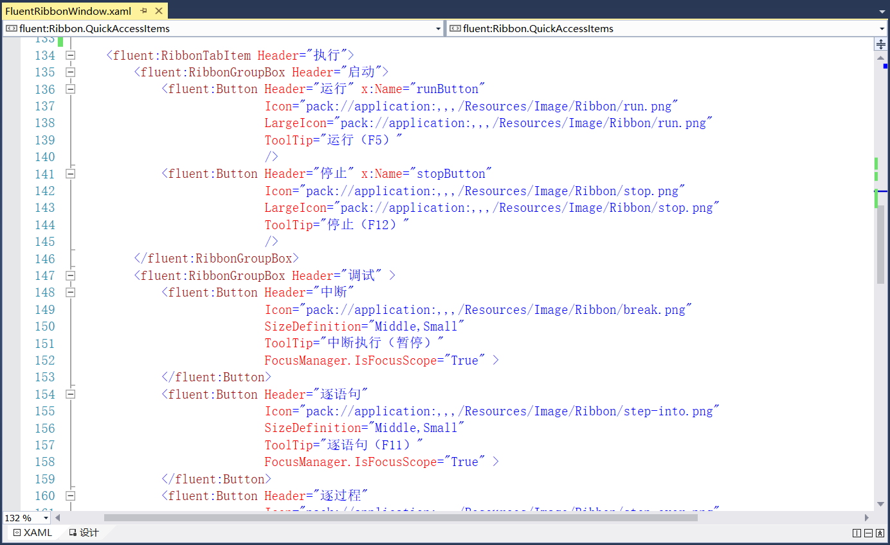

图7.3-25 启动和调试

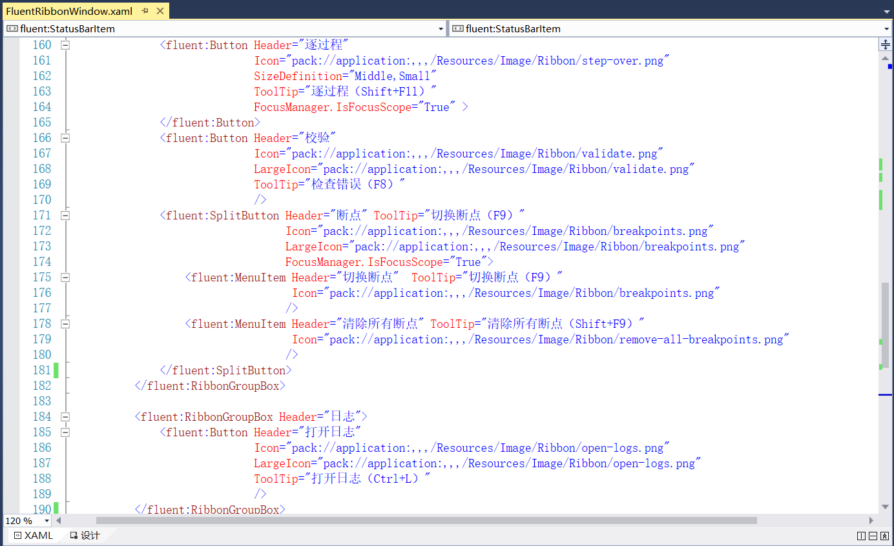

图7.3-26 日志

24、重新编译程序运行，效果如图7.3-27所示。

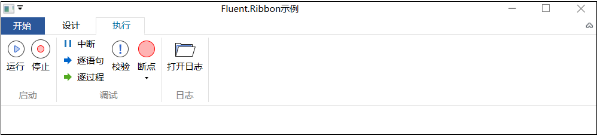

图7.3-27 执行选项卡

25、接着就是添加底部的状态栏，如图7.3-28所示。

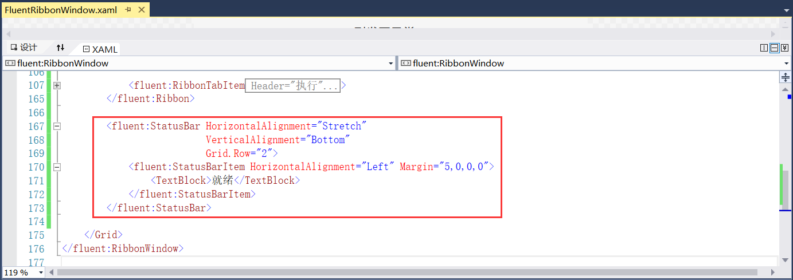

图7.3-28 状态栏

26、现在来添加自定义快速访问工具栏，并且添加工具栏的帮助按钮，如图7.3-29所示。其中saveButton、runButton和stopButton分别为保存、运行和停止按钮的Name。注意的是：由于VS的某些原因，有时在xaml文件中会报查找不到资源文件的错误，但只要可以正常编译，其实是成功的。

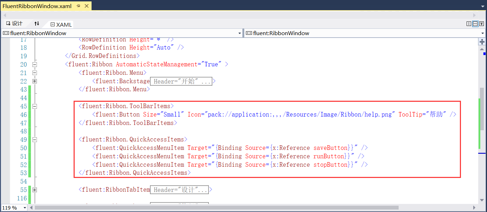

图7.3-29 帮助按钮和自定义快速访问

27、程序重新编译运行，如图7.3-30所示。

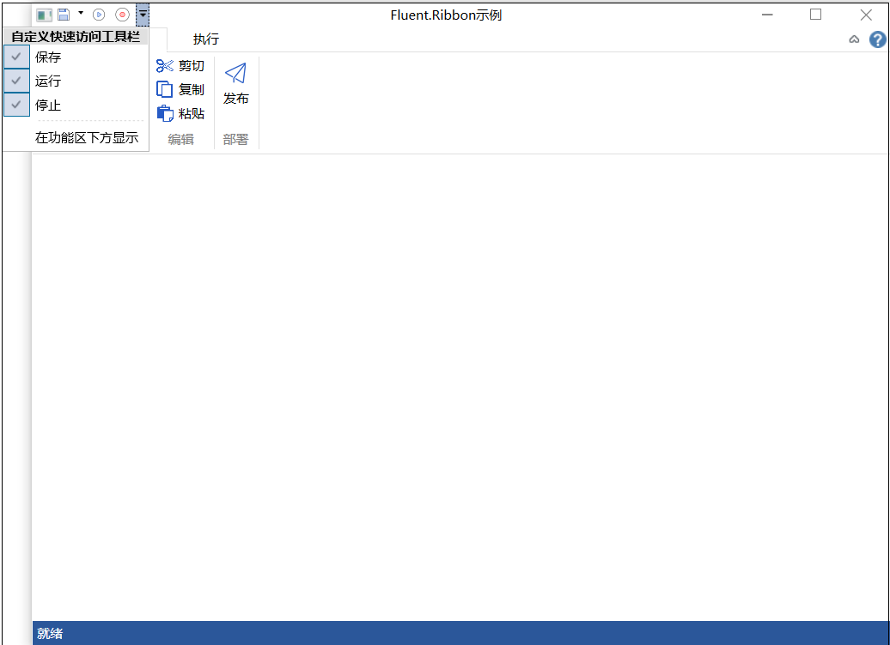

图7.3-30 自定义快速访问和帮助按钮

28、在上图中右上角帮助按钮的左侧是功能区最小化，可以仅显示功能区上的选项卡名称，可用快捷键Ctrl+F1。比如上述添加的保存、全部保存等按钮添加快捷键时如图7.3-31所示。

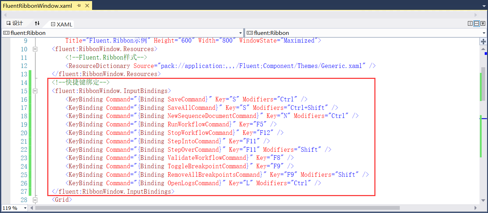

图7.3-31 添加快捷键

## links
   * [目录](<preface.md>)
   * 上一节: [新建界面库示例项目](<07.2.md>)
   * 下一节: [Dock界面库示例](<07.4.md>)