## 7.4 Dock界面库示例

1、Avalon Dock界面库用于创建可停靠式布局，能在WPF中开发出类似VS2015的软件界面，对于复杂的软件系统，大量控件的使用会使的界面变得难以管理。Avalon Dock帮我们解决了这一问题，想要在WPF项目中使用Avalon Dock的功能，首先要安装Extended.Wpf.Toolkit 3.8.2版本的NuGet包，如图7.4-1所示。

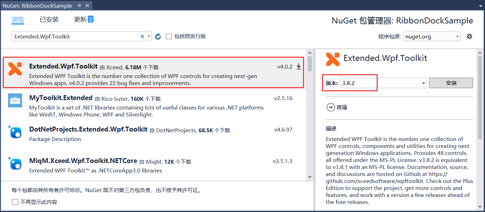

图7.4-1 安装NuGet包

2、在Windows文件夹下添加AvalonDockWindow.xaml文件，并且在Image文件夹下添加Dock界面库使用到的一些图片资源，并更改窗体的属性，如图7.4-2所示。

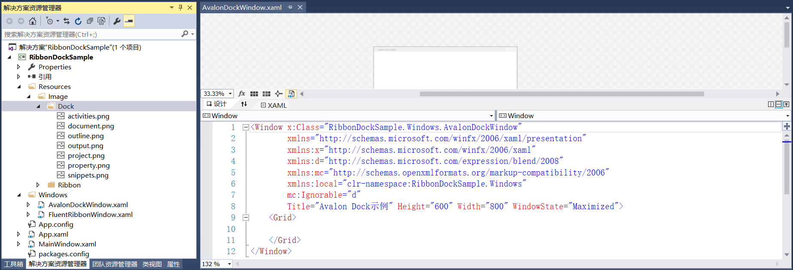

图7.4-2 添加Dock文件和图片资源

3、在MainWindow.xaml文件中添加Avalon Dock示例的按钮和Click事件，如图7.4-3所示。

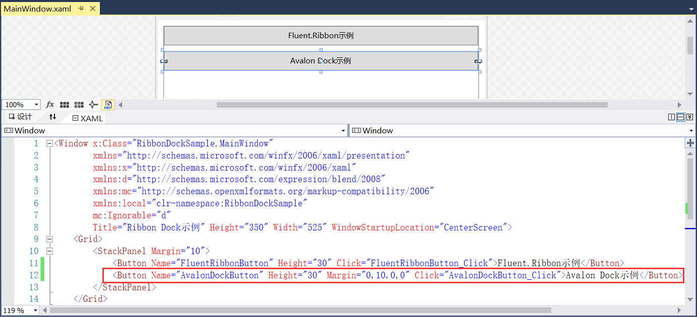

图7.4-3 添加Avalon Dock示例按钮

4、其中Click事件如图7.4-4所示。

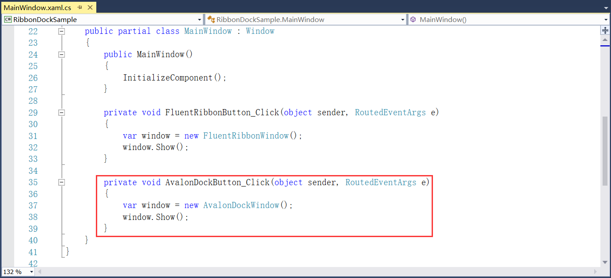

图7.4-4 Click事件

5、为了后期更方便的做Fluent.Ribbon结合 Avalon Dock的示例，所以这里将Dock的界面使用用户控件摘除出来，也可以选择不单独摘出来，效果是一样的。在项目下新建文件夹Views，在此文件夹下新建用户控件DocksView.xaml文件，如图7.4-5所示。

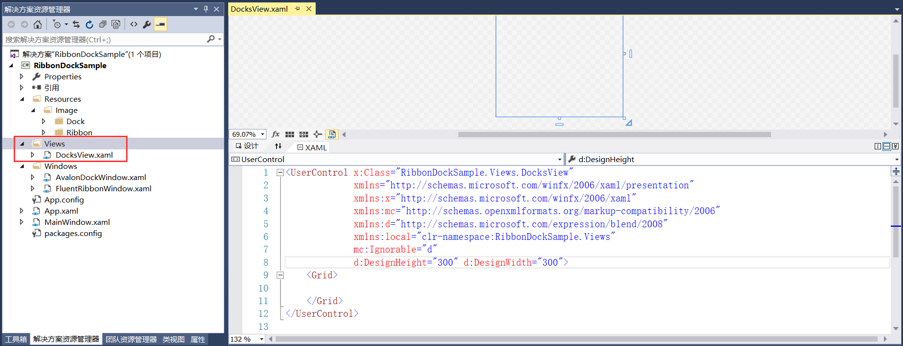

图7.4-5 DocksView文件

6、在AvalonDockWindow.xaml文件中添加对DocksView文件的引用。首先添加对Views文件夹引用的命名空间，再添加对DocksView文件的引用，如图7.4-6所示。

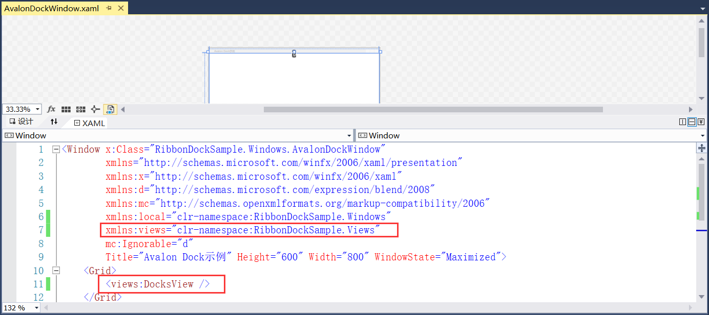

图7.4-6 对DocksView文件的引用

7、添加Avalon Dock的命名空间，如图7.4-7所示。其中属性AllowMixedOrientation="True" 代表允许文档窗格混合方向，BorderThickness="0"代表控件的边框宽度，默认情况下所有四个边的宽度为0。

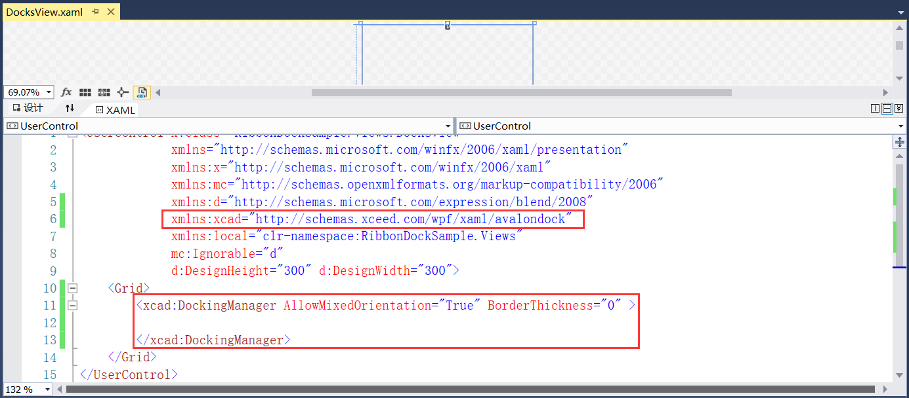

图7.4-7 添加命名空间

8、Avalon Dock库提供了一些基本的类，简单的相关介绍如下：

DockingManager：停靠管理器类，是AvalonDock中的核心控件之一，负责管理浮动窗体、布局存储、恢复，样式主题等。在XAML中，是AvalonDock元素的根节点。

LayoutRoot：布局根节点类。

LayoutPanel：布局面板类，LayoutRoot中的内容控件，完全占满LayoutRoot中的空间，在LayoutPanel中，可以有多个LayoutGroup，可以设定Orientation 属性，控件布局组的浮动方向，实际的窗格都位于LayoutPanel节点下。

LayoutAnchorablePaneGroup：可停靠窗格组类，是可停靠窗格LayoutAnchorablePane的容器。通过设置Orientation 属性，用于管理多个可停靠窗格的浮动方向。

LayoutAnchorablePane：可停靠窗格类，浮动窗格是可停靠控件LayoutAnchorable的容器。一个窗格中，可以有多个可停靠控件。浮动窗格中的可停靠控件只能是LayoutAnchorable，窗格大小设定后，不能自动改变。

LayoutAnchorable：可停靠内容类，一般放置在LayoutAnchorablePane中，其内容可以是用户自定义控件类型，比如，在UserControl中设置好WPF基础控件布局，然后将整个UserControl放置在LayoutAnchorable中，这样整个UserControl内容就可以随着可停靠控件一起浮动或者停靠。

LayoutDocumentPaneGroup：文档窗格组类，是文档窗格LayoutDocumentPane的容器。通过设置Orientation 属性，用于管理多个文档窗格的浮动方向。

LayoutDocumentPane：文档窗格类，与LayoutAnchorablePane类似，也是可停靠控件的容器，文档窗格类中可以放置可停靠控件LayoutAnchorable。也可以放置文档控件LayoutDocument，LayoutDocunemtPane会自动占满窗体的窗体布局中的剩余空间。

LayoutDocument：文档类，与LayoutAnchorable功能类似，区别在于LayoutDoucument会随着LayoutDocumentPane一起占满窗体剩余空间。

9、更改Avalon Dock的样式主题，并且添加布局面板，使用可停靠窗格组类，添加可停靠窗格，如图7.4-8所示。

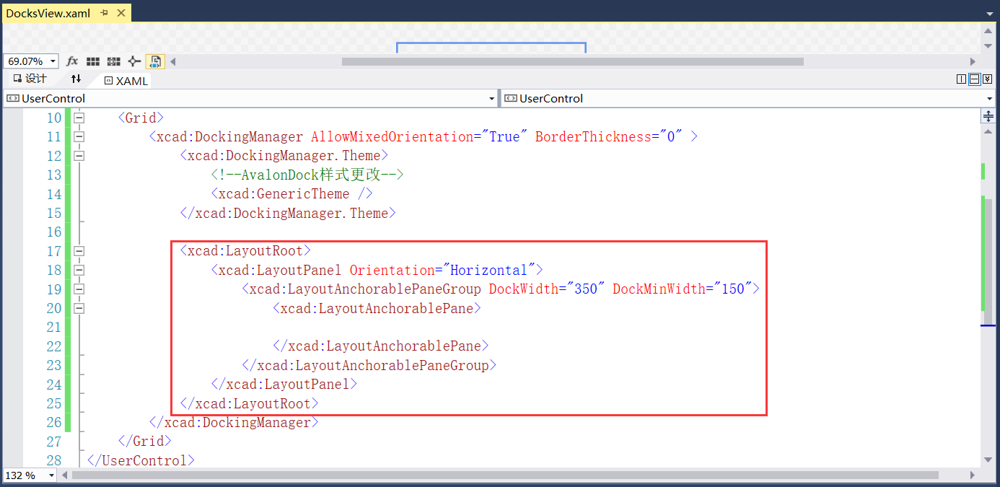

图7.4-8 添加布局

10、添加可停靠内容，添加项目面板，其中IconSource属性引用图片资源，CanHide属性为是否隐藏该窗口，CanClose属性为是否关闭该窗口，如图7.4-9所示。

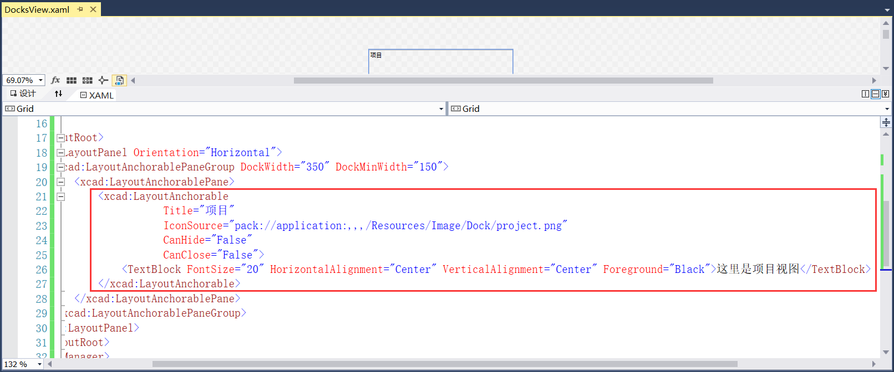

图7.4-9 添加项目面板

11、同上述添加项目面板一致，再次添加活动和代码片断面板，如图7.4-10所示。

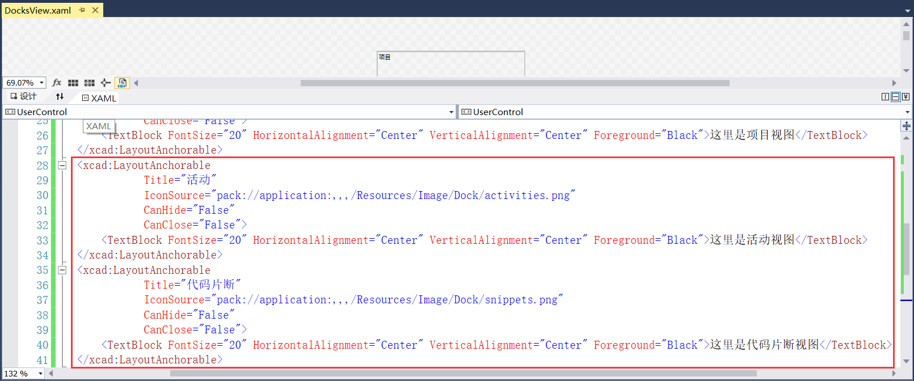

图7.4-10 活动和代码片断面板

12、程序重新编译运行，效果如图7.4-11所示。

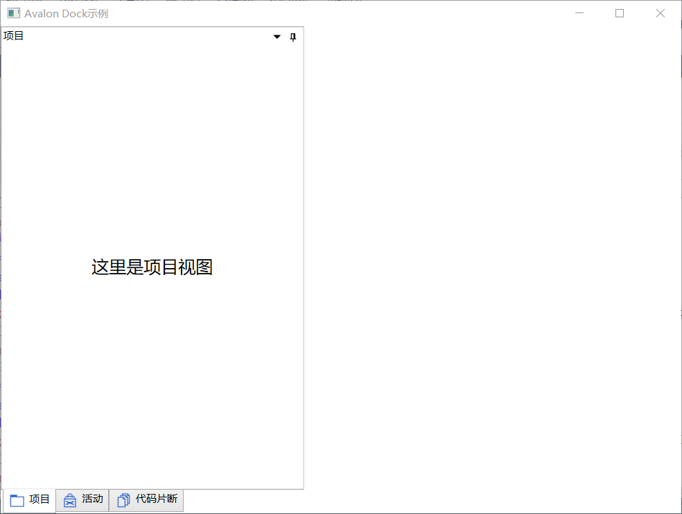

图7.4-11 项目、活动和代码片断面板

13、添加两个文档，并且设置文档的提示信息，如图7.4-12所示。

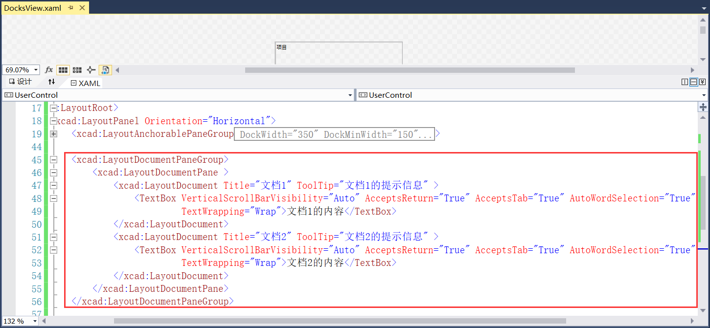

图7.4-12 添加文档

14、再添加右侧的属性和大纲面板，方法与左侧的项目和活动面板同理，如图7.4-13所示。

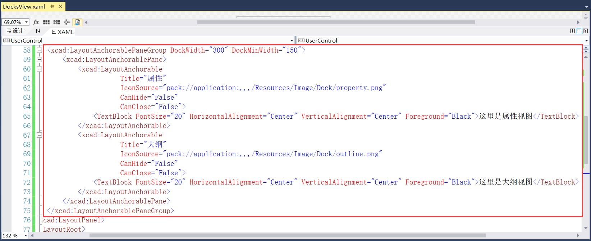

图7.4-13 属性和大纲面板

15、最后在底部添加输出面板，如图7.4-14所示。

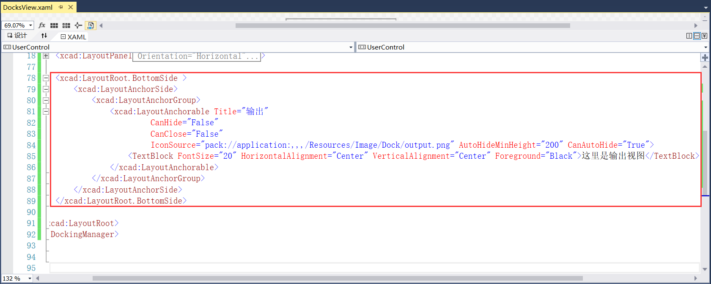

图7.4-14 输出面板

16、程序重新编译运行，效果如图7.4-15所示。

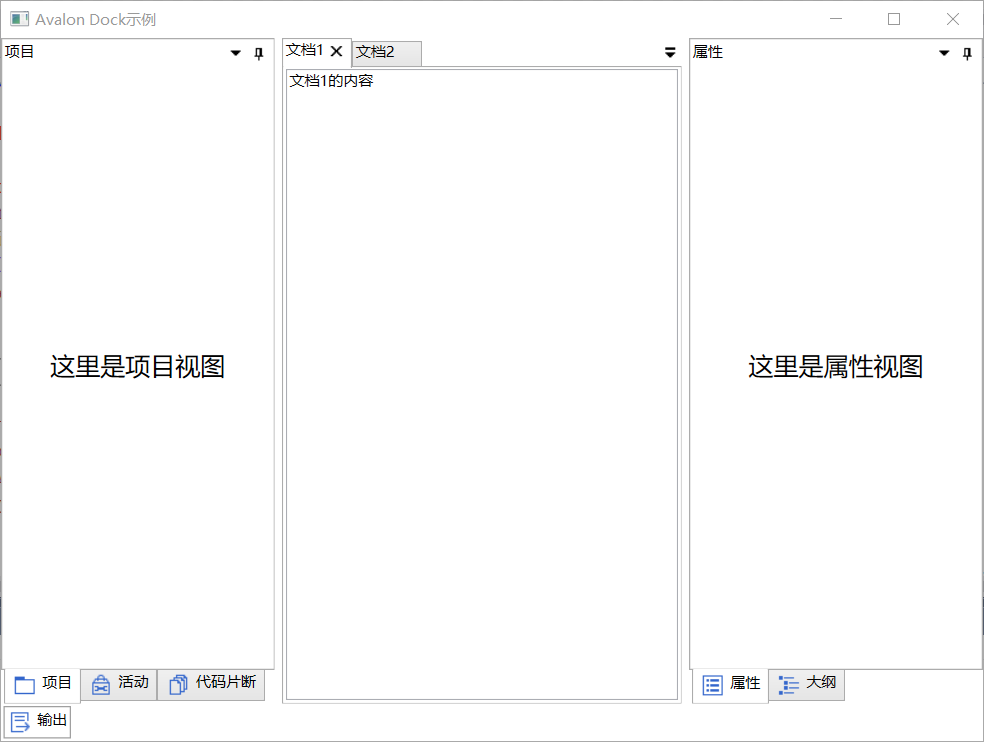

图7.4-15 效果展示

## links
   * [目录](<preface.md>)
   * 上一节: [Ribbon界面库示例](<07.3.md>)
   * 下一节: [Ribbon和Dock界面结合的例子](<07.5.md>)