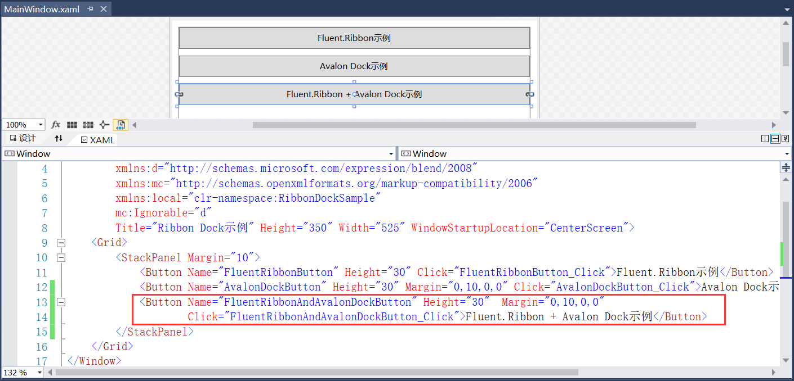
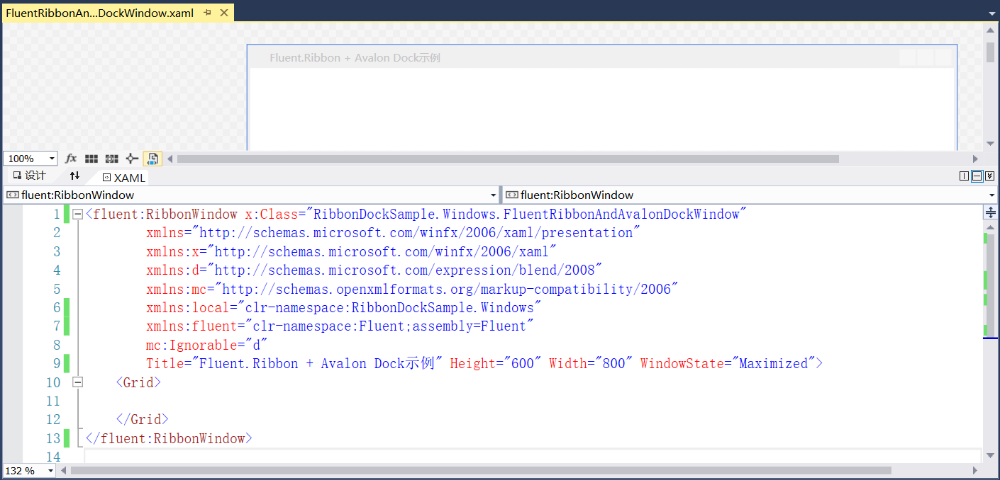
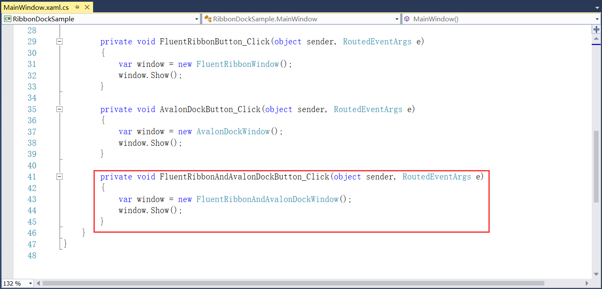
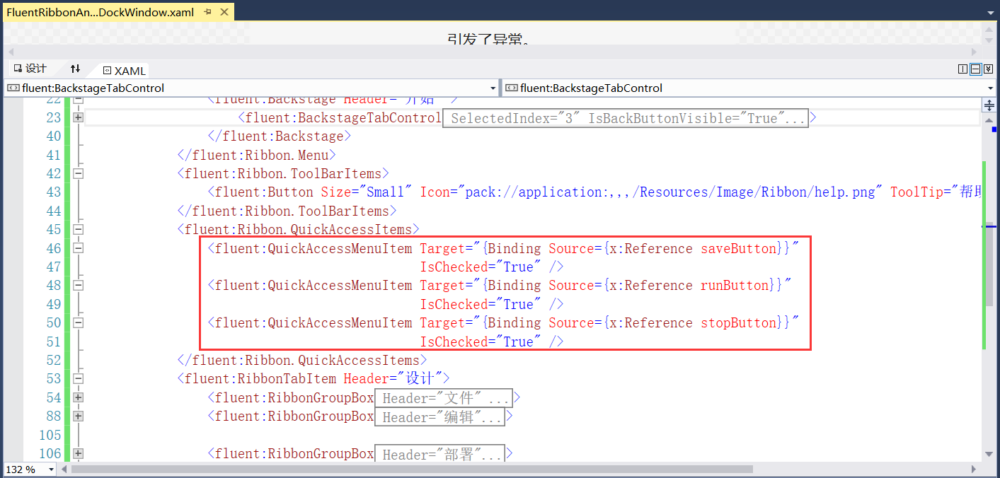
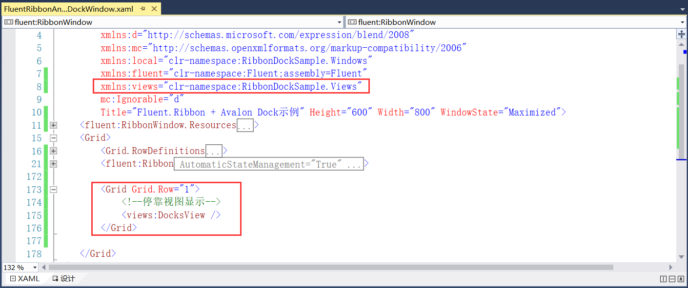
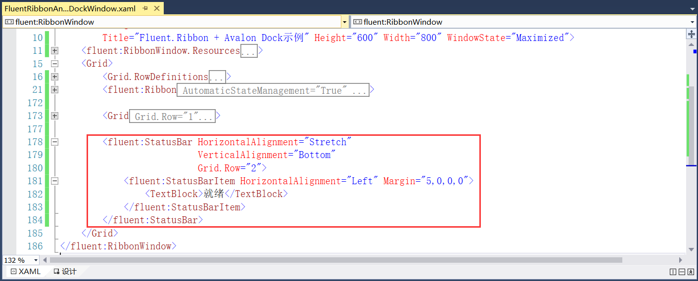
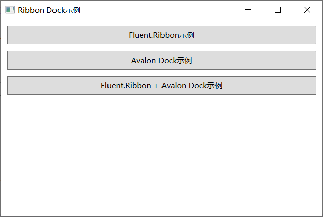
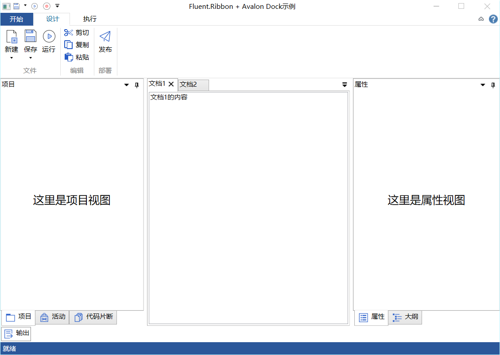

## 7.5 Ribbon和Dock界面结合的例子

1、Ribbon和Dock结合的例子就是将前面讲述的两个例子结合成一个完整的例子，首先MainWindow.xaml文件中添加Ribbon和Dock结合例子的按钮和Click事件，如图7.5-1所示。

图7.5-1 添加Fluent.Ribbon + Avalon Dock示例的按钮

2、在Windows文件夹下添加FluentRibbonAndAvalonDockWindow.xaml文件，同在Ribbon界面库中的讲解一致，在新建文件中引用Fluent的命名空间，并且在xaml和xaml.cs文件中中将Window修改为RibbonWindow。修改窗体的属性等，如图7.5-2所示。

图7.5-2 新建文件

3、在步骤1的Click事件中添加打开步骤2文件的代码，如图7.5-3所示。

图7.5-3 Click事件

4、接下来就是将Ribbon界面库中的代码复制到FluentRibbonAndAvalonDockWindow.xaml文件中。其中在自定义快速工具栏中可以添加属性IsChecked=”True”，代表默认将此按钮显示在快速访问工具栏中，如图7.5-4所示。

图7.5-4 Ribbon界面

5、添加Views文件夹的引用的命名空间，并且在第二行添加Dock停靠的视图，引用用户控件即可，如图7.5-5所示。

图7.5-5 添加面板视图

6、最后以状态栏结尾，如图7.5-6所示。

图7.5-6 状态栏

7、程序重新编译运行，效果如图7.5-7和图7.5-8所示。

图7.5-7 多个示例界面

图7.5-8 Fluent.Ribbon + Avalon Dock示例

## links
   * [目录](<preface.md>)
   * 上一节: [Dock界面库示例](<07.4.md>)
   * 下一节: [商业界面库Actipro Software的Ribbon+Dock示例](<07.6.md>)