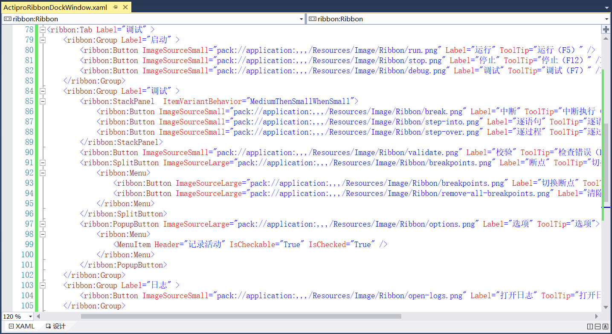

## 7.6 商业界面库Actipro Software的Ribbon+Dock示例

1、商业界面库Actipro Software有着先进的停靠窗口、MDI、树控件和强大的编辑器，可用于常见的数据类型，还有很多的现代主题等等。在使用Actipro Software之前我们可以下载并安装它，安装成功以后，我们可以在应用程序中找到Actipro WPF Controls Sample Browser，如图7.6-1所示。

图7.6-1 Actipro Software

2、如果是默认安装的话，位置在“C:\Program Files (x86)\Actipro Software\WPF-Controls\v19.1.0685”，在此路径下可以查看帮助文档Documentation.chm，如图7.6-2所示。

图7.6-2 帮助文档

3、在Assemblies文件夹下可以引用它的一些dll文件，如图7.6-3所示。

图7.6-3 DLL文件

4、打开Actipro WPF Controls Sample Browser，如图7.6-4所示，右上角可以切换主题样式。例如打开Editors，如图7.6-5所示，可以点击右上方的Next Sample继续查看具体的使用教程，也可在右上角的Tools中找到此例子的文件，也可通过VS打开此项目文件查看具体的用法，如图7.6-6所示。

图7.6-4 Actipro Software WPF控件

图7.6-5 Next Sample

图7.6-6 打开文件以及VS打开项目文件

5、Actipro Software可通过以上讲述的方法查看使用教程，接下来就是在项目中如何使用商业界面库Actipro Software。首先在MainWindow.xaml文件中添加商业界面库的Ribbon+Dock示例的按钮和Click事件，如图7.6-7所示。

图7.6-7 商业界面库的按钮

6、在项目中添加对程序集的引用，在上述步骤中提到的Actipro Software文件夹下Assemblies存放着dll文件，项目中要对其文件夹下ActiproSoftware.Docking.Wpf.dll、ActiproSoftware.Ribbon.Wpf.dll和ActiproSoftware.Shared.Wpf.dll添加引用，添加完后以后如图7.6-8所示。

图7.6-8 添加程序集

7、接着在Windows文件夹下新建窗口文件ActiproRibbonDockWindow.xaml，并在文件中添加ribbon和themes的命名空间，同时在xaml文件中将Window改为ribbon:RibbonWindow，并在xaml.cs文件中将Window改为RibbonWindow。更改窗体的名称、高度和宽度以及窗口状态为最大化等，如图7.6-9所示。

图7.6-9 ActiproRibbonDockWindow.xaml文件

8、在MainWindow.xaml文件中的Click事件代码添加，如图7.6-10所示。

图7.6-10 Click事件

9、将Grid换成DockPanel，并且使用ribbon，其中属性FontFamily为字体设置，设置显示在应用程序按钮上的字符串标签为主页，设置快速访问工具栏的位置属性QuickAccessToolBarLocation在功能区选项卡的上方。设置当前功能区IsMinimized不是最小化，设置字体大小为13等，如图7.6-11所示。

图7.6-11 Ribbon类

10、添加在功能区最小化状态之间切换的按钮功能区控件。继续添加界面的菜单栏，我们在主页这个按钮做成回退的按钮使用Backstage，同在Ribbon界面库中设计的界面一致。在回退的页面中添加打开和关闭两个Button按钮，再使用分隔符Separator进行分隔，继续添加四个BackstageTab页面，分别为开始、工具、设置和帮助，其属性设置与Ribbon设计中类似，如图7.6-12所示。

7.6-12 回退界面

11、程序重新编译运行，主窗体如图7.6-13所示，点击第四个按钮，出现Actipro Software的购买提示，如图7.6-14所示。点击提示右下角的close即可，打开使用商业界面库Actipro Software设计的窗体，如图7.6-15所示。点击左上角的主页，回退页面如图7.6-16所示。

图7.6-13 Ribbon和Dock示例

图7.6-14 Actipro Software提示

图7.6-15 主窗体

图7.6-16 回退页面

12、添加功能区选项卡，使用Ribbon.Tabs，功能区选项卡主要包括主页、设计和调试包括，主页已经添加完毕，接着就是添加设计选项卡，具体包括内容如下：

工作流：新建（序列图、流程图和状态机）、保存（另存为和全部保存）、运行。

编辑：剪切、复制和粘贴。

部署：发布。

添加Tab页，设置标签为设计，接着就是使用Group进行分组，分为工作流、编辑和部署。如图7.6-17所示。

图7.6-17 添加设计选项卡

13、在工作流分组中添加新建按钮，这里使用PopupButton，用于打开一个列表或菜单，并且使用ImageSourceLarge属性添加大图标，小图标使用ImageSourceSmall属性。
  因在新建按钮中又可以分为新建序列图、流程图和状态机，因此添加Menu菜单，里面添加三个Button按钮。接着就是添加保存按钮，设计方法同上述一致，只不过这里保存按钮使用的是分割按钮SplitButton，点击按钮的上半部分可以直接触发事件，点击按钮的下半部分是一个菜单列表，在菜单列表中添加两个Button按钮为另存为和全部保存。最后再添加一个运行的Button按钮即可，如图7.6-18所示。

图7.6-18 工作流区域

14、程序重新编译运行，效果如图7.6-19所示。

图7.6-19 工作流区域

15、接下来就是添加编辑区域了，设置属性ItemVariantBehavior根据当前值分配子控件。添加剪切、复制和粘贴三个Button按钮，如图7.6-20所示。

图7.6-20 编辑区域

16、最后添加部署区域的发布按钮，如图7.6-21所示。

图7.6-21 部署区域

17、程序重新编译运行，效果如图7.6-22所示。

图7.6-22 设计选项卡

18、设计选项卡添加完成以后，接着就是添加调试选项卡，添加方法同上述一致。其中调试选项卡包括启动、调试和日志三组，具体包括内容如下
  启动：运行、停止、调试。

调试：中断、逐语句、逐过程、校验、断点（切换断点、清除所有断点）、选项（记录活动）。

日志：打开日志。

调试选项卡的设计如上述的设计选项卡一致，详细用法请参考上述讲解，代码如图7.6-23所示。

图7.6-23 调试选项卡

18、程序重新编译运行，设计选项卡如图7.6-24所示，调试选项卡如图7.6-25所示。

图7.6-24 设计选项卡

图7.6-25 调试选项卡

20、添加底部的状态栏，代码如图7.6-26所示。

图7.6-26 状态栏

21、界面到现在为止，还剩下中间区域的面板视图即Dock界面，这里为了更好的设计，把Dock界面拆分开来，还是在Views文件夹下新建一个用户控件ActiproDocksView.xaml，如图7.6-27所示。

图7.6-27 新建用户控件

22、在ActiproRibbonDockWindow.xaml文件中引用上述新建的用户控件，首先在文件中添加对Views文件夹的命名空间，然后直接引用即可，如图7.6-28所示。

图7.6-28 引用用户控件

23、现在就剩设计面板视图了，打开ActiproDocksView用户控件，添加docking停靠的的命名空间。使用DockSite作为停靠窗体的根控件，其中使用到了一些属性，如图7.6-29所示，具体介绍如下：

ToolWindowsHaveTabImages="True"允许工具窗口的选项卡上有图像。CanDocumentWindowsFloat="True"：设置文档窗口可以包含在浮动窗口中。

AreNewTabsInsertedBeforeExistingTabs="False"：代表在添加新选项卡时不允许在现有选项卡之前插入新选项卡。

AutoHidePerContainer="False"：自动隐藏状态切换不会影响父窗口容器中的所有窗口。

AreDocumentWindowsDestroyedOnClose="True"：在关闭时自动销毁文档窗口。

UseHostedPopups="False"：弹出窗口不应位于停靠站点的边界内。

IsLiveSplittingEnabled="False"：不启用对接窗口的实时拆分。

CanDocumentWindowsDragToLinkedDockSites="False"：不允许文档窗口被拖到链接的Dock站点。

CanToolWindowsBecomeDocuments="False"：工具窗口不可以置于文档状态。

图7.6-29 使用DockSite

24、使用SplitContainer类是由可移动条组成的控件，可将容器的显示区域分成两个大小可调的面板，设置方向为垂直方向。在其控件中再放一个此控件，方向设置为水平。先来添加左侧的项目、活动和代码片断面板，使用ToolWindowContainer组件，可以用来嵌套其他页面。这里用来嵌套ToolWindow工具页面，现在来添加项目面板，设置Title标题为项目，ContainerDockedSize属性为设置窗口处于停靠状态时的大小，CanClose属性设置窗口不可以关闭，如图7.6-30所示。

图7.6-30 项目视图

25、左侧的活动和代码片断面板同上述一致，代码如图7.6-31所示。

图7.6-31 活动和代码视图

26、使用Workspace来添加中间区域的文档，并且用TabbedMdiHost以选项卡式承载停靠窗口的容器，使用TabbedMdiContainer来作为一个或多个文档的容器。接下里就是使用DocumentWindow来添加文档，设置标题Title以及提示信息TabToolTip，如图7.6-32所示。

图7.6-32 添加文档

27、接着就是添加右侧的属性和大纲视图，添加的方法和左侧的项目以及活动视图一样，代码如图7.6-33所示。

图7.6-33 属性和大纲视图

28、最后就剩底部的一个输出窗口，使用ToolWindowContainer作为工具窗口的容器。使用ToolWindow添加工具窗口，如图7.6-34所示。

图7.6-34 输出窗口

29、添加到此处，界面已经设计好了，现在来重新编译程序运行，点击图7.6-35所示的第四个按钮，然后会出现图7.6-36所示的提示，点击右下角的close，出现图7.6-37就是最终我们设计的界面了。

图7.6-35 Ribbon和Dock示例按钮

图7.6-36 提示

图7.6-37 Actipro Software的Ribbon+Dock

## links
   * [目录](<preface.md>)
   * 上一节: [Ribbon和Dock界面结合的例子](<07.5.md>)
   * 下一节: [什么是活动组件（Activity）](<08.1.md>)