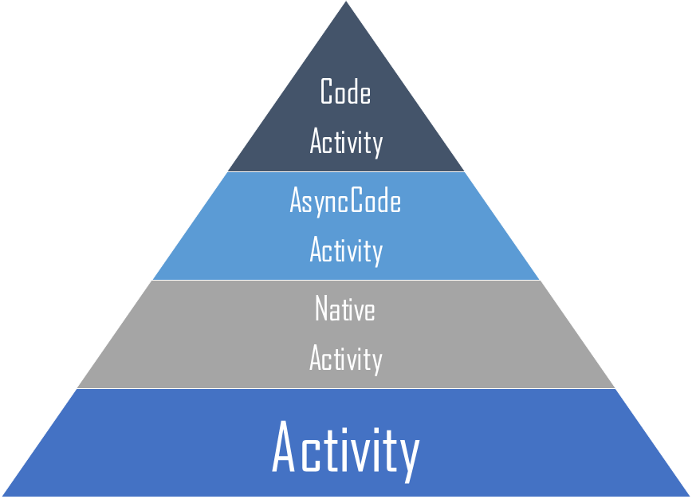

## 8.1 什么是活动组件（Activity）

活动（Activity）是一种可以包含用户界面的组件，主要用于和用户进行交互。一个应用程序中可以包含零个或多个活动。

RPA设计器中场景组件库采用微软WF框架，WF是一个可扩展框架，用于在Windows平台上开发工作流解决方案。活动组成了工作流中的步骤（或任务），也可以说活动定义了工作流，我们按顺序和层次组织活动，然后这些活动将作为指令供工作流引擎执行，WF所有的活动都继承了一个基类----Activity，WF就运作在这些基本活动库中的现成活动之上。Activity的分类如图8.1-1所示。

图8.1-1 Activity分类

CodeActivity提供了一个Execute方法，可以重写该方法来实现具体功能，它还提供对跟踪，变量和参数的访问。NativeActivity提供CodeActivity/Sync的所有功能，但也允许中止活动的执行，取消子活动执行，安排活动，使用书签以及活动操作和功能。

## links
   * [目录](<preface.md>)
   * 上一节: [商业界面库Actipro Software的Ribbon+Dock示例](<07.6.md>)
   * 下一节: [工作流控制台应用程序示例项目](<08.2.md>)