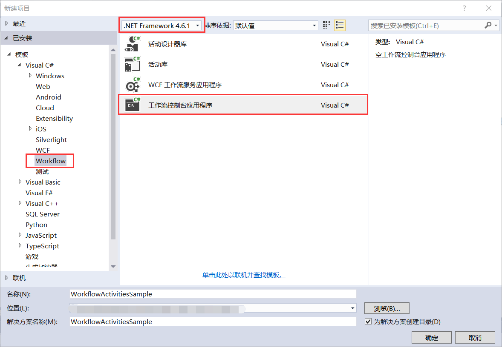
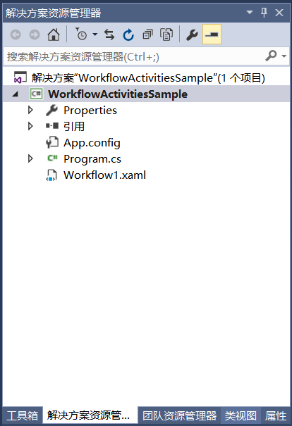
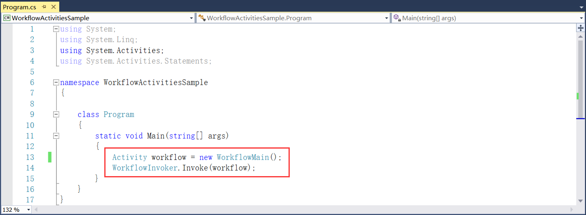
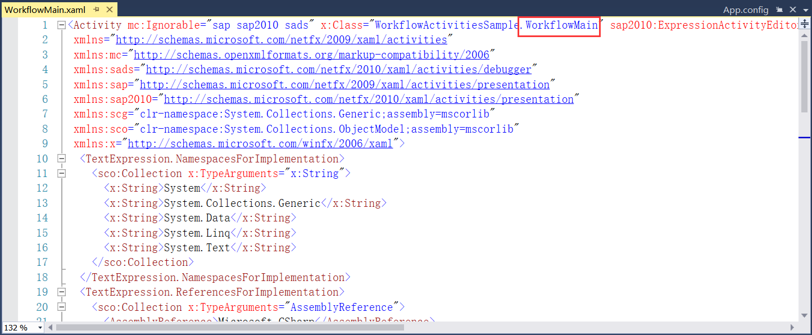
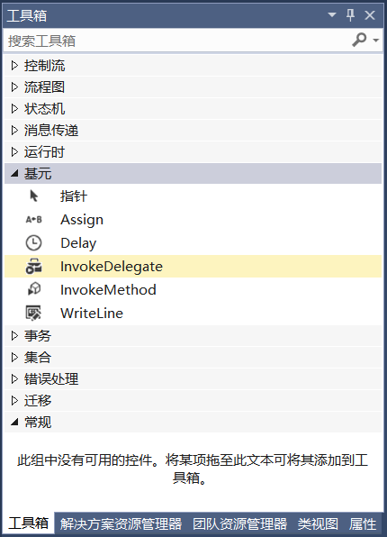
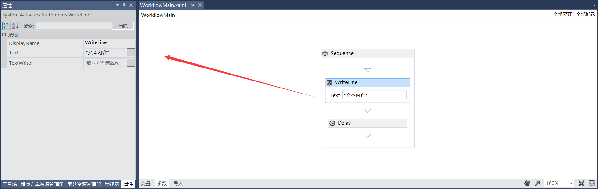
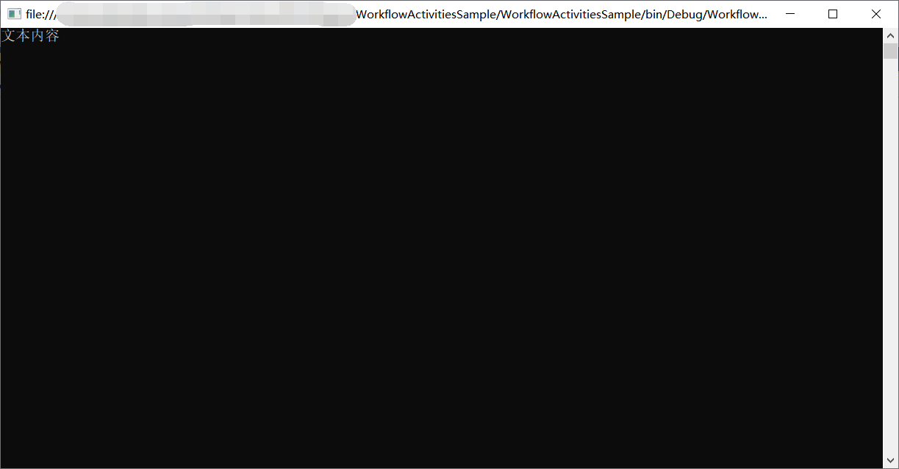

## 8.2 工作流控制台应用程序示例项目

1、打开VS 2015新建项目，使用.NET Framework 4.6.1创建Workflow下的工作流控制台应用程序WorkflowActivitiesSample，如图8.2-1所示。

图8.2-1 新建工作流控制台应用程序

2、新建此应用程序的目的是不需要在设计器中进行组件拖拽，在VS的工具箱中拖拽也可使用，当然也可以依赖我们自定义的活动组件，新建的项目文件如图8.2-2所示。

图8.2-2 新建的项目文件

3、 为了使项目下的文件名称更加友好，这里将Workflow1.xaml更改为WorkflowMain.xaml，也可以不用更改。如果更改名称的话切记不要忘记更改Program.cs里面的代码引用，在Program.cs文件中鼠标放到Workflow1上，按F12，将跳转到文件中的Workflow1全部替换为WorkflowMain并保存，最后再将Program.cs文件中的Workflow1替换为WorkflowMain即可，如图8.2-3所示。

图8.2-3 Program.cs文件

4、改好以后，点击WorkflowMain.xaml文件，再按F7跳转到xaml文件代码，将开头引用的类Workflow1修改为WorkflowMain，如图8.2-4所示。

图8.2-4 修改WorkflowMain.xaml文件

5、修改完成以后点击保存，双击打开WorkflowMain.xaml文件，在工具箱面板中可以拖拽系统自带的组件到文件中，如图8.2-5所示。

图8.2-5 工具箱

6、这里拖拽了WriteLine和Delay组件，点击组件可以在属性面板中填写相关配置，延时组件设置00:00:03，如图8.2-6所示。

图8.2-6 组件属性

7、程序重新编译运行，按照顺序执行WriteLine组件再延时3秒程序退出，如图8.2-7所示。

图8.2-7 组件执行

## links
   * [目录](<preface.md>)
   * 上一节: [什么是活动组件（Activity）](<08.1.md>)
   * 下一节: [新建组件库示例项目](<08.3.0.md>)