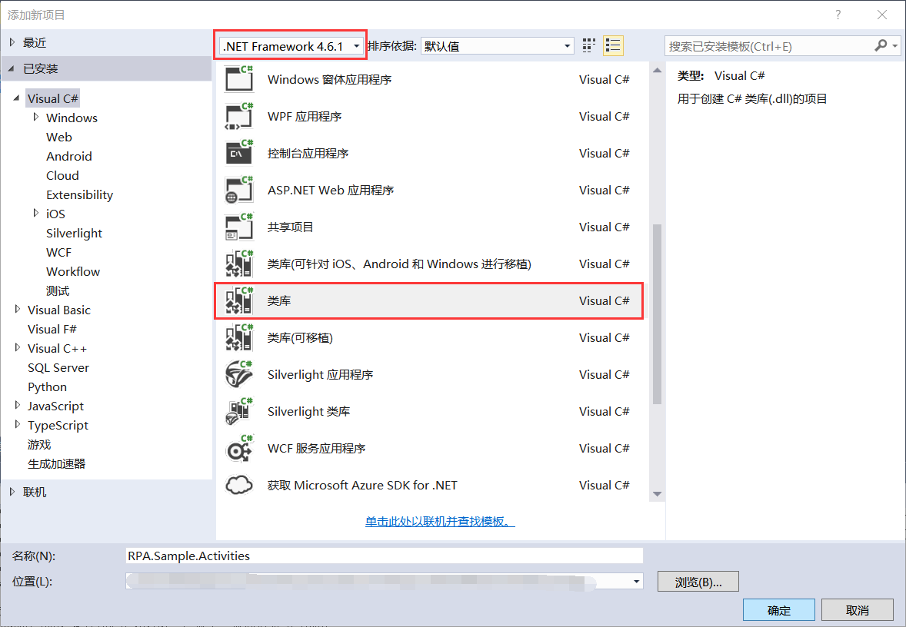
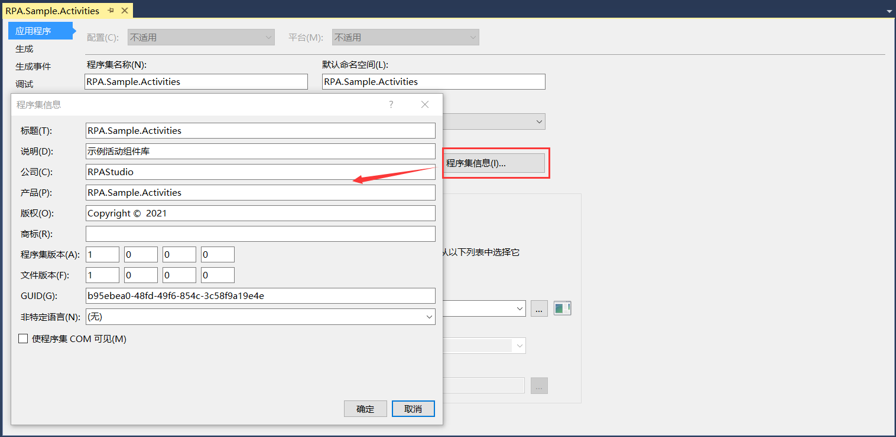
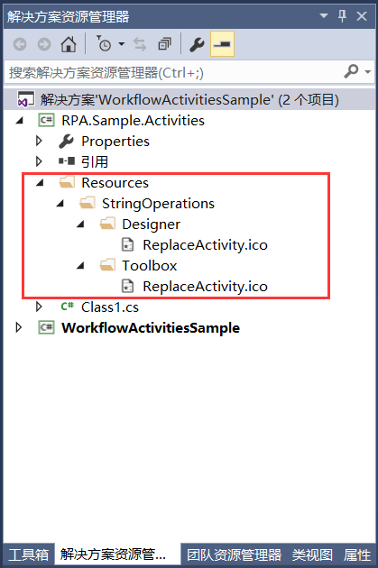
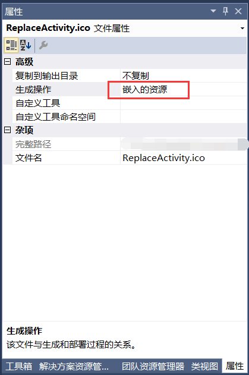
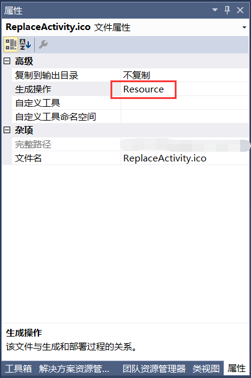
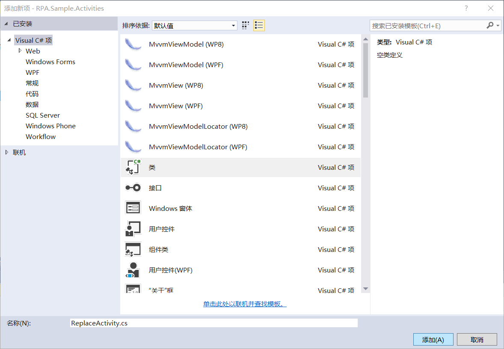
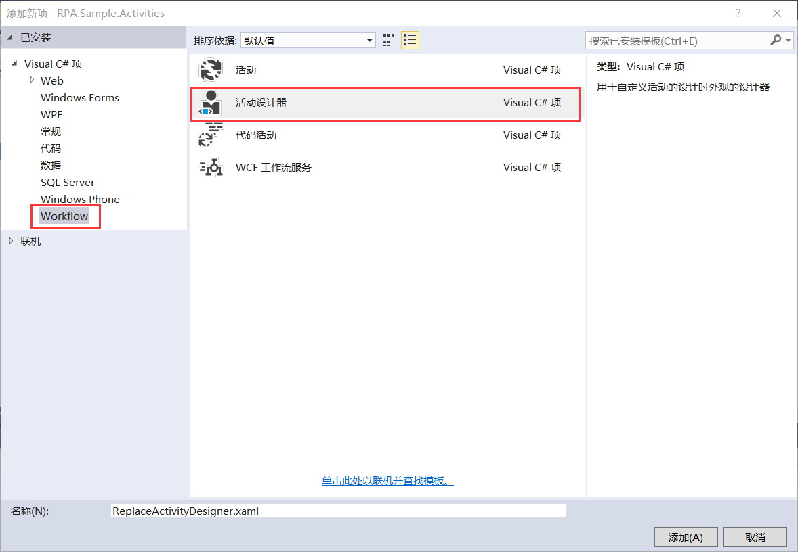

## 8.3 新建组件库示例项目

1、在同一个解决方案下新建一个自定义组件库的项目，使用.NET Framework 4.6.1创建Visual C#下的类库项目RPA.Sample.Activities，如图8.3-1所示。

图8.3-1 新建类库项目

2、.Net工程的Properties文件夹下会自动生成一个名为AssemblyInfo.cs的文件，一般情况下我们很少直接改动该文件。但我们实际上通过另一个形式操作该文件，那就是通过在鼠标右键点击项目的属性进入应用程序---->程序集信息，然后修改信息，修改内容如图8.3-2所示。

图8.3-2 程序集信息

3、我们这里新建一个字符串替换的活动组件，首先我们先添加活动组件使用到的图标。在项目下新建一个文件夹Resources，文件夹下再新建StringOperations文件夹。在此文件夹下分为工具箱使用图标和组件界面使用图标，并且使用ico格式，这里作区分的原因是为了让图标可以在VS的工具箱中可以正常显示，且必须使用16x16的ico格式，如图8.3-3所示。

图8.3-3 图标文件

其中在工具箱Toolbox文件夹下的图标属性为嵌入的资源，如图8.3-4所示。组件界面Designer文件下使用的图标属性为Resource，如图8.3-5所示。

图8.3-4 嵌入的资源

图8.3-5 Resource资源

4、项目下新建StringOperations文件夹，文件夹下存放活动组件实现的文件以及活动组件界面实现的文件。首先在此文件夹下添加ReplaceActivity类，如图8.3-6所示。再添加活动组件的界面设计文件，添加位置为Workflow下的活动设计器，如图8.3-7所示。

图8.3-6 添加ReplaceActivity类

图8.3-7 添加活动设计器

## links
   * [目录](<preface.md>)
   * 上一节: [工作流控制台应用程序示例项目](<08.2.md>)
   * 下一节: [组件功能实现](<08.3.1.md>)