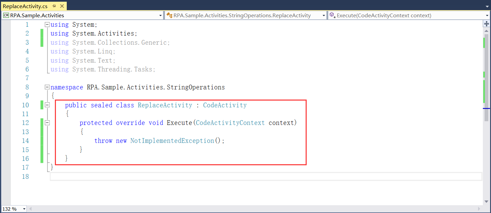
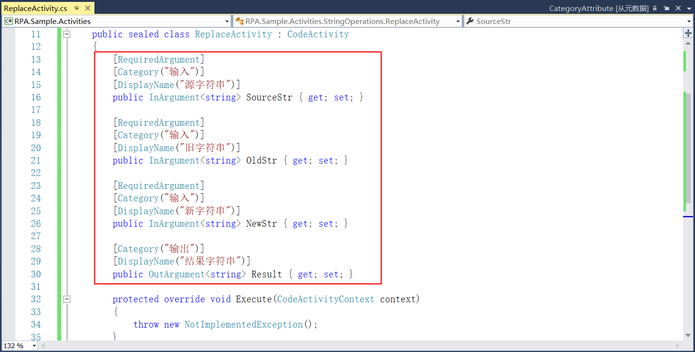
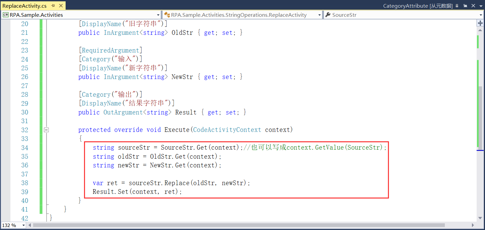
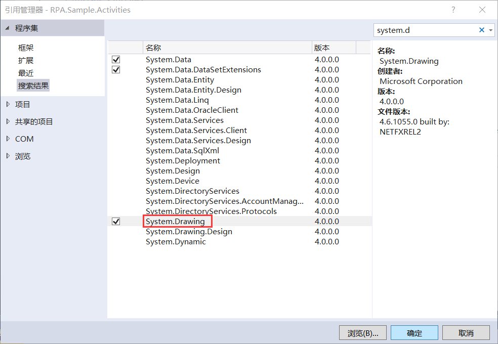
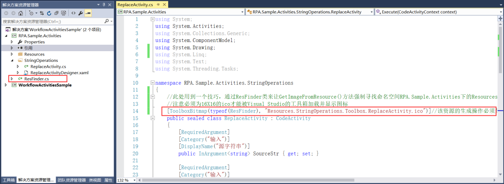

## 8.3.1 组件功能实现

1、将新建好的类使用public sealed来修饰，并且继承CodeActivity，根据提示添加引用并实现抽象类以后，具体的代码实现是通过Execute来执行的，如图8.3.1-1所示。

图8.3.1-1 继承CodeActivity

2、接着就是添加此组件的属性，属性有输入的源字符串、输入的需要替换的旧字符串和输入的替换成的新字符串，以及输出的替换好的结果字符串。对于上述这些属性大致分为输入和输出两组，使用Category进行分组。对于属性的显示名称使用DisplayName，还有一些必填的属性设置使用RequiredArgument。添加的属性字段如图8.3.1-2所示。

图8.3.1-2 属性字段

3、接下来就是具体的代码实现，通过Get或GetValue来获取字段的值，Replace函数进行替换，最后通过Set进行设置值，具体代码实现如图8.3.1-3所示。

图8.3.1-3 Execute实现

3、替换的活动组件代码实现就完成了，现在为此组件添加图标。使用ToolboxBitmap来添加图片资源，首先添加对System.Drawing的引用，如图8.3.1-4所示。

图8.3.1-4 添加引用

5、这里使用到一个技巧，通过Class1类让GetImageFromResource()方法强制寻找命名空间RPA.Sample.Activities下的Resources.StringOperations.Toolbox.ReplaceActivity.ico。这里将Class1类名修改为更友好的ResFinder，如图8.3.1-5所示。

图8.3.1-5 添加图标

6、图标添加好以后就是设计组件的界面了。

## links
   * [目录](<preface.md>)
   * 上一节: [新建组件库示例项目](<08.3.0.md>)
   * 下一节: [组件界面设计](<08.3.2.md>)