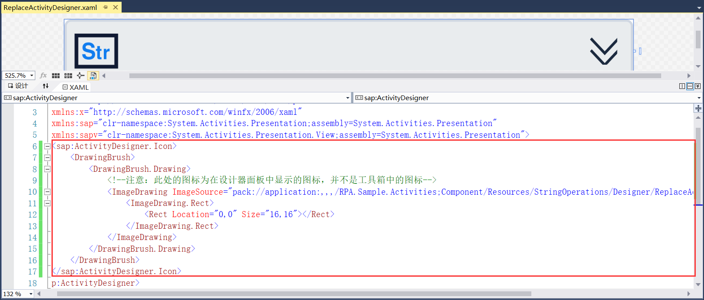
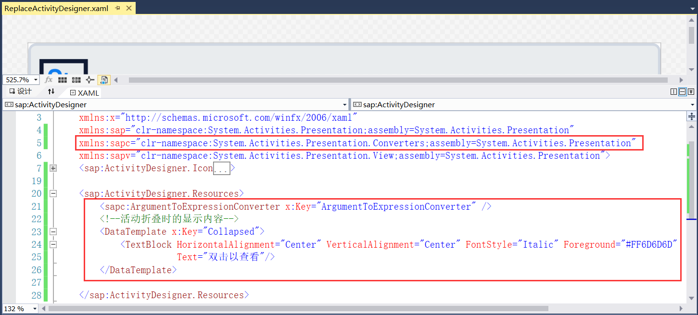
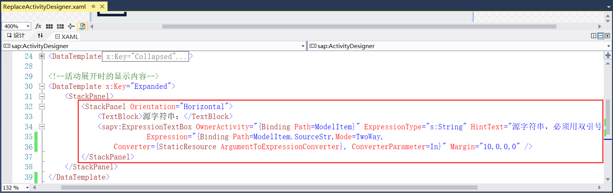
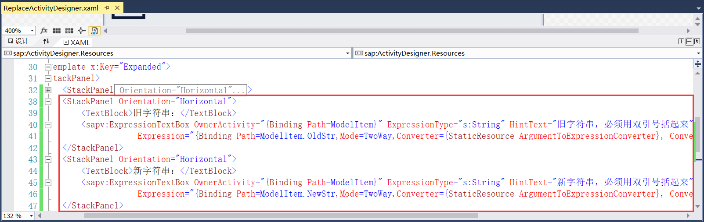
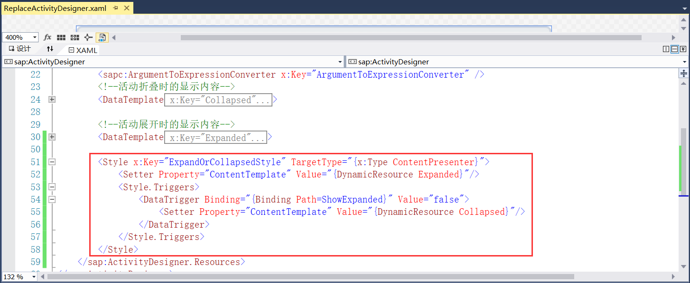
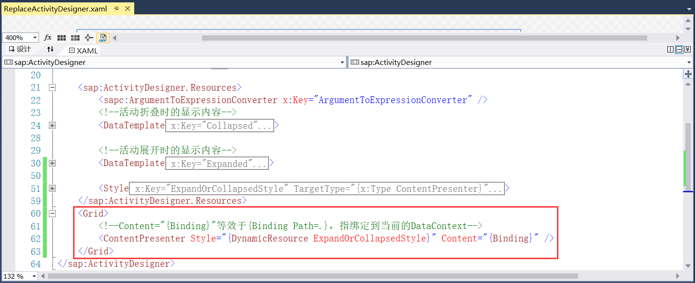

## 8.3.2 组件界面设计

1、打开ReplaceActivityDesigner.xaml文件，为活动组件界面添加图标，这里的图标使用的是在设计器面板中显示的图标，并不是在工具箱显示的图标，添加的图标代码如图8.3.2-1所示。

图8.3.2-1 添加图标

2、添加转换器，使用ArgumentToExpressionConverter定义参数和表达式之间的映射，并提供在这些对象之间进行转换的功能，添加System.Activities.Presentation.Converters转换的命名空间。定义活动组件折叠时显示双击以查看，如图8.3.2-2所示。

图8.3.2-2 添加转换和折叠

3、接下来就是活动组件展开时候的代码实现，添加StackPanel，方向为水平，放至TextBlock文本为源字符串。后面就是输入的源字符串，因使用的是String类型，这里添加对System的命名空间，起名为s。通过Binding将组件界面输入的值与组件属性中的字段绑定起来，通过HintText属性设置文本提示信息，代码如图8.3.2-3所示。

图8.3.2-3 添加源字符串界面

4、使用上述同样的方法继续添加旧字符串和新字符串界面，如图8.3.2-4所示。

图8.3.2-4 添加旧字符串和新字符串界面

5、接着就是在类型的不同实例之间共享属性、资源和事件处理程序，如图8.3.2-5所示。

图8.3.2-5 事件处理

6、最后就是绑定到当前的DataContext，如图8.3.2-6所示。

图8.3.2-6 绑定到当前的DataContext

7、那么到此为止，此活动组件的界面就设计好了，接下来就是对活动组件界面和实现的绑定。

## links
   * [目录](<preface.md>)
   * 上一节: [组件功能实现](<08.3.1.md>)
   * 下一节: [界面绑定](<08.3.3.md>)