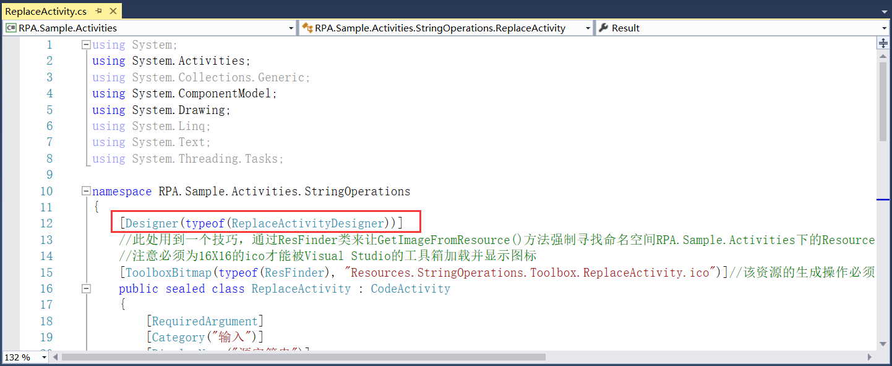

## 8.3.3 界面绑定

1、活动组件的实现和界面设计都已经完成好了以后，就是对它们两个之间进行绑定。打开ReplaceActivity.cs类文件，使用Designer进行绑定，typeof填写组件界面的名称即可，如图8.3.3-1所示。

图8.3.3-1 组件实现和界面绑定

2、以上就是一个完整的活动组件的实现。

## links
   * [目录](<preface.md>)
   * 上一节: [组件界面设计](<08.3.2.md>)
   * 下一节: [活动组件的测试](<08.4.md>)