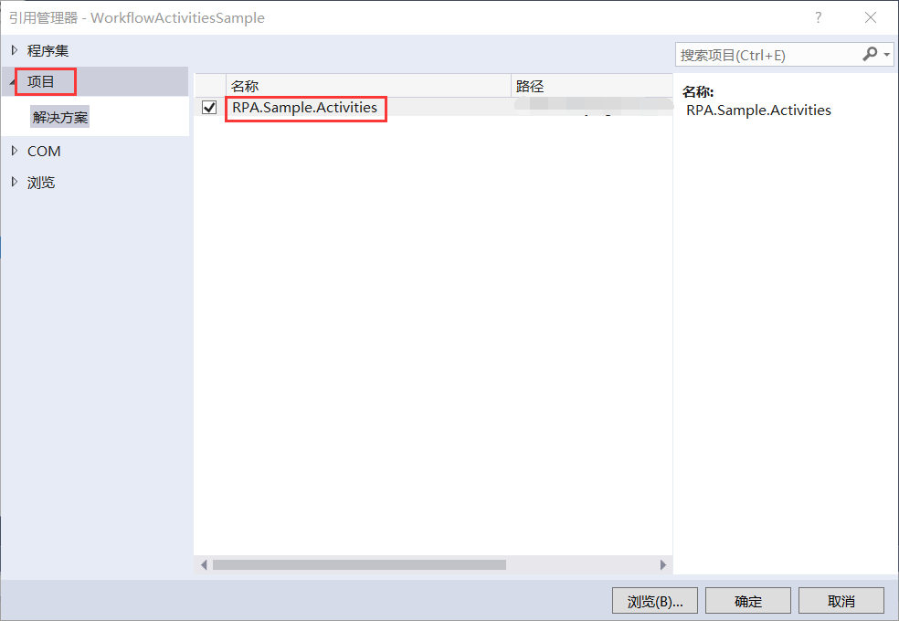
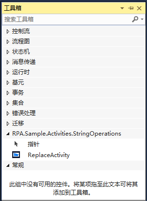
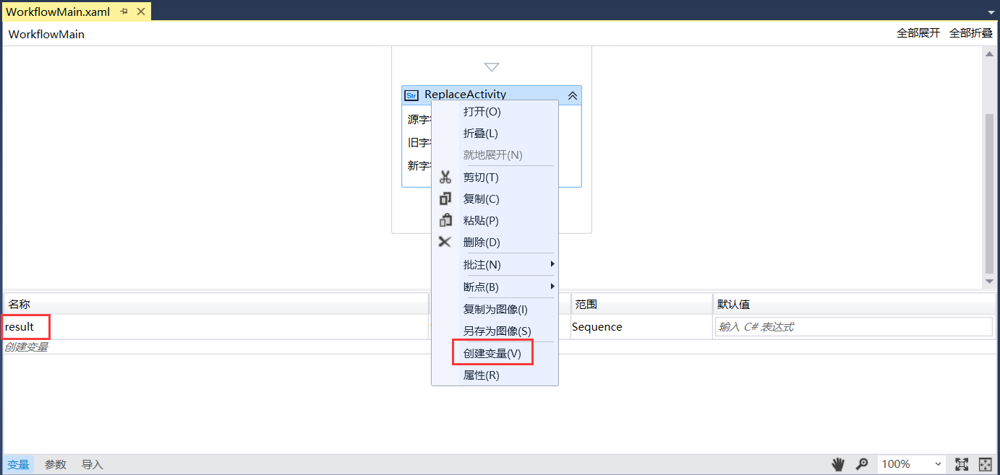
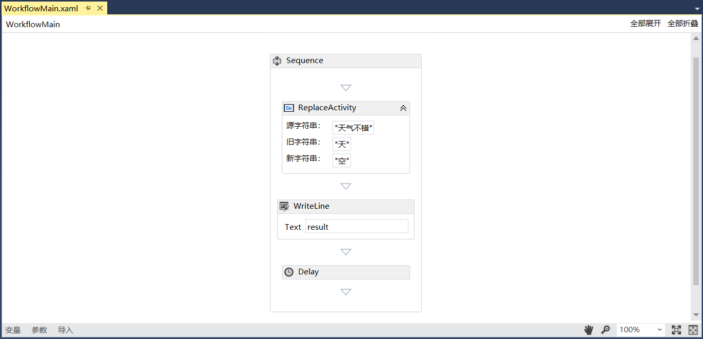
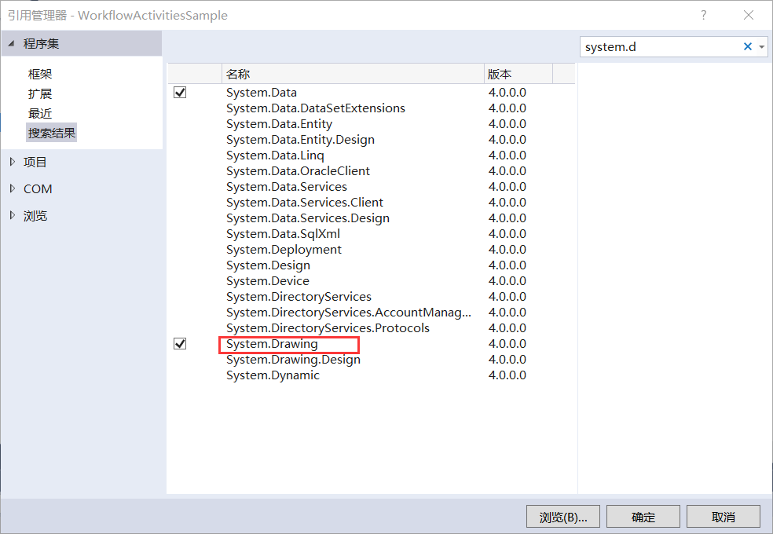
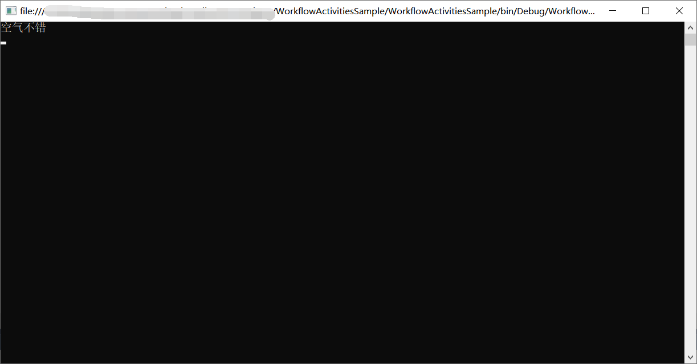

## 8.4 活动组件的测试

1、因为上述创建的项目为类库，不能直接设为启动项目运行，因此这里我们将项目添加到上述新建的工作流控制台应用程序示例WorkflowActivitiesSample中。首先在WorkflowActivitiesSample项目中添加对项目RPA.Sample.Activities的引用，如图8.4-1所示。

图8.4-1 添加引用

2、打开WorkflowMain.xaml文件，点击工具箱，可以看到引用的替换活动组件（带图标），如图8.4-2所示。

图8.4-2 工具箱中的替换活动组件

3、在WorkflowMain.xaml文件中，将替换组件拖拽到序列图中，在此组件的属性中进行配置，将“天气不错”替换为“空气不错”，并且创建String类型的变量用来输出结果字符串。创建变量的方法为：点击变量面板直接创建或者点击序列图Sequence----》右键----》创建变量，如图8.4-3所示。

图8.4-3 创建变量

4、在此组件的输出结果字符串中配置result，接着再拖拽WriteLine组件打印输出result，最后放一个延时组件，设置为3秒延时，如图8.4-4所示。

图8.4-4 序列图

5、因RPA.Sample.Activities项目中添加了对System.Drawing的引用，在WorkflowActivitiesSample项目中也要添加。如果不添加的话，程序在编译过程中会报错。添加引用如图8.4-5所示。

图8.4-5 添加引用

6、将WorkflowActivitiesSample项目设为启动项目，程序重新编译运行，结果如图8.4-6所示。

图8.4-6 运行结果

7、通过上述的运行结果证明组件是执行成功的。

## links
   * [目录](<preface.md>)
   * 上一节: [界面绑定](<08.3.3.md>)
   * 下一节: [活动组件在设计器中的显示](<08.5.md>)