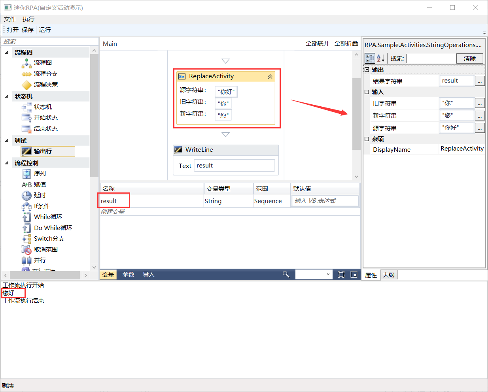

## 8.5 活动组件在设计器中的显示

1、活动组件测试成功以后，现在将此自定义活动组件集成到设计器MiniRPA（第三章新建的RPA项目）中。首先将MiniRPA项目添加到此解决方案中，添加方法为：解决方案右键----》添加----》现有项目，浏览MiniRPA项目所在位置添加即可。添加后如图8.5-1所示。

图8.5-1 添加MiniRPA项目

2、为了区分，这里将项目MiniRPA名称更改为MiniRPAWithActivities，在项目名称重命名以后，需要进行全局的替换。然后在项目中添加对组件库示例项目RPA.Sample.Activities的引用，如图8.5-2所示。

图8.5-2 添加引用

3、添加完引用以后，打开MainWindow.xaml文件，将窗体的属性Title修改为“迷你RPA(自定义活动演示)”。接着就是定义字符串资源，如图8.5-3所示。

图8.5-3 定义资源

4、在文件中找到项目面板的设计位置，在组件的结尾处添加自定义活动组件，如图8.5-4所示。

图8.5-4 添加自定义活动

5、将MiniRPAWithActivities项目设为启动项目，程序重新编译运行，在组件的结尾处可以看到添加的自定义活动组件字符串替换，如图8.5-5所示。

图8.5-5 组件显示

6、将字符串替换组件拖拽到设计面板中，并将字符串“你好”替换成“您好”，然后创建变量作为结果字符串的值，使用输出行组件打印输出查看。点击运行，效果如图8.5-6所示。

图8.5-6 字符串替换组件

## links
   * [目录](<preface.md>)
   * 上一节: [活动组件的测试](<08.4.md>)
   * 下一节: [活动组件库的Nupkg包的生成](<08.6.md>)