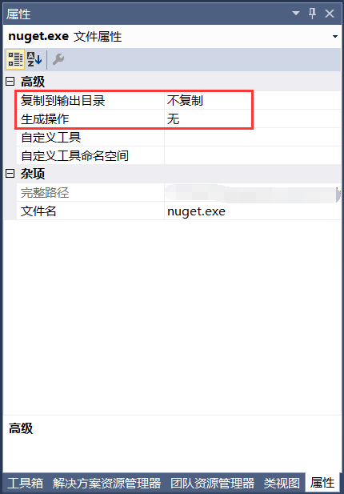
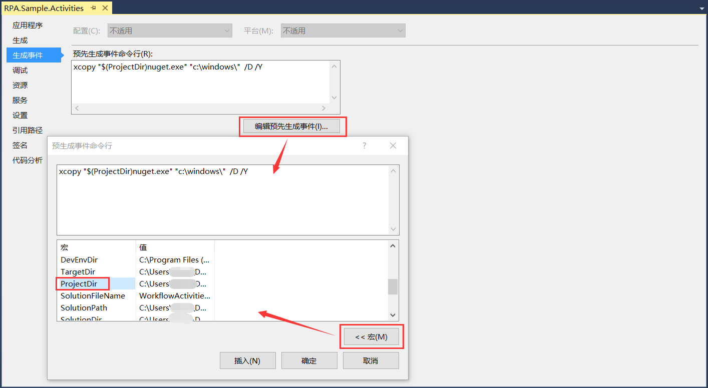
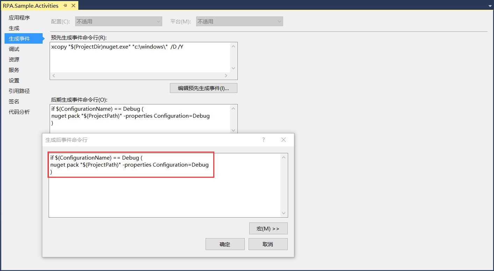
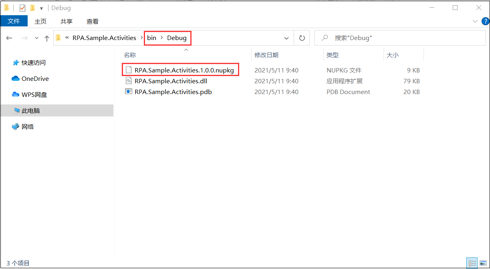

## 8.6 活动组件库的Nupkg包的生成

1、重回到组件库示例项目RPA.Sample.Activities，将nuget.exe拷贝到此项目下，将其包括在项目中，属性中设置为不复制、生成操作为无，如图8.6-1所示。

图8.6-1 nuget.exe

2、此项目右键----》属性----》生成事件，在预先生成事件命令行中填写“xcopy "$(ProjectDir)nuget.exe" "c:\windows\"  /D /Y”，将nuget.exe拷贝到C盘下。其中结尾处/D代表只复制源时间比目标时间新的文件，/Y代表取消提示以确认要覆盖现有目标文件。点击编辑预生成事件，再点击宏，可以查看ProjectDir代表的值是什么，如图8.6-2所示。

图8.6-2 预先生成事件命名行

3、接着就是后期生成事件命令行，在Debug下生成包的命令如图8.6-3所示。

图8.6-3 后期生成事件命令

4、将程序重新编译，打开组件库示例项目所在的文件夹，在bin\Debug下可以看到生成的nupkg包，如图8.6-4所示。

图8.6-4 生成的nupkg包

## links
   * [目录](<preface.md>)
   * 上一节: [活动组件在设计器中的显示](<08.5.md>)
   * 下一节: [活动组件库的Nupkg包的管理](<08.7.md>)